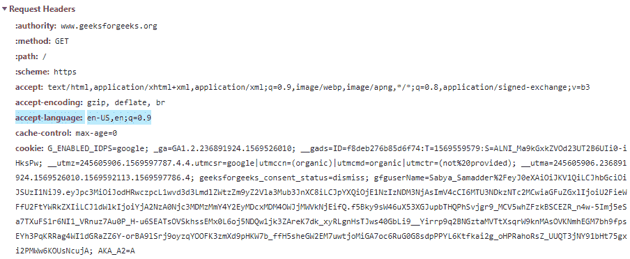

# HTTP 头 | Accept-Language

> 原文: [https://www.geeksforgeeks.org/http-headers-accept-language/](https://www.geeksforgeeks.org/http-headers-accept-language/)

`Accept-Language` 头告诉服务器客户端可以理解的所有语言。在内容协商的帮助下，`Accept-Language` 头中会包含一组支持的语言，然后服务器从中选择一个，并将其放在 `Content-Language` 头中。在少数情况下，用户可以手动更改语言，否则服务器会通过浏览器的语言设置来检测支持的语言。但是请记住一点，服务器永远不要覆盖用户的明确决定。如果用户对服务器语言中未列出的语言感到满意，则服务器不能向客户端提供匹配的语言，在这种情况下 `406 Not Acceptable` 状态码将被发送。

## 语法

这是特定的语言选择语法。

```html
Accept-Language: <language>
```

这种语法可以作为通配符（选择所有语言）。

```html
Accept-Language: *
```

**注意：** 使用逗号可以列出多种语言。

## 指令

此头接受两个指令，如下所述：

*   `<language>`：这由代表该语言的 2-3 个字母的基本语言标签组成，后面是用 `-` 分隔的子标签。额外的信息是地区和国家变量（如 `US` 或 `CA`）。
*   `*`：它用作任何语言的通配符。

**注：** `;q=` 它定义了因子权重，该值按照使用相对质量值表示的偏好顺序排列。

## 示例

在本例中，单个值位于 `Accept-Language` 头上，表示美国英语。

```html
Accept-Language: en-US
```

在本例中，双值位于 `Accept-Language` 头上，即美国的英语和加拿大的法语。

```html
Accept-Language: en-US,fr-CA
```

In this example single value is on Accept-Language header that is English of US with the factor weighting.

```html
Accept-Language: en-US,en;q=0.9
```

要检查此 `Accept-Language` 是否有效，请转到 **检查元素 -> 网络**，检查 `Accept-Language` 请求头，如下所示，`Accept-Language` 被突出显示，您可以看到。



## 支持的浏览器

浏览器对 `Accept-Language` 头的兼容性如下：

*   谷歌 Chrome
*   微软 Edge
*   火狐浏览器
*   Safari
*   歌剧