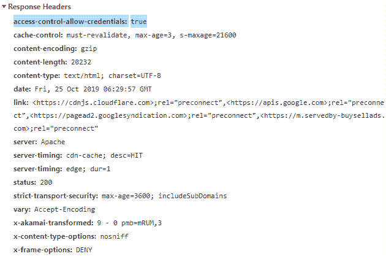

# HTTP 头 | 访问控制-允许-凭证

> 原文: [https://www.geeksforgeeks.org/http-headers-access-control-allow-credentials/](https://www.geeksforgeeks.org/http-headers-access-control-allow-credentials/)

HTTP 访问控制允许凭证是一个响应头。当请求的凭证模式 `Request.credentials` 为 `include` 时，访问控制允许凭证头用于告诉浏览器向前端 JavaScript 代码公开响应。请记住一件事，当 `Request.credentials` 为 `include` 模式时，如果 `Access-Control-Allow-Credentials` 设置为 `true`，浏览器将向前端 JavaScript 代码公开响应。

访问控制-允许-凭证头使用 `XMLHttpRequest.withCredentials` 属性或使用 Fetch API 的 `Request()` 构造函数中的凭证选项来执行。

**注意:** 凭证实际上是 cookies、授权头或 TLS (传输层安全) 客户端证书。

## 语法:

```html
Access-Control-Allow-Credentials: true
```

## 指令:

该标题接受上面提到的和下面描述的单个指令:

*   `true`: 这是唯一有意义的或者你可以说有效的访问控制-允许-凭证头值。如果不需要此凭据，请删除标头。不要放在那里 `Access-Control-Allow-Credentials: false`。该指令区分大小写。

## 示例:

*   这是允许访问控制允许凭证。

```html
Access-Control-Allow-Credentials: true
```

*   这是使用带有凭据的 XHR。

```html
var xhr = new XMLHttpRequest();
xhr.open('GET', 'https://www.geeksforgeeks.org/', true); 
xhr.withCredentials = true; 
xhr.send(null);
```

*   这是使用带有凭据的 Fetch。

```javascript
fetch(url, {
  credentials: 'include'  
})
```

要检查此访问控制-允许-凭证是否有效，请转到 **检查元素 -> 网络** 检查访问控制-允许-凭证的响应头如下所示，访问控制-允许-凭证高亮显示，您可以看到。



## 支持的浏览器:

兼容 `HTTP Access-Control-Allow-Credentials` 头的浏览器如下:

*   谷歌 Chrome
*   微软公司出品的 web 浏览器
*   火狐浏览器
*   旅行队
*   歌剧