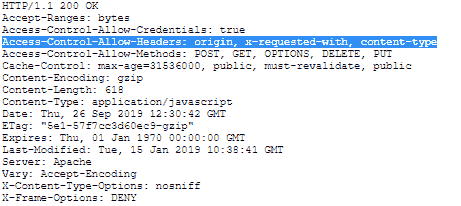

# HTTP 头 | 访问控制-允许-头

> 原文: [https://www.geeksforgeeks.org/http-headers-access-control-allow-headers/](https://www.geeksforgeeks.org/http-headers-access-control-allow-headers/)

`Access-Control-Allow-Headers` 头是一个响应类型的头，用于指示 HTTP 头。它可以在请求期间使用，并用于响应 CORS 飞行前请求，检查 CORS 协议是否被理解，服务器是否知道使用特定的方法和报头，包括 `Access-Control-Request-Headers` HTTP 报头。

## 语法

```html
Access-Control-Allow-Headers: <header-name>
```

**注意:** 可以使用多个表头。

## 指令

该标题接受下述两个指令:

*   `<header-name>` : 指定支持的请求头。如果有多个标题在使用，我们用逗号将它们分开。
*   `*` (通配符): 用于没有 HTTP cookies 或 HTTP 认证信息的请求。应该注意的是，`Authorization` 头不能是通配符，需要明确提及。

## 示例

*   当只有一个标题时

```html
Access-Control-Allow-Headers: Proxy-Authorization
```

*   当有多个标题时

```html
Access-Control-Allow-Headers: Proxy-Authorization, Max-Forwards
```

要检查 `Access-Control-Allow-Headers`，请转到 **检查元素 -> 网络**。检查如下图所示的响应标题: `Access-Control-Allow-Headers` 突出显示。


## 支持的浏览器

浏览器兼容 `Access-Control-Allow-Headers` 标题如下:

*   谷歌 Chrome 4.0
*   Internet Explorer 12.0
*   Firefox 3.5
*   Opera 12.0
*   Safari 4.0

**注意:** `*` (通配符)指令可能在 Safari 和 Internet Explorer 上不受支持。