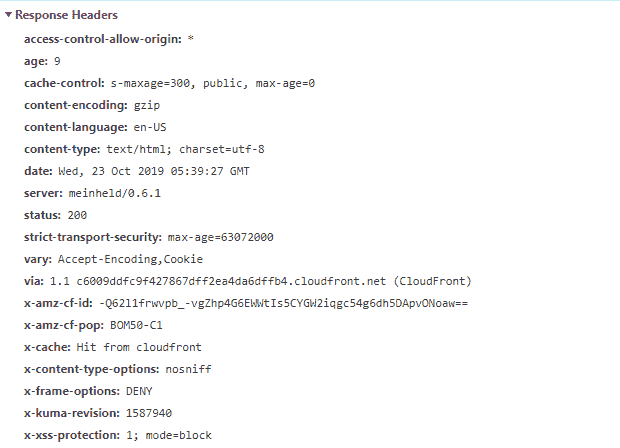

# HTTP 头 | Access-Control-Allow-Origin

> 原文: [https://www.geeksforgeeks.org/http-headers-access-control-allow-origin/](https://www.geeksforgeeks.org/http-headers-access-control-allow-origin/)

`Access-Control-Allow-Origin` 是一个响应头，用于指示该响应是否可以与来自给定源的请求代码共享。

## 语法:

```html
Access-Control-Allow-Origin: * | <origin> | null
```

## 指令:

`Access-Control-Allow-Origin` 接受上面提到的和下面描述的指令类型:

*   `*`: 这个指令告诉浏览器允许来自任何来源的请求代码访问资源。用作通配符。
*   `<origin>`: 本指令定义任何单一原点。
*   `null`: 该指令定义了 `null`，由于任何来源都可能创建一个“null”Origin 的敌对文档，因此不应使用该 `null`。因此，应避免使用 `Access-Control-Allow-Origin` 标题的“空”值。

## 示例:

*   这个例子告诉浏览器允许任何来源的代码访问资源。

```html
Access-Control-Allow-Origin: *
```

*   一个告诉浏览器允许来自源 `https://www.geeksforgeeks.org` 的请求代码访问资源的响应将包含以下内容:

```html
Access-Control-Allow-Origin: https://www.geeksforgeeks.org
```

这里，将源请求头的值与允许的源列表进行比较，如果响应头源值存在于该比较列表中。然后将 `Access-Control-Allow-Origin` 值设置为与原点值相同的值。

要检查此 `Access-Control-Allow-Origin` 的操作，请转到检查 **元素 -> 网络** 检查 `Access-Control-Allow-Origin` 的响应头如下所示，`Access-Control-Allow-Origin` 高亮显示，您可以看到。


## 支持的浏览器:

兼容 `Access-Control-Allow-Origin` HTTP 头的浏览器如下:

*   谷歌 Chrome 4.0
*   Internet Explorer 10.0
*   Firefox 3.5
*   Safari 4.0
*   Opera 12.0