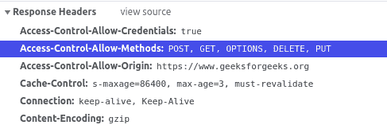

# HTTP 头 | Access-Control-Request-Method

> 原文: [https://www.geeksforgeeks.org/http-headers-access-control-request-method/](https://www.geeksforgeeks.org/http-headers-access-control-request-method/)

`Access-Control-Request-Method` 是一个请求类型头，用于通知服务器在发出实际请求时将使用哪种 HTTP 方法。

## 语法

```
Access-Control-Request-Method: <method>
```

## 指令

该标题接受上面提到的和下面描述的单个指令:

*   `<method>`: 该指令包含实际请求时将使用的方法。

## 注意

实际会提出请求时，可以使用多种方法。

## 示例

*   ```
    Access-Control-Request-Method: POST
    ```

*   ```
    Access-Control-Request-Method: GET, PUT
    ```

要检查此 `Access-Control-Request-Method` 是否正在运行，请转到 **检查元素 -> 网络**，检查请求头中的 `Access-Control-Request-Method`，如下所示，`Access-Control-Request-Method` 高亮显示，您可以看到。


## 支持的浏览器

兼容 `Access-Control-Request-Method` 的浏览器如下:

*   谷歌 Chrome
*   微软公司出品的 web 浏览器
*   火狐浏览器
*   旅行队
*   歌剧