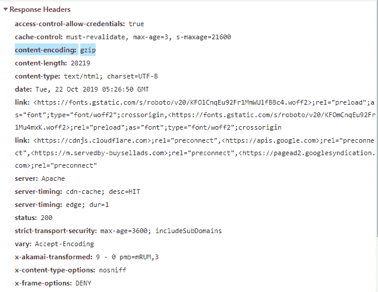

# HTTP 头: 内容编码

> 原文: [https://www.geeksforgeeks.org/http-headers-content-encoding/](https://www.geeksforgeeks.org/http-headers-content-encoding/)

**HTTP 头内容编码**用于压缩媒体类型。它通知服务器用户将支持哪种编码。它将信息发送到`Accept-Encoding`。服务器选择提议中的任何一个，使用它并用`Content-Encoding`响应头通知客户端它的选择。

## 语法

```
Content-Encoding: gzip | compress | deflate | br | identity
```

**注意:** 也可以应用多种算法。

## 指令

*   `gzip`: 它使用莱姆佩尔-齐夫编码(LZ77)，32 位 CRC 格式。它是 UNIX `gzip` 程序的原始格式。
*   `compress`: 采用莱姆佩尔-齐夫-韦尔奇(LZW)算法。由于专利问题，许多现代浏览器不支持这种类型的内容编码。
*   `deflate`: 该格式采用 zlib 结构，带有 `deflate` 压缩算法。
*   `br`: 这是一种使用 Brotli 算法的压缩格式。
*   `identity`: 表示没有压缩。

你可以查看你的`Accept-Encoding`和`Content-Encoding`在这个[网站上的表现。](https://gtmetrix.com)

## 示例

*   单次压缩:

```
Content-Encoding: gzip
Content-Encoding: compress
```

*   多重压缩:

```
Content-Encoding: gzip, compress
```

要检查`Content-Encoding`是否正在运行，请转到检查**元素 -> 网络**，检查`Content-Encoding`的请求头，如下所示，`Content-Encoding`高亮显示，您可以看到。


## 支持的浏览器

与 **HTTP 头内容编码**兼容的浏览器如下:

*   谷歌 Chrome
*   微软公司出品的 web 浏览器
*   火狐浏览器
*   旅行队
*   歌剧