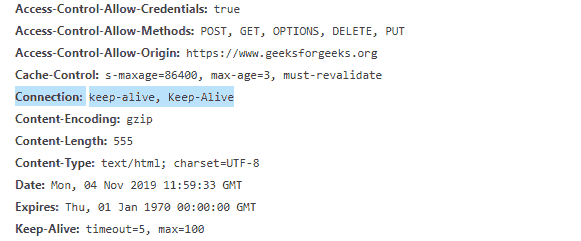

# HTTP 头：Keep-Alive

> 原文：[https://www.geeksforgeeks.org/http-headers-keep-alive/](https://www.geeksforgeeks.org/http-headers-keep-alive/)

`Keep-Alive`头是通用型头。此标头用于提示如何使用连接来设置超时和最大请求量。它还可以用于允许单个 TCP 连接对多个 HTTP 请求/响应保持开放（默认的 HTTP 连接在每个请求后关闭）。它也被称为持久连接。启用`Keep-Alive`完全取决于您使用的服务器和您拥有的访问权限。

## 语法

```html
Keep-Alive: parameters
```

## 指令

此标题接受如上所述的单一指令，如下所述：

*   **参数：**该指令保存两个逗号分隔的参数`timeout`和`max`。`timeout`参数保存连接必须保持打开的最短时间（以秒为单位）。`max`参数包含一个整数，用于定义在关闭连接之前可以向该连接发送多少请求。

## 示例

在本例中，`Connection`头必须设置为`Keep-Alive`。

```html
HTTP/1.1 200 OK
Connection: Keep-Alive
Content-Encoding: gzip
Content-Type: text/html; charset=utf-8
Date: Thu, 17 Feb 2020 18:23:13 GMT
Keep-Alive: timeout=5, max=1000
Last-Modified: Mon, 17 Feb 2020 04:32:39 GMT
Server: Apache
```

要检查此`Keep-Alive`是否正在运行，请转到“检查元素” -> “网络”选项卡，检查如下所示的`Keep-Alive`头。


## 支持的浏览器

与`Keep-Alive`头兼容的浏览器如下：

*   谷歌 Chrome
*   微软公司出品的 web 浏览器
*   火狐浏览器
*   旅行队
*   歌剧