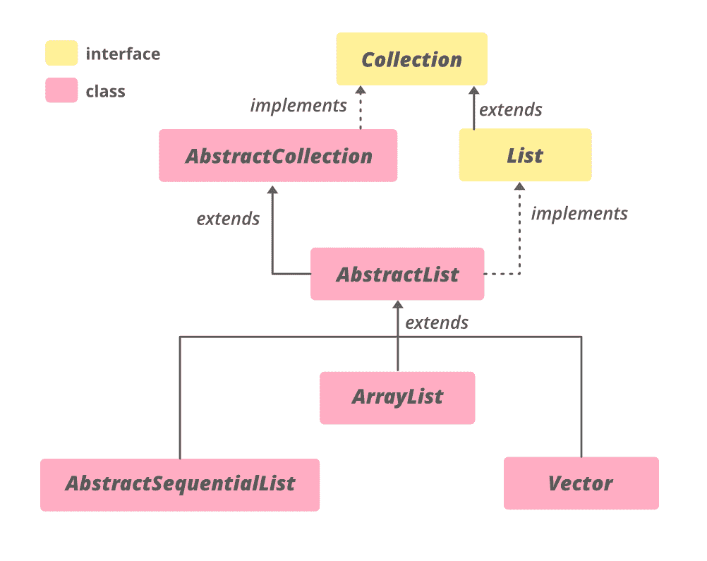

# Java 抽象列表，带示例

> 原文：[https://www.geeksforgeeks.org/abstractlist-in-java-with-examples/](https://www.geeksforgeeks.org/abstractlist-in-java-with-examples/)

Java 中的 `AbstractList` 类是 [Java 集合框架](https://www.geeksforgeeks.org/collections-in-java-2/)的一部分，实现了 `Collection` 接口和 [`AbstractCollection`](https://www.geeksforgeeks.org/abstractcollection-in-java-with-examples/#:~:text=The%20AbstractCollection%20class%20in%20Java,iterator%20and%20the%20size%20methods.) 类。该类提供了 `List` 接口的框架实现，以最小化实现该接口所需的工作量，该接口由**随机访问**数据存储(如数组)支持。对于顺序访问数据(如链表)，应优先使用 [`AbstractSequentialList`](https://www.geeksforgeeks.org/abstractsequentiallist-in-java-with-examples/)。

要实现一个不可修改的列表，只需要扩展这个抽象列表类并实现 [`get(int)`](https://www.geeksforgeeks.org/abstractlist-get-method-in-java-with-examples/) 和 [`size()`](https://www.geeksforgeeks.org/list-size-method-in-java-with-examples/) 方法。为了实现一个可修改的列表，需要额外覆盖 [`set(int index, E element)`](https://www.geeksforgeeks.org/abstractlist-set-method-in-java-with-examples/) 方法(否则会抛出一个 `UnsupportedOperationException`)。如果列表是可变大小的，应该覆盖 [`add(int, E)`](https://www.geeksforgeeks.org/abstractlist-adde-ele-method-in-java-with-examples/) 和 [`remove(int)`](https://www.geeksforgeeks.org/abstractlist-remove-method-in-java-with-examples/) 方法。

**等级:**



**声明:**

```java
public abstract class AbstractList<E> extends AbstractCollection<E> implements List<E>

where E is the type of elements maintained by this collection.
```

**构造函数:** `protected AbstractList()` – 默认构造函数，但受保护，不允许创建 `AbstractList` 对象。

```java
AbstractList<E> al = new ArrayList<E>();
```

**示例 1:** `AbstractList` 是一个[抽象类](https://www.geeksforgeeks.org/abstract-classes-in-java/)，因此应该为它分配一个子类的实例，如 [`ArrayList`](https://www.geeksforgeeks.org/arraylist-in-java/)、[`LinkedList`](https://www.geeksforgeeks.org/linked-list-in-java/) 或 [`Vector`](https://www.geeksforgeeks.org/java-util-vector-class-java/)。

## 代码示例

```java
// Java code to illustrate AbstractList
import java.util.*;

public class AbstractListDemo {
    public static void main(String args[])
    {
        // Creating an empty AbstractList
        AbstractList<String> list = new ArrayList<String>();

        // Use add() method to add elements in the list
        list.add("Geeks");
        list.add("for");
        list.add("Geeks");
        list.add("10");
        list.add("20");

        // Displaying the AbstractList
        System.out.println("AbstractList:" + list);
    }
}
```

**输出:**

```java
AbstractList:[Geeks, for, Geeks, 10, 20]
```

**例 2:**

## 代码示例

```java
// Java code to illustrate
// methods of AbstractCollection

import java.util.*;

public class AbstractListDemo {
    public static void main(String args[])
    {
        // Creating an empty AbstractList
        AbstractList<String>
            list = new LinkedList<String>();

        // Using add() method to add elements in the list
        list.add("Geeks");
        list.add("for");
        list.add("Geeks");
        list.add("10");
        list.add("20");

        // Output the list
        System.out.println("AbstractList: " + list);

        // Remove the head using remove()
        list.remove(3);

        // Print the final list
        System.out.println("Final AbstractList: " + list);

        // getting the index of last occurence
        // using lastIndexOf() method
        int lastindex = list.lastIndexOf("A");

        // printing the Index
        System.out.println("Last index of A : "
                        + lastindex);
    }
}
```

**输出:**

```java
AbstractList: [Geeks, for, Geeks, 10, 20]
Final AbstractList: [Geeks, for, Geeks, 20]
Last index of A : -1
```

### **AbstractList 中的方法**

| 方法 | 描述 |
| --- | --- |
| `add(int index, E element)` | 在列表中的指定位置插入指定元素(可选操作)。 |
| [`add(E e)`](https://www.geeksforgeeks.org/abstractlist-adde-ele-method-in-java-with-examples/) | 将指定的元素追加到该列表的末尾(可选操作)。 |
| `addAll(int index, Collection<? extends E> c)` | 将指定集合中的所有元素插入列表中的指定位置(可选操作)。 |
| [`clear()`](https://www.geeksforgeeks.org/abstractlist-clear-method-in-java-with-examples/#:~:text=The%20clear()%20method%20of,empty%20after%20this%20call%20returns.) | 从此列表中移除所有元素(可选操作)。 |
| [`equals(Object o)`](https://www.geeksforgeeks.org/abstractlist-equals-method-in-java-with-examples/) | 将指定的对象与该列表进行比较，看是否相等。 |
| [`get(int index)`](https://www.geeksforgeeks.org/abstractlist-get-method-in-java-with-examples/) | 返回列表中指定位置的元素。 |
| [`hashCode()`](https://www.geeksforgeeks.org/abstractlist-hashcode-method-in-java-with-examples/) | 返回此列表的哈希代码值。 |
| [`indexOf(Object o)`](https://www.geeksforgeeks.org/abstractlist-indexof-method-in-java-with-examples/) | 返回此列表中指定元素的第一个匹配项的索引，如果此列表不包含该元素，则返回-1。 |
| [`iterator()`](https://www.geeksforgeeks.org/abstractlist-iterator-method-in-java-with-examples/) | 以适当的顺序返回列表中元素的迭代器。 |
| [`lastIndexOf(Object o)`](https://www.geeksforgeeks.org/abstractlist-lastindexof-method-in-java-with-examples/) | 返回此列表中指定元素最后一次出现的索引，如果此列表不包含该元素，则返回-1。 |
| [`listIterator()`](https://www.geeksforgeeks.org/abstractlist-listiterator-method-in-java-with-examples/) | 返回列表中元素的列表迭代器(按正确的顺序)。 |
| [`listIterator(int index)`](https://www.geeksforgeeks.org/abstractlist-listiterator-method-in-java-with-examples/) | 从列表中的指定位置开始，返回列表中元素的列表迭代器(按正确的顺序)。 |
| [`remove(int index)`](https://www.geeksforgeeks.org/abstractlist-remove-method-in-java-with-examples/#:~:text=The%20remove(int%20index)%20method,a%20specific%20position%20or%20index.&text=Parameters%3A%20The%20parameter%20index%20is,be%20removed%20from%20the%20AbstractList.) | 移除列表中指定位置的元素(可选操作)。 |
| `removeRange(int fromIndex, int toIndex)` | 从该列表中删除索引介于 `fromIndex`(包含)和 `toIndex`(不包含)之间的所有元素。 |
| [`set(int index, E element)`](https://www.geeksforgeeks.org/abstractlist-set-method-in-java-with-examples/#:~:text=The%20set()%20method%20of,of%20the%20set()%20method.) | 用指定的元素替换列表中指定位置的元素(可选操作)。 |
| [`subList(int fromIndex, int toIndex)`](https://www.geeksforgeeks.org/abstractlist-sublist-method-in-java-with-examples/) | 返回此列表中指定的 `fromIndex`(包含)和 `toIndex`(不包含)之间的部分的视图。 |

### java.util.AbstractCollection 类中声明的方法

| 方法 | 描述 |
| --- | --- |
| [`addAll(Collection<? extends E> c)`](https://www.geeksforgeeks.org/abstractcollection-addall-method-in-java-with-examples/) | 将指定集合中的所有元素添加到此集合中(可选操作)。 |
| [`contains(Object o)`](https://www.geeksforgeeks.org/abstractcollection-contains-method-in-java-with-examples/) | 如果此集合包含指定的元素，则返回 `true`。 |
| [`containsAll(Collection<?> c)`](https://www.geeksforgeeks.org/abstractcollection-containsall-method-in-java-with-examples/) | 如果此集合包含指定集合中的所有元素，则返回 `true`。 |
| [`isEmpty()`](https://www.geeksforgeeks.org/abstractcollection-isempty-method-in-java-with-examples/) | 如果此集合不包含元素，则返回 `true`。 |
| [`remove(Object o)`](https://www.geeksforgeeks.org/abstractcollection-remove-method-in-java-with-examples/#:~:text=The%20remove(Object%20O)%20method,particular%20element%20from%20a%20Collection.&text=Parameters%3A%20The%20parameter%20O%20is,be%20removed%20from%20the%20collection.) | 从该集合中移除指定元素的单个实例(如果存在)(可选操作)。 |
| [`removeAll(Collection<?> c)`](https://www.geeksforgeeks.org/abstractcollection-removeall-method-in-java-with-example/) | 移除此集合中也包含在指定集合中的所有元素(可选操作)。 |
| [`retainAll(Collection<?> c)`](https://www.geeksforgeeks.org/abstractcollection-retainall-method-in-java-with-examples/) | 仅保留此集合中包含在指定集合中的元素(可选操作)。 |
| [`toArray()`](https://www.geeksforgeeks.org/abstractcollection-toarray-method-in-java-with-examples/) | 返回包含此集合中所有元素的数组。 |
| [`toArray(T[] a)`](https://www.geeksforgeeks.org/abstractcollection-toarray-method-in-java-with-examples/) | 返回包含此集合中所有元素的数组；返回数组的运行时类型是指定数组的运行时类型。 |
| [`toString()`](https://www.geeksforgeeks.org/abstractcollection-tostring-method-in-java-with-examples/) | 返回此集合的字符串表示形式。 |

### 接口 java.util.Collection 中声明的方法

| 方法 | 描述 |
| --- | --- |
| `parallelStream()` | 以此集合为源返回一个可能并行的流。 |
| `removeIf(Predicate<? super E> filter)` | 移除此集合中满足给定谓词的所有元素。 |
| `stream()` | 返回以此集合为源的顺序流。 |
| `toArray(IntFunction<T[]> generator)` | 使用提供生成器函数来分配返回的数组，返回包含此集合中所有元素的数组。 |

### 接口 `java.util.List` 中声明的方法

| 方法 | 描述 |
| --- | --- |
| [`addAll(Collection<? extends E> c)`](https://www.geeksforgeeks.org/list-addall-method-in-java-with-examples/) | 将指定集合中的所有元素追加到此列表的末尾，顺序如下它们由指定集合的迭代器返回(可选操作)。 |
| [`contains(Object o)`](https://www.geeksforgeeks.org/list-contains-method-in-java-with-examples/) | 如果此列表包含指定的元素，则返回 `true`。 |
| [`containsAll(Collection<?> c)`](https://www.geeksforgeeks.org/list-containsall-method-in-java-with-examples/#:~:text=The%20containsAll()%20method%20of,set%20of%20elements%20or%20not.&text=Parameters%3A%20This%20method%20accepts%20a,of%20the%20type%20of%20collection.) | 如果此列表包含指定集合的所有元素，则返回 `true`。 |
| [`isEmpty()`](https://www.geeksforgeeks.org/list-isempty-method-in-java-with-examples/) | 如果此列表不包含任何元素，则返回 `true`。 |
| `remove(int index)` | 移除列表中指定位置的元素(可选操作)。 |
| `removeAll(Collection<?> c)` | 从此列表中移除指定集合中包含的所有元素(可选操作)。 |
| `replaceAll(UnaryOperator<E> operator)` | 将列表中的每个元素替换为对该元素应用运算符的结果。 |
| [`retainAll(Collection<?> c)`](https://www.geeksforgeeks.org/list-retainall-method-in-java-with-examples/) | 仅保留此列表中包含在指定集合中的元素(可选操作)。 |
| [`size()`](https://www.geeksforgeeks.org/list-size-method-in-java-with-examples/#:~:text=The%20size()%20method%20of,present%20in%20this%20list%20container.&text=Parameters%3A%20This%20method%20does%20not,of%20elements%20in%20this%20list.) | 返回此列表中的元素数量。 |
| `sort(Comparator<? super E> c)` | 根据指定比较器引发的顺序对该列表进行排序。 |
| `spliterator()` | 在此列表中的元素上创建拆分器。 |
| `toArray()` | 返回一个数组，该数组按正确的顺序(从第一个元素到最后一个元素)包含列表中的所有元素。 |
| `toArray(T[] a)` | 返回一个数组，该数组包含此列表中按正确顺序排列的所有元素(从第一个元素到最后一个元素)；返回数组的运行时类型是指定数组的运行时类型。 |

**参考:** [`https://docs.oracle.com/en/java/javase/11/docs/api/java.base/java/util/AbstractList.html`](https://docs.oracle.com/en/java/javase/11/docs/api/java.base/java/util/AbstractList.html)

```
if (condVar > someVal) {console.log("xxx")}
```