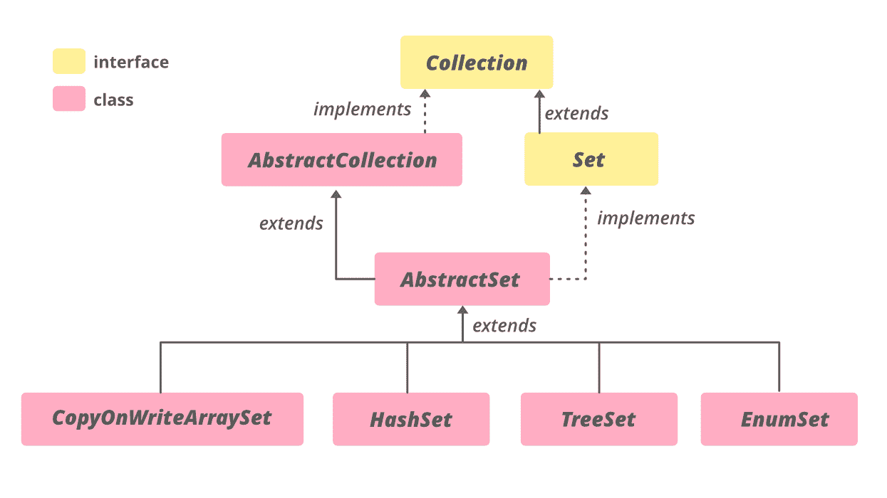

# 用示例在 Java 中抽象设置类

> 原文:[https://www . geesforgeks . org/abstract set-class-in-Java-with-examples/](https://www.geeksforgeeks.org/abstractset-class-in-java-with-examples/)

Java 中的**抽象集合**类是 [Java 集合框架](https://www.geeksforgeeks.org/collections-in-java-2/)的一部分，该框架实现了`Set`接口并扩展了`AbstractCollection`类。它提供了`Set`接口的框架实现。这个类没有覆盖`AbstractCollection`类的任何实现，只是添加了`equals()`和`hashCode()`方法的实现。

通过扩展此类实现集合的过程与通过扩展`AbstractCollection`实现集合的过程相同，只是此类子类中的所有方法和构造函数必须遵守`Set`接口施加的附加约束(例如，`add`方法不得允许向集合中添加对象的多个实例)。

**等级等级:**



**申报:**

```java
public abstract class AbstractSet<E>
  extends AbstractCollection<E>
     implements Set<E>

Where E is the type of elements maintained by this Set.
```

实现`Iterable<E>`、`Collection<E>`、`Set<E>`接口。直接子类为`ConcurrentSkipListSet`、`CopyOnWriteArraySet`、`EnumSet`、`HashSet`、`TreeSet`。

**构造函数:** `protected AbstractSet()`–默认构造函数，但受保护，不允许创建 abstract set 对象。

> `AbstractSet<E> set = new TreeSet<E>();`

**示例 1:** `AbstractSet`是一个抽象类，因此应该为其分配一个子类的实例，如`TreeSet`、`HashSet`或`EnumSet`。

## Java 语言(一种计算机语言，尤用于创建网站)

```java
// Java code to illustrate AbstractSet
import java.util.*;

public class GFG1 {
    public static void main(String[] args) throws Exception
    {

        try {

            // Creating object of AbstractSet<Integer>
            AbstractSet<Integer>
                abs_set = new TreeSet<Integer>();

            // Populating abs_set
            abs_set.add(1);
            abs_set.add(2);
            abs_set.add(3);
            abs_set.add(4);
            abs_set.add(5);

            // print abs_set
            System.out.println("AbstractSet: "
                               + abs_set);
        }
        catch (Exception e) {
            System.out.println(e);
        }
    }
}
```

**输出:**

```java
AbstractSet: [1, 2, 3, 4, 5]
```

**例 2:**

## Java 语言(一种计算机语言，尤用于创建网站)

```java
// Java code to illustrate
// methods of AbstractSet
import java.util.*;

public class GFG1 {

    public static void main(String[] args) throws Exception
    {

        try {

            // Creating object of AbstractSet<Integer>
            AbstractSet<Integer> abs_set = new TreeSet<Integer>();

            // Populating abs_set
            abs_set.add(1);
            abs_set.add(2);
            abs_set.add(3);
            abs_set.add(4);
            abs_set.add(5);

            // print abs_set
            System.out.println("AbstractSet before "
                               + "removeAll() operation : "
                               + abs_set);

            // Creating another object of ArrayList<Integer>
            Collection<Integer> arrlist2 = new ArrayList<Integer>();
            arrlist2.add(1);
            arrlist2.add(2);
            arrlist2.add(3);

            // print arrlist2
            System.out.println("Collection Elements"
                               + " to be removed : "
                               + arrlist2);

            // Removing elements from AbstractSet
            // specified in arrlist2
            // using removeAll() method
            abs_set.removeAll(arrlist2);

            // print arrlist1
            System.out.println("AbstractSet after "
                               + "removeAll() operation : "
                               + abs_set);
        }

        catch (NullPointerException e) {
            System.out.println("Exception thrown : " + e);
        }
    }
}
```

**输出:**

```java
AbstractSet before removeAll() operation : [1, 2, 3, 4, 5]
Collection Elements to be removed : [1, 2, 3]
AbstractSet after removeAll() operation : [4, 5]
```

### 抽象集合的方法

| 方法 | 描述 |
| --- | --- |
| [`equals(Object o)`](https://www.geeksforgeeks.org/abstractset-equals-method-in-java-with-examples/) | 将指定的对象与此相等集进行比较。 |
| [`hashCode()`](https://www.geeksforgeeks.org/abstractset-hashcode-method-in-java-with-examples/) | 返回该集合的哈希代码值。 |
| [`removeAll(Collection<?> c)`](https://www.geeksforgeeks.org/abstractset-removeall-method-in-java-with-examples/) | 从此集合中移除指定集合中包含的所有元素(可选操作)。 |

### java.util.AbstractCollection 类中声明的方法

| 方法 | 描述 |
| --- | --- |
| [`add(E e)`](https://www.geeksforgeeks.org/abstractcollection-add-method-in-java-with-examples/#:~:text=The%20add()%20method%20in,already%20present%20in%20the%20Collection.) | 确保此集合包含指定的元素(可选操作)。 |
| [`addAll(Collection<? extends E> c)`](https://www.geeksforgeeks.org/abstractcollection-addall-method-in-java-with-examples/) | 将指定集合中的所有元素添加到此集合中(可选操作)。 |
| [`clear()`](https://www.geeksforgeeks.org/abstractcollection-clear-method-in-java-with-examples/) | 从此集合中移除所有元素(可选操作)。 |
| [`contains(Object o)`](https://www.geeksforgeeks.org/abstractcollection-contains-method-in-java-with-examples/) | 如果此集合包含指定的元素，则返回 true。 |
| [`containsAll(Collection<?> c)`](https://www.geeksforgeeks.org/abstractcollection-containsall-method-in-java-with-examples/) | 如果此集合包含指定集合中的所有元素，则返回 true。 |
| [`isEmpty()`](https://www.geeksforgeeks.org/abstractcollection-isempty-method-in-java-with-examples/) | 如果此集合不包含元素，则返回 true。 |
| [`iterator()`](https://www.geeksforgeeks.org/absractcollection-iterator-method-in-java-with-examples/) | 返回此集合中包含的元素的迭代器。 |
| [`remove(Object o)`](https://www.geeksforgeeks.org/abstractcollection-remove-method-in-java-with-examples/#:~:text=The%20remove(Object%20O)%20method,particular%20element%20from%20a%20Collection.&text=Parameters%3A%20The%20parameter%20O%20is,be%20removed%20from%20the%20collection.) | 从该集合中移除指定元素的单个实例(如果存在)(可选操作)。 |
| [`retainAll(Collection<?> c)`](https://www.geeksforgeeks.org/abstractcollection-retainall-method-in-java-with-examples/) | 仅保留此集合中包含在指定集合中的元素(可选操作)。 |
| [`toArray()`](https://www.geeksforgeeks.org/abstractcollection-toarray-method-in-java-with-examples/) | 返回包含此集合中所有元素的数组。 |
| [`toArray(T[] a)`](https://www.geeksforgeeks.org/abstractcollection-toarray-method-in-java-with-examples/) | 返回包含此集合中所有元素的数组；返回数组的运行时类型是指定数组的运行时类型。 |
| [`toString()`](https://www.geeksforgeeks.org/abstractcollection-tostring-method-in-java-with-examples/) | 返回此集合的字符串表示形式。 |

### 接口 java.util.Collection 中声明的方法

| 方法 | 描述 |
| --- | --- |
| `parallelStream()` | 以此集合为源返回一个可能并行的流。 |
| `removeIf(Predicate<? super E> filter)` | 移除此集合中满足给定谓词的所有元素。 |
| `stream()` | 返回以此集合为源的顺序流。 |
| `toArray(IntFunction<T[]> generator)` | 使用提供的生成器函数分配返回的数组，返回包含此集合中所有元素的数组。 |

### 在接口 java.lang.Iterable 中声明的方法

| 方法 | 描述 |
| --- | --- |
| [`forEach(Consumer<? super T> action)`](https://www.geeksforgeeks.org/iterable-foreach-method-in-java-with-examples/) | 对`Iterable`的每个元素执行给定的操作，直到所有元素都被处理完或者该操作引发异常。 |

### 接口 `java.util.Set` 中声明的方法

| 方法 | 描述 |
| --- | --- |
| `add(E e)` | 如果指定元素尚不存在，则将指定元素添加到该集合中(可选操作)。 |
| `addAll(Collection<? extends E> c)` | 如果指定集合中的所有元素尚不存在，则将它们添加到该集合中(可选操作)。 |
| `clear()` | 从此集合中移除所有元素(可选操作)。 |
| `contains(Object o)` | 如果此集合包含指定的元素，则返回 `true`。 |
| `containsAll(Collection<?> c)` | 如果此集合包含指定集合的所有元素，则返回 `true`。 |
| `isEmpty()` | 如果此集合不包含元素，则返回 `true`。 |
| `iterator()` | 返回该集合中元素的迭代器。 |
| `remove(Object o)` | 如果存在指定的元素，则从该集中移除该元素(可选操作)。 |
| `retainAll(Collection<?> c)` | 仅保留该集合中包含在指定集合中的元素(可选操作)。 |
| `size()` | 返回该集合中的元素数量(其基数)。 |
| `spliterator()` | 在该集合中的元素上创建一个拆分器。 |
| `toArray()` | 返回包含该集合中所有元素的数组。 |
| `toArray(T[] a)` | 返回包含该集合中所有元素的数组；返回数组的运行时类型是指定数组的运行时类型。 |

参考：`https://docs.oracle.com/en/java/javase/11/docs/api/java.base/java/util/AbstractSet.html`