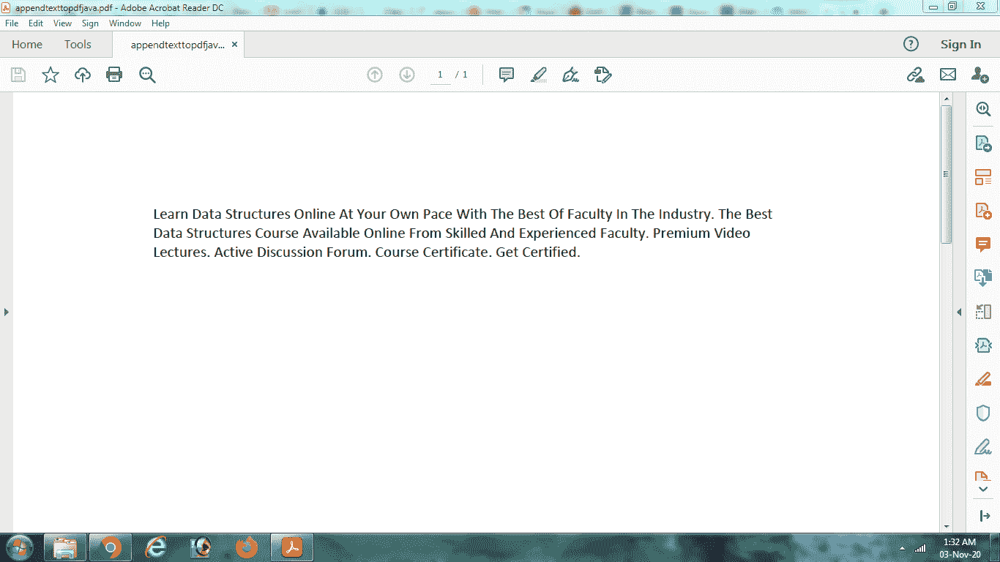

# 使用 Java 将段落作为文本添加到 PDF 中

> 原文：[https://www.geeksforgeeks.org/adding-paragraphs-as-text-to-a-pdf-using-java/](https://www.geeksforgeeks.org/adding-paragraphs-as-text-to-a-pdf-using-java/)

**iText** 是一个开源的 Java 库，用来访问和操作 PDF 文件，也就是对 PDF 内容进行提取和修改。Java 允许我们合并各种完全开发的包和模块，以便处理 PDF 文件。我们将看到如何使用 **iText** 库创建一个 PDF 文档并添加一个段落。

## 1. PdfWriter 类

Java 有一个内置的包 `com.itextpdf.kernel.pdf`，它基本上提供了用 Java 创建 PDF 文档的类和模块。这个包中的一个可用类是 `PdfWriter`。我们实例化这个类的一个对象，并将文件路径以及我们希望创建的新 PDF 文件的名称作为参数传递。一个对象被传递给这个类，以便将文本追加到指定的文件位置。下面的 Java 代码片段说明了这个类的用法：

```java
// path to create the file 
String file_path = "C:/appendtexttopdfjava.pdf";

// creating an object of PdfWriter class with file_path as argument
PdfWriter pdf_writer = new PdfWriter(file_path);
```

这将在 C: 盘中创建新的 PDF 文件，名称为 `appendtexttopdfjava.pdf`。

## 2. PdfDocument 类

包 `com.itextpdf.kernel.pdf` 包含另一个类来表示 iText 中指定的 PDF 文件，通过结合该类的各种方法，用户可以轻松添加各种功能，如页面字体、文件附件。需要通过将使用 `PdfWriter` 类创建的 `pdf_writer` 对象作为参数传递来实例化该类的对象。下面的 Java 代码片段说明了这个类的用法：

```java
// Representing PDF document in iText 
PdfDocument pdf_doc = new PdfDocument(pdf_writer);
```

## 3. Document 类

包 `com.itextpdf.layout` 的 `Document` 类将创建的 `PdfDocument` 对象作为参数，并实例化文档，该文档用作要执行的所有 PDF 操作的源。它充当需要修改或追加到文档文件中的内容的容器。

```java
// Instantiating a document object from pdf document object 
Document document = new Document(pdf_doc);
```

当创建这个类的对象时，文件被可视化为一个字符流，对其进行操作（添加新字符、修改以前的字符、删除等）都可以进行。

## 4. Paragraph 类

Java 内置包 `com.itextpdf.layout.element` 的 `Paragraph` 类基本上是 `Document` 类的子类。它使用文本流创建一个对象，即实际上要添加到 PDF 文档中的内容。内容可能是一个行块，需要使用 `Document` 类提供的 `add()` 方法添加到 `Document` 类对象中。`Paragraph` 类基本上是 `Document` 类的一个元素。可以创建多个 `Paragraph` 对象并将其添加到同一文档中。

将内容写入文档后，文档将被关闭。

```java
//content to be added to the pdf document
String paragraph = "Geeks For Geeks makes you learn coding. It also provides competitions";

//Creating a paragraph class object
Paragraph para_obj = new Paragraph (paragraph);

//adding paragraph to the document object 
document.add(para_obj);

//closing the document after writing the contents
document.close();
```

下面的 Java 代码指出了在 Java 文件中添加段落的功能：

### 完整代码示例

```java
// importing the required packages
import com.itextpdf.kernel.pdf.PdfDocument;
import com.itextpdf.kernel.pdf.PdfWriter;
import com.itextpdf.layout.Document;
import com.itextpdf.layout.element.Paragraph;

public class AppendtoPdf {
    public static void main(String args[]) throws Exception
    {
        // path to create the file
        String file_path = "C:/appendtexttopdfjava.pdf";

        // creating PdfWriter object
        PdfWriter pdf_writer = new PdfWriter(file_path);

        // Representing PdfDocument object
        PdfDocument pdf_doc = new PdfDocument(pdf_writer);

        // Creating a Document
        // Instantiating a document object from pdf document object
        Document document = new Document(pdf_doc);

        // paragraph to be added
        String para
            = "Learn Data Structures Online At Your Own Pace With "
              + "The Best Of Faculty In The Industry. "
              + "The Best Data Structures Course Available "
              + "Online From Skilled And Experienced "
              + "Faculty. Premium Video Lectures "
              + "Active Discussion Forum "
              + "Course Certificate. Get Certified.";

        // Creating Paragraph object
        Paragraph paragraph_obj
            = new Paragraph(para);

        // Adding paragraphs to document
        document.add(paragraph_obj);

        // Closing the document
        document.close();

        // final message
        System.out.println(
            "Finished writing contents to the file!");
    }
}
```

该代码在终端上执行时会在终端上产生以下输出，并在本地计算机上保存一个 C: 盘文件。

```
Finished writing contents to the file!
```

保存的 PDF 文件内容如下：

