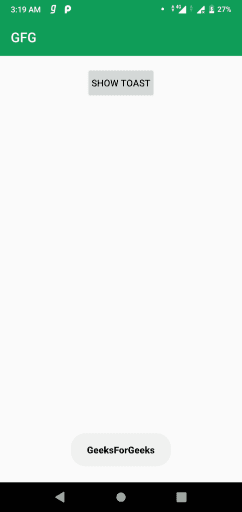

# 安卓 | 如何更改吐司字体？

> 原文: [https://www.geeksforgeeks.org/android-how-to-change-toast-font/](https://www.geeksforgeeks.org/android-how-to-change-toast-font/)

一个[吐司](https://www.geeksforgeeks.org/android-what-is-toast-and-how-to-use-it-with-examples/)是反馈信息。当整个活动是交互式的并且对用户可见时，它占用很少的显示空间。几秒钟后就消失了。它会自动消失。如果用户想要永久可见的消息，可以使用[通知](https://www.geeksforgeeks.org/notifications-in-android-oreo-8/)。

吐司会根据开发人员定义的吐司长度自动消失。更改吐司信息字体的步骤如下：

## 第一步：在 `activity_main.xml` 文件中添加按钮

在 `activity_main.xml` 文件中添加一个按钮，以自定义字体显示吐司信息。打开 `activity_main.xml` 文件，创建一个 id 为 `showToast` 的按钮。

```xml
<?xml version="1.0" encoding="utf-8"?>
<RelativeLayout 
    xmlns:android="http://schemas.android.com/apk/res/android"
    xmlns:app="http://schemas.android.com/apk/res-auto"
    xmlns:tools="http://schemas.android.com/tools"
    android:layout_width="match_parent"
    android:layout_height="match_parent"
    tools:context=".MainActivity">

    <!-- To show the Toolbar -->
    <android.support.v7.widget.Toolbar
        android:id="@+id/toolbar"
        android:layout_width="match_parent"
        android:background="@color/colorPrimary"
        app:title="GFG"
        app:titleTextColor="@android:color/white"
        android:layout_height="android:attr/actionBarSize"/>

    <!-- Button To show the toast message -->
    <Button
        android:id="@+id/showToast"
        android:layout_width="wrap_content"
        android:layout_height="wrap_content"
        android:text="Show Toast"
        android:layout_marginTop="16dp"
        android:padding="8dp"
        android:layout_below="@id/toolbar"
        android:layout_centerHorizontal="true"/>

</RelativeLayout>
```

## 第二步：在 `styles.xml` 文件中添加新样式

打开 `styles.xml` 文件并添加以下代码。这里使用 `sans-serif-black` 字体。

```xml
<!-- Toast Style -->
<style name="toastTextStyle" parent="TextAppearance.AppCompat">
    <item name="android:fontFamily">sans-serif-black</item>
</style>
```

## 第三步：在 `MainActivity.java` 中添加显示自定义吐司的函数

打开 `MainActivity.java` 文件，添加显示吐司的功能。使用 `makeText()` 方法创建吐司的新实例。使用 `getView()` 方法获取吐司的视图。

```java
private void showMessage(Boolean b, String msg) {
    // Creating new instance of Toast
    Toast toast = Toast.makeText(
        MainActivity.this,
        " " + msg + " ",
        Toast.LENGTH_SHORT);

    // Getting the View
    View view = toast.getView();

    // Finding the textview in Toast view
    TextView text = (TextView) view.findViewById(
        android.R.id.message);

    // Setting the Text Appearance
    if (Build.VERSION.SDK_INT >= Build.VERSION_CODES.M) {
        text.setTextAppearance(R.style.toastTextStyle);
    }

    // Showing the Toast Message
    toast.show();
}
```

## 第四步：为按钮设置 `setOnClickListener` 并显示吐司消息

要设置 `setOnClickListener()`，首先在 Java 文件中创建新的 `Button` 类实例，并使用 `xml` 文件中给出的 id 找到 `Button` 视图，然后在 `Button` 对象上调用 `setOnClickListener()` 方法。

```java
// Finding the button
Button showToast = findViewById(R.id.showToast);

// Setting the on click listener
showToast.setOnClickListener(new View.OnClickListener() {
    @Override
    public void onClick(View v) {
        // Calling the function to show toast message
        showMessage();
    }
});
```

## 完整代码文件

### `activity_main.xml`

```xml
<?xml version="1.0" encoding="utf-8"?>
<RelativeLayout 
    xmlns:android="http://schemas.android.com/apk/res/android"
    xmlns:app="http://schemas.android.com/apk/res-auto"
    xmlns:tools="http://schemas.android.com/tools"
    android:layout_width="match_parent"
    android:layout_height="match_parent"
    tools:context=".MainActivity">

    <!-- To show the Toolbar -->
    <android.support.v7.widget.Toolbar
        android:id="@+id/toolbar"
        android:layout_width="match_parent"
        android:background="@color/colorPrimary"
        app:title="GFG"
        app:titleTextColor="@android:color/white"
        android:layout_height="android:attr/actionBarSize"/>

    <!-- Button To show the toast message -->
    <Button
        android:id="@+id/showToast"
        android:layout_width="wrap_content"
        android:layout_height="wrap_content"
        android:text="Show Toast"
        android:layout_marginTop="16dp"
        android:padding="8dp"
        android:layout_below="@id/toolbar"
        android:layout_centerHorizontal="true"/>

</RelativeLayout>
```

### `styles.xml`

```xml
<resources>
    <!-- Base application theme. -->
    <style name="AppTheme" parent="Theme.AppCompat.Light.NoActionBar">
        <!-- Customize your theme here. -->
        <item name="colorPrimary">@color/colorPrimary</item>
        <item name="colorPrimaryDark">@color/colorPrimaryDark</item>
        <item name="colorAccent">@color/colorAccent</item>
    </style>

    <!-- Toast Style -->
    <style name="toastTextStyle" parent="TextAppearance.AppCompat">
        <item name="android:fontFamily">sans-serif-black</item>
    </style>
</resources>
```

### `MainActivity.java`

```java
package org.geeksforgeeks.customtoast;

import android.os.Build;
import android.support.v7.app.AppCompatActivity;
import android.os.Bundle;
import android.view.View;
import android.widget.Button;
import android.widget.TextView;
import android.widget.Toast;

public class MainActivity extends AppCompatActivity {
    @Override
    protected void onCreate(Bundle savedInstanceState) {
        super.onCreate(savedInstanceState);
        setContentView(R.layout.activity_main);

        // Finding the button
        Button showToast = findViewById(R.id.showToast);

        // Setting the on click listener
        showToast.setOnClickListener(new View.OnClickListener() {
            @Override
            public void onClick(View v) {
                showMessage();
            }
        });
    }

    private void showMessage() {
        // Creating new instance of Toast
        Toast toast = Toast.makeText(
            MainActivity.this,
            "GeeksForGeeks",
            Toast.LENGTH_SHORT);

        // Getting the View
        View view = toast.getView();

        // Finding the textview in Toast view
        TextView text = (TextView) view.findViewById(
            android.R.id.message);

        // Setting the Text Appearance
        if (Build.VERSION.SDK_INT >= Build.VERSION_CODES.M) {
            text.setTextAppearance(R.style.toastTextStyle);
        }

        // Showing the Toast Message
        toast.show();
    }
}
```

**输出:**
[](https://media.geeksforgeeks.org/wp-content/uploads/20190906032021/Screenshot_20190906-031903.png)