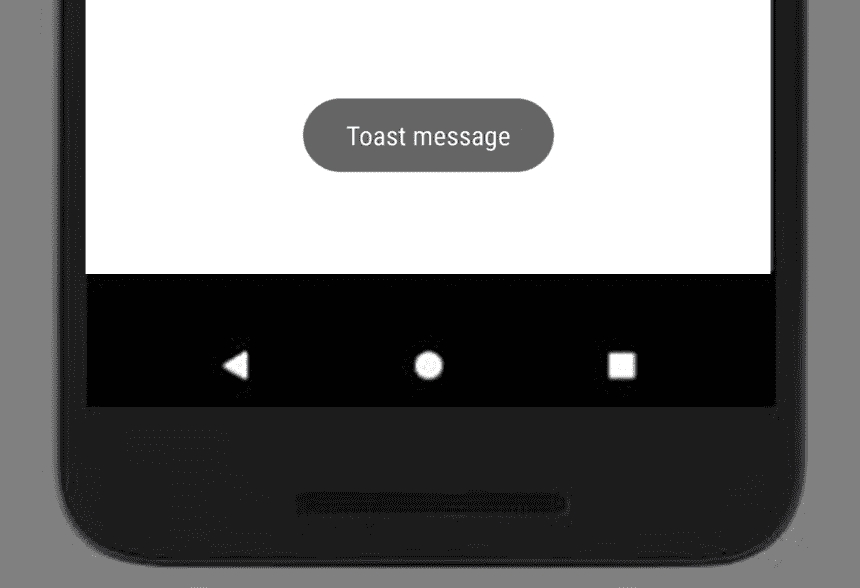
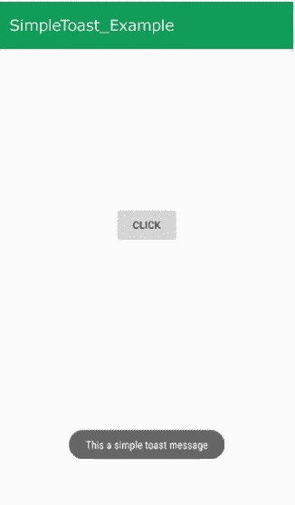
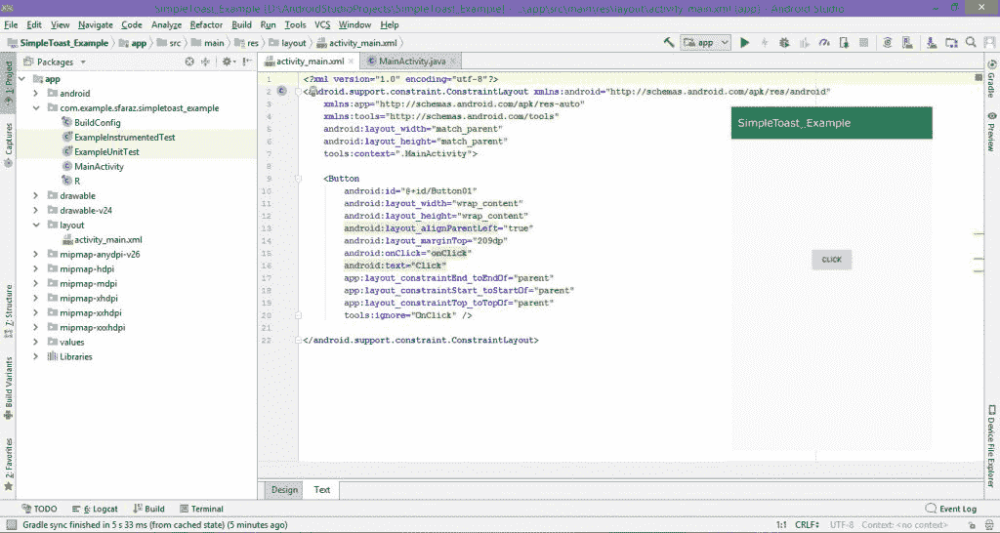
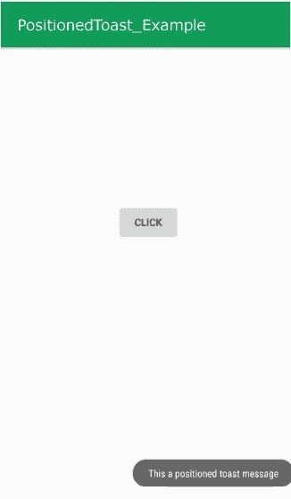

# 安卓 | 什么是吐司以及如何使用举例

> 原文: [https://www.geeksforgeeks.org/android-what-is-toast-and-how-to-use-it-with-examples/](https://www.geeksforgeeks.org/android-what-is-toast-and-how-to-use-it-with-examples/)

**先决条件:**

*   [新手安卓应用开发基础](https://www.geeksforgeeks.org/android-app-development-fundamentals-for-beginners/)
*   [安卓工作室安装设置指南](https://www.geeksforgeeks.org/guide-to-install-and-set-up-android-studio/)
*   [安卓 | 从第一个 app/安卓项目开始](https://www.geeksforgeeks.org/android-starting-with-first-app-android-project/)
*   [安卓 | 运行你的第一个安卓应用](https://www.geeksforgeeks.org/android-running-your-first-android-app/)

本文旨在讲述什么是吐司以及如何在安卓应用中使用它来显示消息。

## 安卓里什么是吐司？

一个 **[吐司](https://www.geeksforgeeks.org/toasts-android-studio/)** 是反馈信息。当整个活动是交互式的并且对用户可见时，它占用很少的显示空间。几秒钟后就消失了。它会自动消失。如果用户想要永久可见的消息，可以使用 **[通知](https://www.geeksforgeeks.org/notifications-in-android-oreo-8/)**。

另一种吐司是**自定义吐司**，可以用图片代替简单的信息。

**例:**
[](https://media.geeksforgeeks.org/wp-content/uploads/Toast.jpg)

**吐司类**: `Toast`类提供了一个简单的弹出消息，显示在当前活动 UI 屏幕上(如主活动)。

**吐司类的常数**

| 常数 | 描述 |
| --- | --- |
| `public static final int LENGTH_LONG` | 长时间显示 |
| `public static final int LENGTH_SHORT` | 短时间显示 |

**吐司类方法**

| 方法 | 描述 |
| --- | --- |
| `public static Toast makeText(Context context, CharSequence text, int duration)` | 使吐司信息由文本和持续时间组成 |
| `public void show()` | 显示祝酒信息 |
| `public void setMargin(float horizontalMargin, float verticalMargin)` | 改变水平和垂直差异 |

## 如何创建安卓应用程序来显示吐司信息(示例)

在本例中，“这是一条简单的敬酒信息”是一条**敬酒信息**，通过点击“点击”按钮显示。每次单击时，您的祝酒信息都会出现。

[](https://media.geeksforgeeks.org/wp-content/uploads/20190429174544/Android-Sample-Toast-Example.jpg)

**创建带有吐司信息的安卓应用程序的步骤:**

*   **步骤 1:** 创建一个 XML 文件和一个 Java 文件。请参考先决条件以了解有关此步骤的更多信息。
*   **步骤 2:** 打开 `activity_main.xml` 文件并添加一个 `Button` 来在 [Constraint Layout](https://www.geeksforgeeks.org/layouts-android-ui-design/) 中显示 Toast 消息。
    另外，为按钮组件分配 `id`，如下图和代码所示。按钮的指定 `id` 有助于识别和在 Java 文件中使用。

    ```java
    android:id="@+id/id_name"
    ```

    这里给定的 ID 是 `Button01`。

    这将使应用程序的用户界面。
    

*   **步骤 3:** 现在，完成 UI 后，此步骤将创建应用程序的后端。为此，打开 `MainActivity.java` 文件并使用 `findViewById()` 方法实例化在 XML 文件中创建的组件（`Button`）。此方法借助分配的 `id` 将创建的对象绑定到 UI 组件。
    **通用语法:**

    > `组件类型 对象 = (组件类型) findViewById(R.id.idOfTheComponent);`

    **已用组件的语法(点击按钮):**

    > `Button btn = (Button) findViewById(R.id.Button01);`

*   **步骤 4:** 该步骤包括设置显示祝酒信息的操作。这些操作如下:
    1.  在按钮上添加监听器，该按钮将显示祝酒信息。

        > `btn.setOnClickListener(new View.OnClickListener() { ... });`

    2.  现在，创建一个 toast 消息。`Toast.makeText()` 方法是一个预定义的方法，它创建一个 `Toast` 对象。

        **语法:**

        ```java
        public static Toast makeText (Context context,
                        CharSequence text,
                        int duration)
        ```

        **参数:** 该方法接受三个参数:

        *   `context`: 第一个参数是一个上下文对象，通过调用 `getApplicationContext()` 获得。

            ```java
            Context context = getApplicationContext();
            ```

        *   `text`: 第二个参数是你要显示的短信。

            ```java
            CharSequence text = "Your text message here";
            ```

        *   `duration`: 最后一个参数是消息的持续时间。

            ```java
            int duration = Toast.LENGTH_LONG;
            ```

        因此，发送祝酒信息的代码是:

        ```java
        Toast.makeText(getApplicationContext(),
                       "This a toast message",
                       Toast.LENGTH_LONG);
        ```

    3.  使用 `Toast` 类的 `show()` 方法显示创建的 Toast 消息。

        **语法:**

        ```java
        public void show ()
        ```

        **显示吐司信息的代码:**

        ```java
        Toast.makeText(getApplicationContext(),
                       "This a toast message",
                       Toast.LENGTH_LONG)
             .show();
        ```

*   **步骤 5:** 现在运行应用程序，操作如下:
    *   当应用程序打开时，它会显示一个“点击”按钮。
    *   单击单击按钮。
    *   然后“这是祝酒词”将作为祝酒词显示在屏幕上。

**完成代码以显示简单的祝酒信息:**

### activity_main.xml

```java
<?xml version="1.0" encoding="utf-8"?>
<android.support.constraint.ConstraintLayout
xmlns:android="http://schemas.android.com/apk/res/android"
    xmlns:app="http://schemas.android.com/apk/res-auto"
    xmlns:tools="http://schemas.android.com/tools"
    android:layout_width="match_parent"
    android:layout_height="match_parent"
    tools:context=".MainActivity">

 <!-- add button for generating Toast message -->
    <Button
        android:id="@+id/Button01"
        android:layout_width="wrap_content"
        android:layout_height="wrap_content"
        android:layout_alignParentLeft="true"
        android:layout_marginTop="209dp"
        android:onClick="onClick"
        android:text="Click"
        app:layout_constraintEnd_toEndOf="parent"
        app:layout_constraintStart_toStartOf="parent"
        app:layout_constraintTop_toTopOf="parent"
        tools:ignore="OnClick" />

</android.support.constraint.ConstraintLayout>
```

### MainActivity.java

```java
package org.geeksforgeeks.simpleToast_Example;

import android.support.v7.app.AppCompatActivity;
import android.os.Bundle;
import android.view.View;
import android.widget.Button;
import android.widget.Toast;

public class MainActivity extends AppCompatActivity {

    // Defining the object for button
    Button btn;

    @Override
    protected void onCreate(Bundle savedInstanceState)
    {
        super.onCreate(savedInstanceState);
        setContentView(R.layout.activity_main);

        // Bind the components to their respective objects
        // by assigning their IDs
        // with the help of findViewById() method
        Button btn = (Button)findViewById(R.id.Button01);

        btn.setOnClickListener(new View.OnClickListener() {
            @Override
            public void onClick(View v)
            {
                // Displaying simple Toast message
                Toast.makeText(getApplicationContext(),
                               "This a toast message",
                               Toast.LENGTH_LONG)
                    .show();
            }
        });
    }
}
```

**输出:**
[](https://media.geeksforgeeks.org/wp-content/uploads/20190429183146/Android-Sample-Toast-Example1.jpg)

## 如何更改吐司信息的位置(示例)

如果需要设置吐司信息的位置，可以使用 `setGravity()` 方法。

```java
public void setGravity (int gravity,
                int xOffset,
                int yOffset)
```

**参数:** 该方法接受三个参数:

*   `gravity`: This sets the position of the Toast message. Following constants can be used to specify the position of a Toast:

    ```java
    1. TOP
    2. BOTTOM
    3. LEFT
    4. RIGHT
    5. CENTER
    6. CENTER_HORIZONTAL
    7. CENTER_VERTICAL
    ```

    每个常量指定 X 轴和 Y 轴的位置，除了 `CENTER` 常量设置水平和垂直方向的居中位置。

*   `xOffset`: 这是一个偏移量值，它告诉我们在 x 轴上水平移动 Toast 消息的量。
*   `yOffset`: 这是偏移值，告诉在 y 轴上垂直移动 Toast 消息多少。

**例如:**

> 1.  要在中间显示吐司:
>     `toast.setGravity(Gravity.CENTER, 0, 0);`
> 2.  要在顶部水平居中显示吐司:
>     `toast.setGravity(Gravity.TOP | Gravity.CENTER_HORIZONTAL, 0, 0);`
> 3.  要在顶部显示吐司，水平居中，但从顶部向下 30 像素:
>     `toast.setGravity(Gravity.TOP | Gravity.CENTER_HORIZONTAL, 0, 30);`
> 4.  要在底部水平最右侧显示吐司:
>     `toast.setGravity(Gravity.BOTTOM | Gravity.RIGHT, 0, 0);`

**示例:** 在下面的示例中，吐司显示在右下角的位置。

**语法:**

```java
Toast t = Toast.makeText(getApplicationContext(),
                         "This a positioned toast message",
                         Toast.LENGTH_LONG);
t.setGravity(Gravity.BOTTOM | Gravity.RIGHT, 0, 0);
t.show();
```

**完整代码:**

## activity_main.xml

```xml
<?xml version="1.0" encoding="utf-8"?>
<android.support.constraint.ConstraintLayout
xmlns:android="http://schemas.android.com/apk/res/android"
    xmlns:app="http://schemas.android.com/apk/res-auto"
    xmlns:tools="http://schemas.android.com/tools"
    android:layout_width="match_parent"
    android:layout_height="match_parent"
    tools:context=".MainActivity">

 <!-- add a button to display positioned toast message -->
    <Button
        android:id="@+id/Button01"
        android:layout_width="wrap_content"
        android:layout_height="wrap_content"
        android:layout_alignParentLeft="true"
        android:layout_marginTop="209dp"
        android:onClick="onClick"
        android:text="Click"
        app:layout_constraintEnd_toEndOf="parent"
        app:layout_constraintStart_toStartOf="parent"
        app:layout_constraintTop_toTopOf="parent"
        tools:ignore="OnClick" />

</android.support.constraint.ConstraintLayout>
```

## MainActivity.java

```java
package org.geeksforgeeks.positionedToast_Example;

import android.support.v7.app.AppCompatActivity;
import android.os.Bundle;
import android.view.Gravity;
import android.view.View;
import android.widget.Button;
import android.widget.Toast;

public class MainActivity extends AppCompatActivity {

    // Defining the object for button
    Button btn;

    @Override
    protected void onCreate(Bundle savedInstanceState)
    {
        super.onCreate(savedInstanceState);
        setContentView(R.layout.activity_main);

        // Binding the components to their respective objects
        // by assigning their IDs
        // with the help of findViewById() method
        Button btn = (Button)findViewById(R.id.Button01);

        btn.setOnClickListener(new View.OnClickListener() {
            @Override
            public void onClick(View v)
            {

                // Displaying posotioned Toast message
                Toast t = Toast.makeText(getApplicationContext(),
                                         "This a positioned toast message",
                                         Toast.LENGTH_LONG);
                t.setGravity(Gravity.BOTTOM | Gravity.RIGHT, 0, 0);
                t.show();
            }
        });
    }
}
```

## Output

[](https://media.geeksforgeeks.org/wp-content/uploads/20190429183144/Android-Sample-Positioned-Toast-Example.jpg)