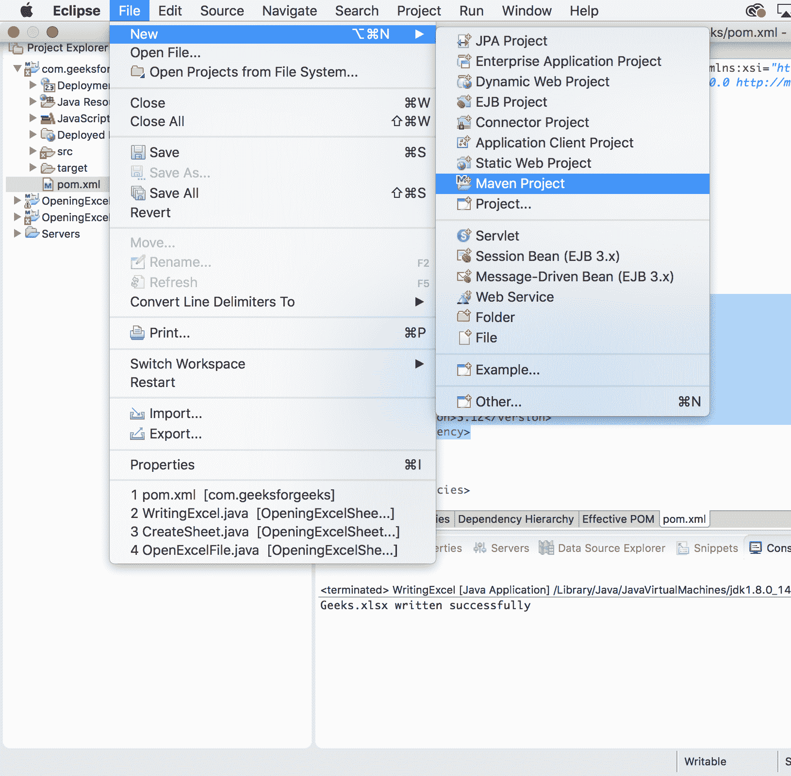
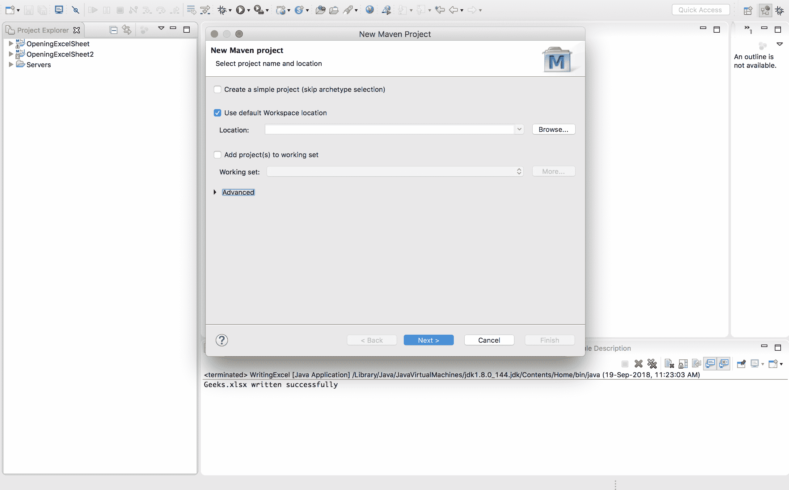
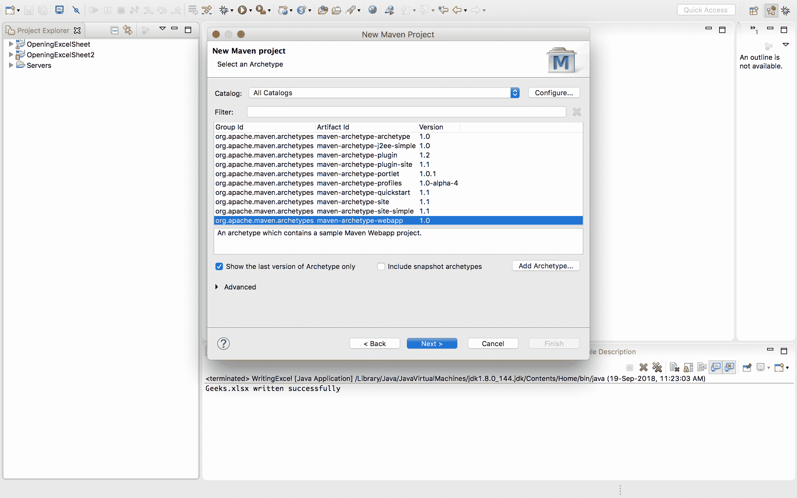
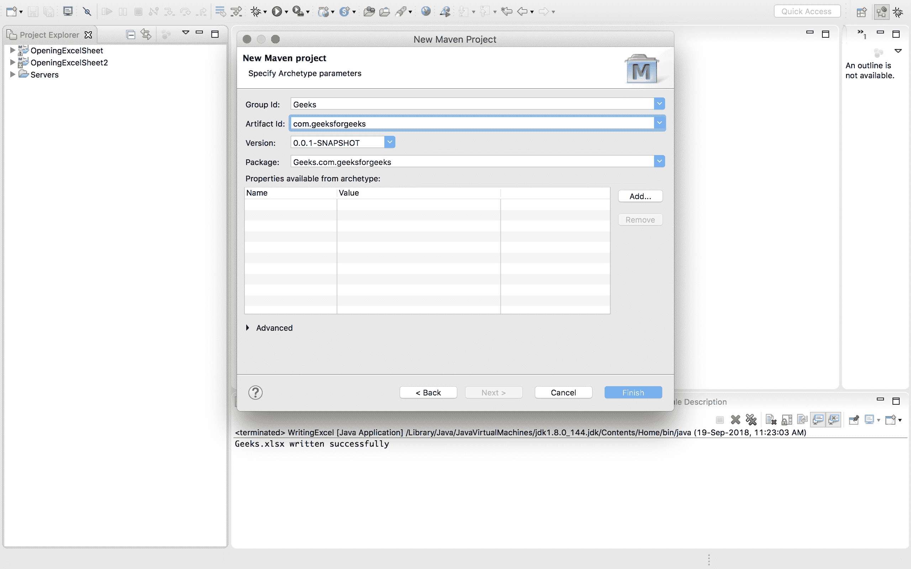
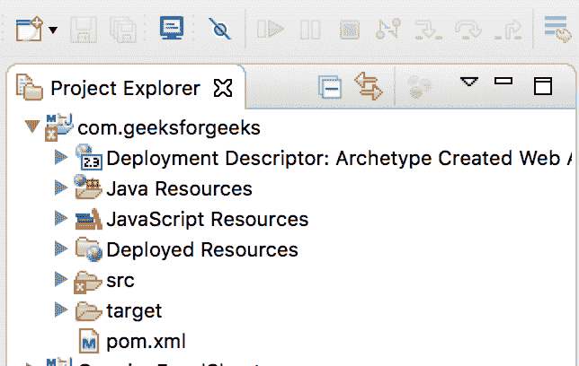
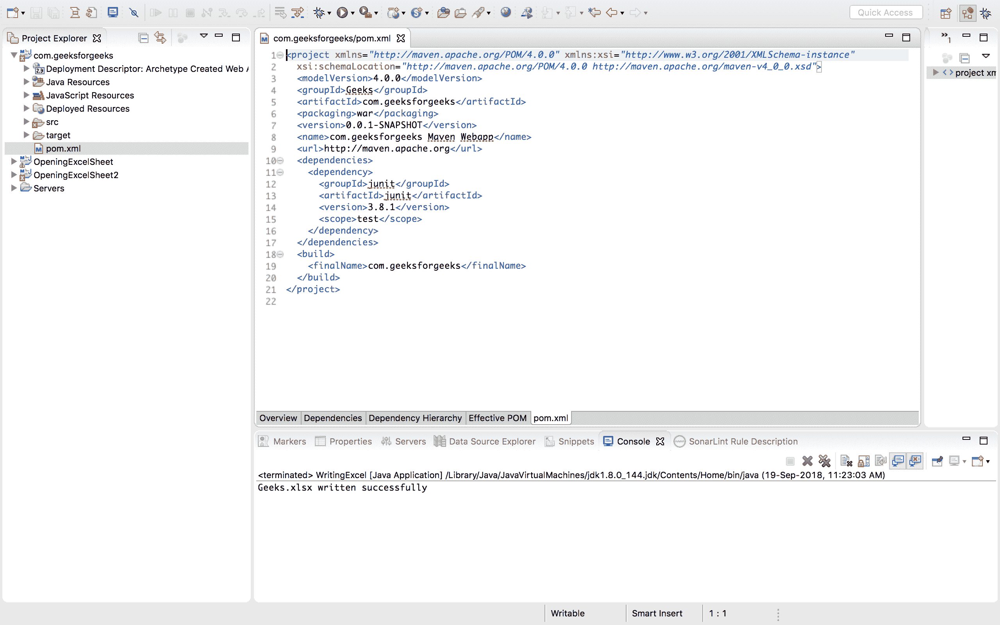
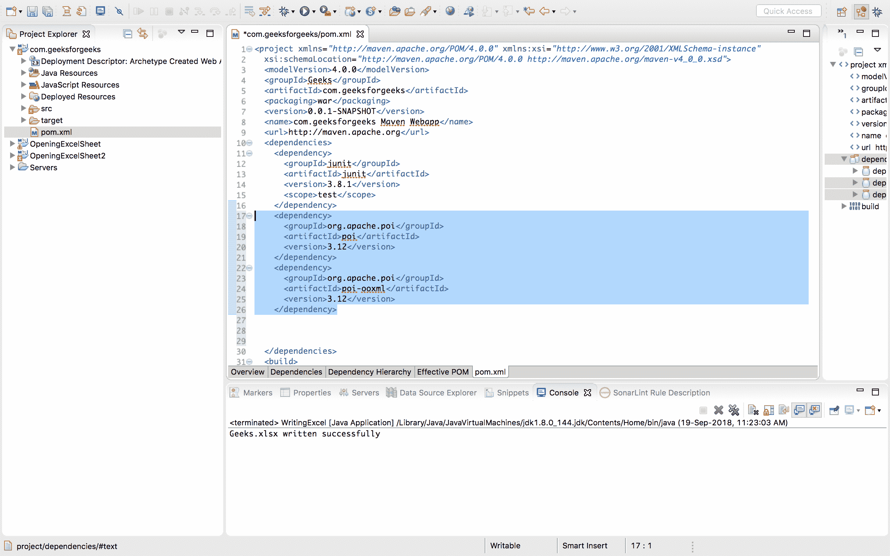
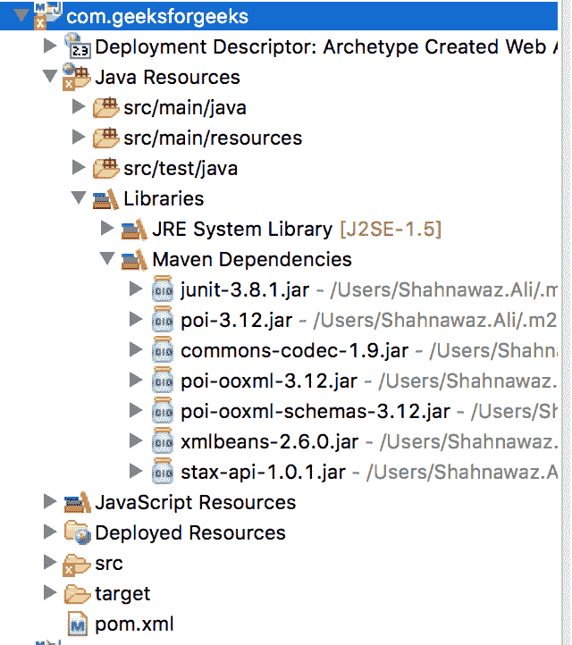

# Apache POI 入门

> 原文: [https://www.geeksforgeeks.org/apache-poi-getting-started/](https://www.geeksforgeeks.org/apache-poi-getting-started/)

**POI** 代表 **“混淆实现不佳”**。Apache POI 是由 **Apache 基金会**提供的一个 API，它是不同 Java 库的集合。这些库提供了读取、写入和操作不同微软文件的功能，如 Excel 工作表、PowerPoint 和 Word 文件。它的第一个版本于 2001 年 12 月 30 日发布。

## Apache POI 架构

Apache POI 有不同的类和方法来处理不同的微软办公文档。

*   **POIFS**
    它代表“糟糕的混淆实现文件系统”。该组件是所有其他 POI 元素的基本因素。它用于显式读取不同的文件。
*   **HSSF**
    代表“可怕的电子表格格式”。用于读写 MS-Excel 文件的 `.xls` 格式。
*   **XSSF**
    它代表“XML 电子表格格式”。用于 MS-Excel 的 `.xlsx` 文件格式。
*   **HPSF**
    代表“恐怖属性集格式”。它用于提取微软办公文件的属性集。
*   **HWPF**
    代表“可怕的文字处理器格式”。用于 MS-Word 文档扩展文件的读写。
*   **XWPF**
    它代表“XML 文字处理器格式”。用于读写 MS-Word 的 `.docx` 扩展文件。
*   **HSLF**
    代表“恐怖的幻灯片版式”。它用于阅读、创建和编辑 PowerPoint 演示文稿。
*   **HDGF**
    代表“恐怖图表格式”。它包含用于 MS-Visio 二进制文件的类和方法。
*   **HPBF**
    代表“可怕的出版商格式”。用于读写微软发布者文件。

## 安装

根据项目的类型，有两种安装 Apache JAR 文件的方法：

### Maven Project

如果项目是 MAVEN，那么在项目的 `pom.xml` 文件中添加依赖项。要添加的依赖关系如下所示：

```xml
<!-- https://mvnrepository.com/artifact/org.apache.poi/poi -->
<dependency>
    <groupId>org.apache.poi</groupId>
    <artifactId>poi</artifactId>
    <version>3.12</version>
</dependency>
<dependency>
    <groupId>org.apache.poi</groupId>
    <artifactId>poi-ooxml</artifactId>
    <version>3.12</version>
</dependency>
```

**在 Eclipse 中创建 Maven 项目并添加依赖关系的步骤**

*   点击文件 -> 新建 -> Maven 项目
    
*   出现一个新窗口，点击下一步
    
*   选择 `maven-archetype-webapp`
    
*   给出项目名称
    
*   工作区中形成一个项目，并自动出现一个 `pom.xml` 文件
    
*   在现有结构的 `pom.xml` 文件中打开该文件
    
*   在 `pom.xml` 文件中复制 Apache POI 依赖关系
    
*   Maven 依赖项是在复制 Maven 依赖项后保存 `pom.xml` 文件时添加的。
    

### Simple Java Project

如果不使用 Maven，那么可以从 [POI 下载](http://poi.apache.org/download.html) 下载 JAR 文件。运行示例代码至少要包含以下 JAR 文件：

> `poi-3.10-final.jar`
> `poi-ooxml-3.10-final.jar`
> `commons-codec-1.5.jar`
> `poi-ooxml-schemas-3.10-final.jar`
> `xml-apis-1.0.b2.jar`
> `stax-api-1.0.1.jar`
> `xmlbeans-2.3.0.jar`

跟着这个 [链接](https://stackoverflow.com/questions/3280353/how-to-import-a-jar-in-eclipse) 看看如何在 Eclipse 中添加外部 JAR 包。

## 类和方法

### Workbook

是所有创建或维护 Excel 工作簿的类的超级接口。下面是实现此接口的两个类：

#### HSSFWorkbook

实现了 `Workbook` 接口，用于处理 Excel 文件的 `.xls` 格式。下面列出了这个类下的一些方法和构造函数。

**方法和构造函数**

> `HSSFWorkbook()`
> `HSSFWorkbook(DirectoryNode directory, boolean preserveNodes)`
> `HSSFWorkbook(POIFSFileSystem fs, boolean preserveNodes)`
> `HSSFWorkbook(InputStream s)`
> `HSSFWorkbook(InputStream s, boolean preserveNodes)`
> `HSSFWorkbook(POIFSFileSystem fs)`

其中：
*   `directory` - 这是要处理的 POI 文件系统目录。
*   `fs` - 包含工作簿流的是 POI 文件系统。
*   `preserveNodes` – 这是一个可选参数，决定是否像宏一样保留其他节点。它会消耗大量内存，因为它会将所有文件系统存储在内存中（如果设置的话）。

#### XSSFWorkbook

它是一个用来表示高、低级 Excel 文件格式的类。它属于 `org.apache.xssf.usermodel` 包，实现了 `Workbook` 接口。下面列出了这个类下的方法和构造函数。

**构造函数**

> `XSSFWorkbook()`
> `XSSFWorkbook(File file)`
> `XSSFWorkbook(InputStream is)`
> `XSSFWorkbook(String path)`

**方法**

> `createSheet()`
> `createSheet(String sheetname)`
> `createFont()`
> `createCellStyle()`
> `setPrintArea(int sheetIndex, int startColumn, int endColumn, int startRow, int endRow)`

## 优势

1.  它适用于大文件，并且使用较少的内存。
2.  Apache POI 的主要优势是它同时支持 `HSSFWorkbook` 和 `XSSFWorkbook`。
3.  它包含 Excel 文件格式的 HSSF 实现。