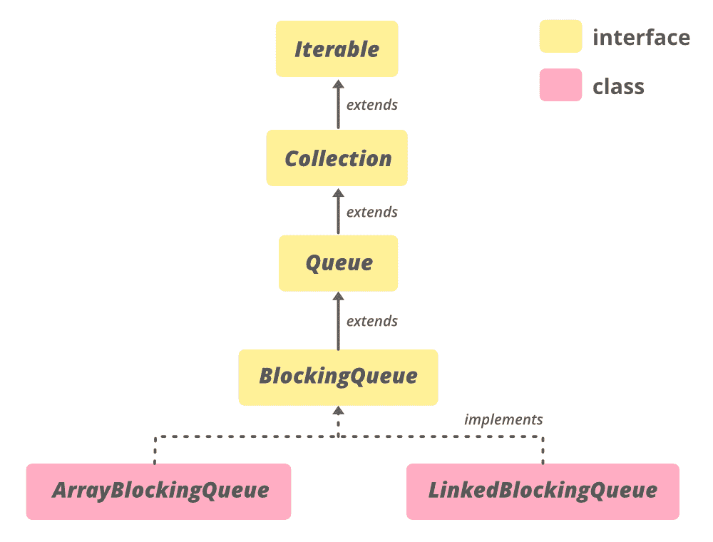

# Java 中的 ArrayBlockingQueue 类

> 原文：[https://www.geeksforgeeks.org/arrayblockingqueue-class-in-java/](https://www.geeksforgeeks.org/arrayblockingqueue-class-in-java/)

`ArrayBlockingQueue` 类是一个由数组支持的有界阻塞队列。通过有界，这意味着队列的大小是固定的。一旦创建，容量就不能更改。试图将元素放入完整队列将导致操作阻塞。同样，从空队列中获取元素的尝试也会被阻止。`ArrayBlockingQueue` 的边界最初可以绕过容量作为 `ArrayBlockingQueue` 构造函数中的参数来实现。该队列对元素**先进先出**进行排序。这意味着该队列的头部是该队列中存在的元素中最老的元素。

这个队列的尾部是这个队列元素的最新元素。新插入的元素总是被插入到队列的尾部，队列检索操作在队列的头部获取元素。

这个类及其迭代器实现了 `Collection` 和 `Iterator` 接口的所有可选方法。这个类是 [Java 集合框架](https://www.geeksforgeeks.org/collections-in-java-2/)的成员。

## ArrayBlockingQueue 的层次结构



该类扩展了 `AbstractQueue<E>` 并实现了 `Serializable`、`Iterable<E>`、`Collection<E>`、`BlockingQueue<E>`、`Queue<E>` 接口。

## 声明

```java
public class ArrayBlockingQueue<E> extends AbstractQueue<E> implements BlockingQueue<E>, Serializable
```

这里，`E` 是集合中存储的元素类型。

### ArrayBlockingQueue 的构造函数

在这里，`capacity` 是 `ArrayBlockingQueue` 的大小。

**1. `ArrayBlockingQueue(int capacity)`：** 创建具有给定（固定）容量和默认访问策略的 `ArrayBlockingQueue`。

```java
ArrayBlockingQueue<E> abq = new ArrayBlockingQueue<E>(int capacity);
```

**2. `ArrayBlockingQueue(int capacity, boolean fair)`：** 创建一个具有给定（固定）容量和指定访问策略的 `ArrayBlockingQueue`。如果 `fair` 值为真，则按先进先出顺序处理插入或移除时被阻止的线程的队列访问；如果为 `false`，则访问顺序未指定。

```java
ArrayBlockingQueue<E> abq = new ArrayBlockingQueue<E>(int capacity, boolean fair);
```

**3. `ArrayBlockingQueue(int capacity, boolean fair, Collection c)`：** 创建一个 `ArrayBlockingQueue`，具有给定（固定）容量、指定的访问策略，并且最初包含给定集合的元素，按照集合迭代器的遍历顺序添加。如果 `fair` 值为真，则按先进先出顺序处理插入或移除时被阻止的线程的队列访问；如果为 `false`，则访问顺序未指定。

```java
ArrayBlockingQueue<E> abq = new ArrayBlockingQueue<E>(int capacity, boolean fair, Collection c);
```

**示例：**

```java
// Java program to demonstrate 
// ArrayBlockingQueue(int initialCapacity)
// constructor

import java.util.concurrent.ArrayBlockingQueue;

public class ArrayBlockingQueueDemo {

    public static void main(String[] args)
    {
        // define capacity of ArrayBlockingQueue
        int capacity = 15;

        // create object of ArrayBlockingQueue
        // using ArrayBlockingQueue(int initialCapacity) constructor
        ArrayBlockingQueue<Integer> abq = new ArrayBlockingQueue<Integer>(capacity);

        // add  numbers
        abq.add(1);
        abq.add(2);
        abq.add(3);

        // print queue
        System.out.println("ArrayBlockingQueue:" + abq);
    }
}
```

**Output:**

```java
ArrayBlockingQueue:[1, 2, 3]
```

### 基本操作

#### 1. 添加元素

[`add(E e)`](https://www.geeksforgeeks.org/arrayblockingqueue-add-method-in-java/) 方法将作为参数传递的元素插入到该队列尾部的方法中。如果添加元素超出了队列的容量，那么该方法将抛出一个 `IllegalStateException`。如果元素的添加成功，此方法返回 `true`，否则将引发 `IllegalStateException`。

```java
// Java Program to Demonstrate adding
// elements to an ArrayBlockingQueue.

import java.util.concurrent.ArrayBlockingQueue;

public class AddingElementsExample {

    public static void main(String[] args)
    {
        // define capacity of ArrayBlockingQueue
        int capacity = 15;

        // create object of ArrayBlockingQueue
        ArrayBlockingQueue<Integer> abq = new ArrayBlockingQueue<Integer>(capacity);

        // add  numbers
        abq.add(1);
        abq.add(2);
        abq.add(3);

        // print queue
        System.out.println("ArrayBlockingQueue:" + abq);
    }
}
```

**Output**

```java
ArrayBlockingQueue:[1, 2, 3]
```

#### 2. 移除元素

[`remove(Object o)`](https://www.geeksforgeeks.org/arrayblockingqueue-remove-method-in-java/) 方法从该队列中移除指定元素的单个实例（如果存在）。我们可以说，如果这个队列包含一个或多个这样的元素，那么这个方法会移除一个元素 `e`，使得 `o.equals(e)`。如果此队列包含我们要移除的指定元素，`remove()` 方法将返回 `true`。

```java
// Java program to demonstrate removal of 
// elements from an AbstractQueue

import java.util.concurrent.ArrayBlockingQueue;

public class RemovingElementsExample {

    public static void main(String[] args)
    {
        // define capacity of ArrayBlockingQueue
        int capacity = 15;

        // create object of ArrayBlockingQueue
        ArrayBlockingQueue<Integer> abq = new ArrayBlockingQueue<Integer>(capacity);

        // add  numbers
        abq.add(1);
        abq.add(2);
        abq.add(3);

        // print queue
        System.out.println("ArrayBlockingQueue:" + abq);

        // remove 2
        boolean response = abq.remove(2);

        // print Queue
        System.out.println("Removal of 2 :" + response);

        // print Queue
        System.out.println("queue contains " + abq);

        // remove all the elements
        abq.clear();

        // print queue
        System.out.println("ArrayBlockingQueue:" + abq);
    }
}
```

**Output**

```java
ArrayBlockingQueue:[1, 2, 3]
Removal of 2 :true
queue contains [1, 3]
ArrayBlockingQueue:[]
```

#### 3. 访问元素

使用 `Queue` 接口提供的 [`peek()`](https://www.geeksforgeeks.org/arrayblockingqueue-peek-method-in-java/) 方法返回队列头。它检索但不删除该队列的头。如果队列为空，则此方法返回 `null`。

```java
// Java program to demonstrate accessing
// elements of ArrayBlockingQueue

import java.util.concurrent.ArrayBlockingQueue;

public class AccessingElementsExample {

    public static void main(String[] args)
    {

        // Define capacity of ArrayBlockingQueue
        int capacity = 5;

        // Create object of ArrayBlockingQueue
        ArrayBlockingQueue<Integer> queue = new ArrayBlockingQueue<Integer>(capacity);

        // Add element to ArrayBlockingQueue
        queue.add(23);
        queue.add(32);
        queue.add(45);
        queue.add(12);

        // Print queue after adding numbers
        System.out.println("After addding numbers queue is ");
        System.out.println(queue);

        // Print head of queue using peek() method
        System.out.println("Head of queue " + queue.peek());
    }
}
```

**Output**

```java
After addding numbers queue is 
[23, 32, 45, 12]
Head of queue 23
```

#### 4. 遍历

`ArrayBlockingQueue` 类的 [`iterator()`](https://www.geeksforgeeks.org/arrayblockingqueue-iterator-method-in-java/#:~:text=The%20iterator()%20method%20of,returned%20iterator%20is%20weakly%20consistent.) 方法用于以适当的顺序返回与该队列相同元素的迭代器。从这个方法返回的元素包含从第一个（头）到最后一个（尾）的元素。返回的迭代器弱一致。

```java
// Java Program to Demonstrate iterating
// over ArrayBlockingQueue.

import java.util.concurrent.ArrayBlockingQueue;
import java.util.*;

public class TraversingExample {

    public static void main(String[] args)
    {
        // Define capacity of ArrayBlockingQueue
        int capacity = 5;

        // Create object of ArrayBlockingQueue
        ArrayBlockingQueue<String> queue = new ArrayBlockingQueue<String>(capacity);

        // Add 5 elements to ArrayBlockingQueue
        queue.offer("User");
        queue.offer("Employee");
        queue.offer("Manager");
        queue.offer("Analyst");
        queue.offer("HR");

        // Print queue
        System.out.println("Queue is " + queue);

        // Call iterator() method and Create an iterator
        Iterator iteratorValues = queue.iterator();

        // Print elements of iterator
        System.out.println("\nThe iterator values:");
        while (iteratorValues.hasNext()) {
            System.out.println(iteratorValues.next());
        }
    }
}
```

**Output**

```java
Queue is [User, Employee, Manager, Analyst, HR]

The iterator values:
User
Employee
Manager
Analyst
HR
```

### ArrayBlockingQueue 的方法

在这里，`E` 是这个集合中持有的元素类型。

| METHOD | DESCRIPTION |
| :--- | :--- |
| `add(E e)` | 将指定的元素插入此队列（如果立即可行且不会违反容量限制），成功时返回 `true`，如果当前没有可用空间，则抛出 `IllegalStateException`。 |
| `offer(E e)` | 将指定的元素插入此队列（如果立即可行且不会违反容量限制），成功时返回 `true`，如果当前没有可用空间，则返回 `false`。当使用容量受限的队列时，此方法通常优于 `add(E e)`，后者只能通过抛出异常来失败。 |
| `put(E e)` | 将指定的元素插入此队列，如果空间立即可用，则返回；否则等待空间变得可用。 |
| `offer(E e, long timeout, TimeUnit unit)` | 将指定的元素插入此队列，如果空间立即可用，则返回 `true`；否则等待指定的等待时间，超时后返回 `false`。 |
| `take()` | 检索并移除此队列的头部，如果此队列为空，则等待。 |
| `poll(long timeout, TimeUnit unit)` | 检索并移除此队列的头部，如果此队列为空，则等待指定的等待时间（如有必要）。 |
| `remove(Object o)` | 从此队列中移除指定元素的单个实例（如果存在）。 |
| `contains(Object o)` | 如果此队列包含指定元素，则返回 `true`。 |
| `drainTo(Collection<? super E> c)` | 移除此队列中所有可用的元素，并将它们添加到给定的集合中。 |
| `drainTo(Collection<? super E> c, int maxElements)` | 最多从此队列中移除给定数量的可用元素，并将它们添加到给定的集合中。 |
| `remove()` | 检索并移除此队列的头部。 |
| `poll()` | 检索并移除此队列的头部，如果此队列为空，则返回 `null`。 |
| `element()` | 检索，但不移除此队列的头部。 |
| `peek()` | 检索但不移除此队列的头部，如果此队列为空，则返回 `null`。 |
| `size()` | 返回此队列中的元素数。 |

### java.util.concurrent.ArrayBlockingQueue 类中声明的方法

| 方法 | 描述 |
| --- | --- |
| [`add(E e)`](https://www.geeksforgeeks.org/arrayblockingqueue-add-method-in-java/) | 在此队列的尾部插入指定元素。如果可能，在不超出队列容量的情况下立即插入，成功则返回 `true`，否则抛出 `IllegalStateException`。 |
| [`clear()`](https://www.geeksforgeeks.org/arrayblockingqueue-clear-method-in-java/) | 自动移除此队列中的所有元素。 |
| [`contains(Object o)`](https://www.geeksforgeeks.org/arrayblockingqueue-contains-method-in-java/) | 如果此队列包含指定元素，则返回 `true`。 |
| [`drainTo(Collection<? super E> c)`](https://www.geeksforgeeks.org/arrayblockingqueue-drainto-method-in-java/) | 移除此队列中所有可用的元素，并将它们添加到给定的集合中。 |
| [`drainTo(Collection<? super E> c, int maxElements)`](https://www.geeksforgeeks.org/arrayblockingqueue-drainto-method-in-java/) | 最多从此队列中移除给定数量的可用元素，并将它们添加到给定的集合中。 |
| [`forEach(Consumer<? super E> action)`](https://www.geeksforgeeks.org/arrayblockingqueue-foreach-method-in-java/) | 对 `Iterable` 的每个元素执行给定的操作，直到所有元素都被处理或该操作抛出异常。 |
| [`iterator()`](https://www.geeksforgeeks.org/arrayblockingqueue-iterator-method-in-java/) | 返回在此队列中的元素上以恰当顺序进行迭代的迭代器。 |
| [`offer(E e)`](https://www.geeksforgeeks.org/arrayblockingqueue-offer-method-in-java/) | 如果可能，在不超出队列容量的情况下立即在队列尾部插入指定元素，成功则返回 `true`，如果队列已满则返回 `false`。 |
| [`offer(E e, long timeout, TimeUnit unit)`](https://www.geeksforgeeks.org/arrayblockingqueue-offer-method-in-java/) | 在此队列的尾部插入指定元素，直到指定的等待时间。如果队列已满，则等待空间变得可用。 |
| [`put(E e)`](https://www.geeksforgeeks.org/arrayblockingqueue-put-method-in-java/) | 在此队列的尾部插入指定元素。如果队列已满，则等待空间变得可用。 |
| [`remainingCapacity()`](https://www.geeksforgeeks.org/arrayblockingqueue-remainingcapacity-method-in-java/) | 返回此队列在理想情况下（不出现内存或资源约束）可以理想地接受而不会阻塞的额外元素数量。 |
| [`remove(Object o)`](https://www.geeksforgeeks.org/arrayblockingqueue-remove-method-in-java/) | 从此队列中移除指定元素的单个实例（如果存在）。 |
| [`removeAll(Collection<?> c)`](https://www.geeksforgeeks.org/arrayblockingqueue-removeall-method-in-java/) | 移除此集合中也包含在指定集合中的所有元素（可选操作）。 |
| [`removeIf(Predicate<? super E> filter)`](https://www.geeksforgeeks.org/arrayblockingqueue-removeif-method-in-java/) | 移除此集合中所有满足给定谓词的元素。 |
| [`retainAll(Collection<?> c)`](https://www.geeksforgeeks.org/arrayblockingqueue-retainall-method-in-java/) | 仅保留此集合中包含在指定集合中的元素（可选操作）。 |
| [`size()`](https://www.geeksforgeeks.org/arrayblockingqueue-size-method-in-java/) | 返回此队列中的元素数量。 |
| [`spliterator()`](https://www.geeksforgeeks.org/arrayblockingqueue-spliterator-method-in-java/) | 返回此队列中元素的 `Spliterator`。 |
| [`toArray()`](https://www.geeksforgeeks.org/arrayblockingqueue-toarray-method-in-java/) | 返回一个包含此队列中所有元素的数组，顺序正确。 |
| [`toArray(T[] a)`](https://www.geeksforgeeks.org/arrayblockingqueue-toarray-method-in-java/) | 返回一个包含此队列中所有元素的数组，顺序正确；返回数组的运行时类型是指定数组的运行时类型。 |

### java.util.AbstractQueue 类中声明的方法

| 方法 | 描述 |
| --- | --- |
| [`addAll(Collection<? extends E> c)`](https://www.geeksforgeeks.org/abstractqueue-addall-method-in-java-with-examples/) | 将指定集合中的所有元素添加到此队列中。 |
| [`element()`](https://www.geeksforgeeks.org/abstractqueue-element-method-in-java-with-examples/) | 检索但不移除此队列的头。 |
| [`remove()`](https://www.geeksforgeeks.org/abstractqueue-remove-method-in-java-with-examples/) | 检索并移除此队列的头。 |

### java.util.AbstractCollection 类中声明的方法

| 方法 | 描述 |
| --- | --- |
| [`containsAll(Collection<?> c)`](https://www.geeksforgeeks.org/abstractcollection-containsall-method-in-java-with-examples/) | 如果此集合包含指定集合中的所有元素，则返回 `true`。 |
| [`isEmpty()`](https://www.geeksforgeeks.org/abstractcollection-isempty-method-in-java-with-examples/) | 如果此集合不包含元素，则返回 `true`。 |
| [`toString()`](https://www.geeksforgeeks.org/abstractcollection-tostring-method-in-java-with-examples/) | 返回此集合的字符串表示形式。 |

### 接口 java.util.concurrent.BlockingQueue 中声明的方法

| 方法 | 描述 |
| --- | --- |
| [`poll(long timeout, TimeUnit unit)`](https://www.geeksforgeeks.org/blockingqueue-poll-method-in-java-with-examples/) | 检索并移除此队列的头，如果需要某个元素变得可用，则等待指定的等待时间。 |
| [`take()`](https://www.geeksforgeeks.org/blockingqueue-take-method-in-java-with-examples/) | 检索并移除此队列的头，如有必要，等待直到某个元素变得可用。 |

### 接口 java.util.Collection 中声明的方法

| 方法 | 描述 |
| --- | --- |
| [`addAll(Collection<? extends E> c)`](https://www.geeksforgeeks.org/collection-addall-method-in-java-with-examples/) | 将指定集合中的所有元素添加到此集合中（可选操作）。 |
| [`containsAll(Collection<?> c)`](https://www.geeksforgeeks.org/collection-containsall-method-in-java-with-examples/) | 如果此集合包含指定集合中的所有元素，则返回 `true`。 |
| [`equals(Object o)`](https://www.geeksforgeeks.org/collection-equals-method-in-java-with-examples/) | 将指定的对象与此集合进行比较，看是否相等。 |
| [`hashCode()`](https://www.geeksforgeeks.org/collection-hashcode-method-in-java-with-examples/) | 返回此集合的哈希代码值。 |
| [`isEmpty()`](https://www.geeksforgeeks.org/collection-isempty-method-in-java-with-examples/) | 如果此集合不包含元素，则返回 `true`。 |
| [`parallelStream()`](https://www.geeksforgeeks.org/collection-parallelstream-method-in-java-with-examples/) | 以此集合为源返回一个可能并行的流。 |
| [`stream()`](https://www.geeksforgeeks.org/collection-stream-method-in-java-with-examples/) | 返回以此集合为源的顺序流。 |
| [`toArray(IntFunction<T[]> generator)`](https://www.geeksforgeeks.org/collection-toarray-method-in-java-with-examples/) | 使用提供的生成器函数分配返回的数组，返回包含此集合中所有元素的数组。 |

### 接口 java.util.Queue 中声明的方法

| 方法 | 描述 |
| --- | --- |
| [`element()`](https://www.geeksforgeeks.org/queue-element-method-in-java/) | 检索但不移除该队列的头。 |
| [`peek()`](https://www.geeksforgeeks.org/queue-peek-method-in-java/) | 检索但不移除该队列的头，如果该队列为空，则返回 null。 |
| [`poll()`](https://www.geeksforgeeks.org/queue-poll-method-in-java/) | 检索并删除该队列的头，如果该队列为空，则返回 null。 |
| [`remove()`](https://www.geeksforgeeks.org/queue-remove-method-in-java/#:~:text=The%20remove()%20method%20of,when%20the%20Queue%20is%20empty.) | 检索并删除该队列的头。 |

**结论:** `ArrayBlockingQueue` 一般用在**线程安全的**环境中，在这种环境中，您希望阻塞单个资源上的两个或多个操作，只允许一个线程。此外，我们可以使用容量限制因子来阻止线程。

**参考:** [https://docs.oracle.com/en/java/javase/11/docs/api/java.base/java/util/concurrent/ArrayBlockingQueue.html](https://docs.oracle.com/en/java/javase/11/docs/api/java.base/java/util/concurrent/ArrayBlockingQueue.html)