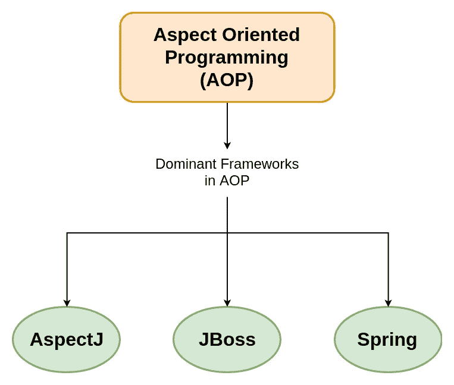
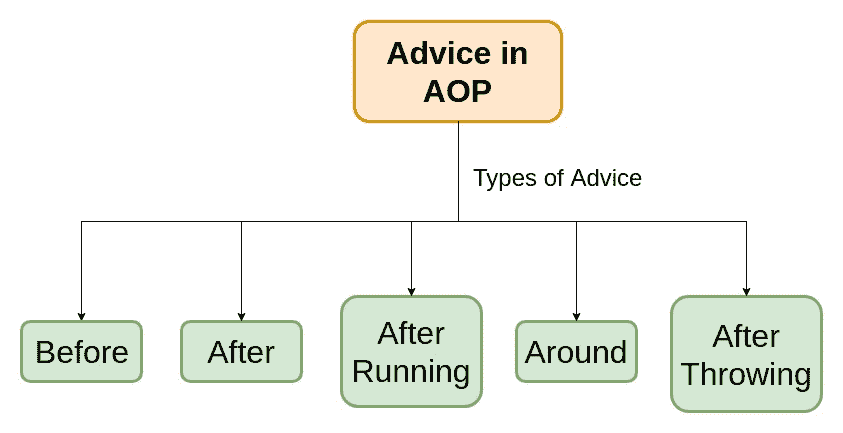

# Spring框架中的面向方面编程（AOP）

> 原文：[https://www.geeksforgeeks.org/aspect-oriented-programming-and-aop-in-spring-framework/](https://www.geeksforgeeks.org/aspect-oriented-programming-and-aop-in-spring-framework/)

**面向方面编程（AOP）** 顾名思义就是在编程中使用方面。可以定义为将代码分解成不同的模块，也称为 **[模块化](https://www.geeksforgeeks.org/modular-approach-in-programming/)** ，其中方面是模块化的关键单元。方面使得横切关注点的实现成为可能，例如事务、不是业务逻辑中心的日志记录，而不会使其功能的代码核心混乱。它通过向现有代码添加额外的行为来实现这一点。例如——安全性是一个横切关注点，在应用程序的许多方法中可以应用安全性规则，因此在每个方法中重复代码，在一个公共类中定义功能，并且控制在整个应用程序中应用该功能。

## AOP中的主导框架

**AOP** 包括支持和实现代码模块化的编程方法和框架。我们来看看AOP中的三个主导框架：



*   **AspectJ：** 它是在 **PARC研究中心** 创建的Java编程的扩展。它使用类似Java的语法和包含的IDE集成来显示横切结构。它有自己的编译器和weaver，使用它可以使用完整的AspectJ语言。
*   **JBoss：** 是JBoss开发的开源Java应用服务器，用于Java开发。
*   **[Spring](https://www.geeksforgeeks.org/introduction-to-spring-framework/)：** 它使用基于XML的配置来实现AOP，它还使用通过使用AspectJ提供的库来解释的注释来进行解析和匹配。

目前，带有Spring框架的 **AspectJ** 库在市场上占据主导地位，因此让我们了解一下面向方面编程是如何与Spring一起工作的。

## 面向方面编程如何与Spring一起工作

人们可能会认为调用一个方法会自动实现跨领域的关注点，但事实并非如此。仅仅调用方法并不能调用建议（应该完成的工作）。Spring使用了 **基于代理的机制** ，也就是说，它创建了一个代理对象，该对象将围绕原始对象，并接受与方法调用相关的建议。代理对象可以通过代理工厂bean手动创建，也可以通过XML文件中的自动代理配置创建，并在执行完成时被销毁。代理对象用于丰富真实对象的原始行为。

## AOP中的常用术语

1.  **方面：** 实现JEE应用程序交叉关注点（事务、记录器等）的类被称为方面。它可以是通过XML配置配置的普通类，也可以是用`@Aspect`注释的常规类。
2.  **Weaving：** 将方面与被通知对象链接的过程。它可以在加载时、编译时或运行时完成。Spring AOP在运行时进行weaving。

让我们编写第一个方面类，但在此之前，先看看所需的jars和AOP的Bean配置文件。


```java
package com.aspect;

import org.aspectj.lang.annotation.Aspect;
import Java.lang.RuntimeException;
import org.springframework.context.ApplicationContext;
import org.springframework.context.support.ClassPathXmlApplicationContext;

// Logging class is anotated with @Aspect
// and will contain advices.
@Aspect
class Logging {
}

// The class ImplementAspect
// contains method Aspectcall
// and the advices will be applied
// on that method for demo.
public class ImplementAspect {
    public static void main(String args[]) {
        Scanner sc = new Scanner(System.in);
        System.out.println("my first aspect");

        // Add beanconfiguration file
        // in your programme when executing.
        ApplicationContext ctx
            = new ClassPathXmlApplicationContext("beanconfigfile.XML");

        ImplementAspect call
            = (ImplementAspect) ctx.getbean("aspect");

        System.out.println("enter an integer");
        int a = sc.nextInt();
        if (a == 1) {
            throw new RuntimeException(msg);
        } else {
            call.aspectCall();
        }
        call.myMethod();
    }

    public void aspectCall() {
        System.out.println("Applying advices"
                           + " for the first time");
    }

    public void myMethod() {
        System.out.println("This is an"
                           + " extra method");
    }
}
```

3.  **Advice：** 由方面完成的工作，或者可以定义为方面在特定点采取的操作。有五种类型的Advice，分别是：`Before`、`After`、`Around`、`AfterThrowing`和`AfterReturning`。让我们简要讨论一下这五种类型。

### 通知类型



1.  **Before：** 在调用建议的方法之前运行。用`@Before`标注。
2.  **After：** 在建议的方法完成后运行，无论结果如何，无论成功与否。用`@After`标注。
3.  **AfterReturning：** 在建议的方法成功完成后运行，即没有任何运行时异常。用`@AfterReturning`标注。
4.  **Around：** 这是所有建议中最强的建议，因为它环绕并在建议的方法前后运行。这种类型的建议用于我们需要频繁访问方法或数据库的地方，比如缓存。用`@Around`标注。
5.  **AfterThrowing：** 在建议的方法引发运行时异常后运行。用`@AfterThrowing`标注。

让我们在Aspect类Logger中实现所有五条建议。

```java
// Program to show types of Advices
@Aspect
class Logging {
    // Implementing all the five pieces of advice
    // to execute AfterThrowing advice enter integer value as 1.

    // Before
    @Before("execution(public void com.aspect.ImplementAspect.aspectCall())")
    public void loggingAdvice1() {
        System.out.println("Before advice is executed");
    }

    // After
    @After("execution(public void com.aspect.ImplementAspect.aspectCall())")
    public void loggingAdvice2() {
        System.out.println("Running After Advice.");
    }

    // Around
    @Around("execution(public void com.aspect.ImplementAspect.myMethod())")
    public void loggingAdvice3() {
        System.out.println("Before and After invoking method myMethod");
    }

    // AfterThrowing
    @AfterThrowing("execution(public void com.aspect.ImplementAspect.aspectCall())")
    public void loggingAdvice4() {
        System.out.println("Exception thrown in method");
    }

    // AfterRunning
    @AfterReturning("execution(public void com.aspect.ImplementAspect.myMethod())")
    public void loggingAdvice5() {
        System.out.println("AfterReturning advice is run");
    }
}
```

4.  **JoinPoints：** 一个应用程序有成千上万个应用建议的机会或点。这些点被称为连接点。例如——建议可以在每次方法调用、异常抛出或其他各种点应用。但Spring AOP目前只支持方法执行连接点（在Spring bean上通知方法的执行）。

让我们看看连接点在我们的`@Aspect`类（`Logger`）中做了什么。

```java
// Program to show JoinPoints
@Aspect
class Logging {
    // Passing a JoinPoint Object
    // into parameters of the method
    // with the annotated advice
    // enables to print the information
    // when the advice is executed
    // with the help of toString() method
    // present in it.
    @Before("execution(public void com.aspect.ImplementAspect.aspectCall())")
    public void loggingAdvice1(JoinPoint joinpoint) {
        System.out.println("Before advice is executed");
        System.out.println(joinpoint.toString());
    }
}
```

5.  **切入点：** 由于不可能在代码的每个点都应用建议，因此，最终应用建议的所选连接点被称为切入点。通常，您使用显式的类和方法名或者通过定义匹配的类和方法名模式的正则表达式来指定这些切入点。它有助于减少重复的代码写一次，并在多个点使用，让我们看看如何。

```java
// Program to show PointCuts
@Aspect
class Logging {
    // pointcut() is a dummy method
    // required to hold @Pointcut annotation
    // pointcut() can be used instead of writing line 1
    // whenever required, as done in line 4.
    // This prevents a repetition of code.
    @Pointcut("execution(public void com.aspect.ImplementAspect.aspectCall())") // line 1
    public void pointCut() {
    }

    // pointcut() is used to avoid repeatition of code
    @Before("pointcut()")
    public void loggingAdvice1() {
        System.out.println("Before advice is executed");
    }
}
```