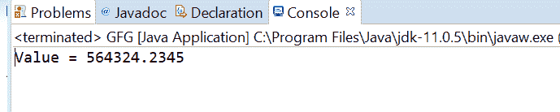
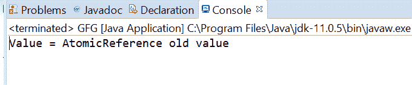

# Java 中的 AtomicReference getOpaque()方法，带示例

> 原文：[https://www.geeksforgeeks.org/atomicreference-getopaque-method-in-java-with-examples/](https://www.geeksforgeeks.org/atomicreference-getopaque-method-in-java-with-examples/)

一个`AtomicReference`类的`getOpaque()`方法用来返回原子引用对象的当前值，内存效果由`VarHandle.getOpaque(java.lang.Object...)`指定。这个`VarHandle.getOpaque(java.lang.Object...)`方法处理操作时不能保证相对于其他线程的内存排序效果。

## 语法

```java
public final V getOpaque()
```

## 参数

此方法不接受任何内容。

## 返回值

这个方法返回`AtomicReference`的值。

下面的程序说明了`getOpaque()`方法：

### 程序 1

```java
// Java program to demonstrate
// AtomicReference.getOpaque() method
import java.util.concurrent.atomic.AtomicReference;

public class GFG {
    public static void main(String[] args)
    {

        // create an atomic reference object.
        AtomicReference<Double> ref
            = new AtomicReference<Double>();

        // set some value
        ref.set(564324.2345);

        // get value using getOpaque()
        double value = ref.getOpaque();

        // print
        System.out.println("Value = " + value);
    }
}
```

**Output:**


### 程序 2

```java
// Java program to demonstrate
// AtomicReference.getOpaque() method
import java.util.concurrent.atomic.AtomicReference;

public class GFG {
    public static void main(String[] args)
    {

        // create an atomic reference object.
        AtomicReference<String> ref
            = new AtomicReference<String>();

        // set some value
        ref.set("AtomicReference old value");

        // get value getOpaque()
        String value = ref.getOpaque();

        // print
        System.out.println("Value = " + value);
    }
}
```

**Output:**


## 参考文献

[https://docs.oracle.com/javase/10/docs/api/java/util/concurrent/atomic/AtomicReference.html#getOpaque()](https://docs.oracle.com/javase/10/docs/api/java/util/concurrent/atomic/AtomicReference.html#getOpaque())