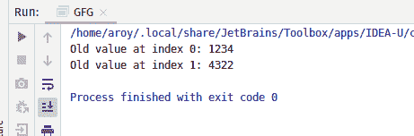
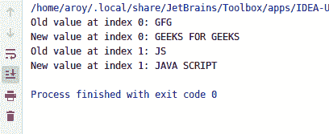

# Java 中的 AtomicReferenceArray compareAndExchangeRelease() 方法

> 原文：[https://www.geeksforgeeks.org/atomicreferencearray-compareandexchangerelease-method-in-java-with-examples/](https://www.geeksforgeeks.org/atomicreferencearray-compareandexchangerelease-method-in-java-with-examples/)

如果 `AtomicReferenceArray` 对象在索引 `i` 处的当前值等于预期值，则 `compareAndExchangeRelease()` 方法会自动将其值设置为新值。此方法将返回见证值，该值将与预期值相同。此方法更新该值，并确保先前的加载和存储在此访问后不会重新排序。

## 语法

```java
public final boolean
       compareAndExchangeRelease(
           int i, E expectedValue, E newValue)
```

## 参数

该方法接受：

*   `i` 是执行操作的原子引用数组的索引。
*   `expectedValue` 是期望值。
*   `newValue` 是要设置的新值。

## 返回值

该方法返回见证值，如果成功则与期望值相同。

## 示例

下面的程序说明了 `compareAndExchangeRelease()` 方法。

### 程序 1

```java
// Java program to demonstrate
// compareAndExchangeRelease() method

import java.util.concurrent.atomic.*;

public class GFG {
    public static void main(String[] args)
    {
        // create an atomic reference object.
        AtomicReferenceArray<Integer> ref
            = new AtomicReferenceArray<Integer>(3);

        // set some value
        ref.set(0, 1234);
        ref.set(1, 4322);

        // apply compareAndExchangeRelease()
        int oldV1
            = ref.compareAndExchangeRelease(
                0, 1234, 8913);
        int oldV2
            = ref.compareAndExchangeRelease(
                1, 4322, 6543);

        // print
        System.out.println("Old value at index 0: "
                           + oldV1);
        System.out.println("Old value at index 1: "
                           + oldV2);
    }
}
```

**Output:**


### 程序 2

```java
// Java program to demonstrate
// compareAndExchangeRelease() method

import java.util.concurrent.atomic.*;

public class GFG {
    public static void main(String[] args)
    {
        // create an atomic reference object.
        AtomicReferenceArray<String> ref
            = new AtomicReferenceArray<String>(3);

        // set some value
        ref.set(0, "GFG");
        ref.set(1, "JS");

        // apply compareAndExchangeRelease()
        String oldV1
            = ref.compareAndExchangeRelease(
                0, "GFG",
                "GEEKS FOR GEEKS");
        String oldV2
            = ref.compareAndExchangeRelease(
                1, "JS",
                "JAVA SCRIPT");

        // print
        System.out.println("Old value at index 0: "
                           + oldV1);
        System.out.println("New value at index 0: "
                           + ref.get(0));
        System.out.println("Old value at index 1: "
                           + oldV2);
        System.out.println("New value at index 1: "
                           + ref.get(1));
    }
}
```

**Output:**


## 参考文献

[https://docs.oracle.com/javase/10/docs/api/java/util/concurrent/atomic/AtomicReferenceArray.html#compareAndExchangeRelease(int,E,E)](https://docs.oracle.com/javase/10/docs/api/java/util/concurrent/atomic/AtomicReferenceArray.html#compareAndExchangeRelease(int,E,E))