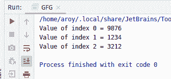
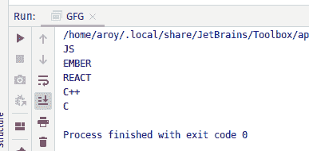

# Java 中的 AtomicReferenceArray setPlain() 方法示例

> 原文：[https://www.geeksforgeeks.org/atomicreferencearray-setplain-method-in-java-with-examples/](https://www.geeksforgeeks.org/atomicreferencearray-setplain-method-in-java-with-examples/)

`AtomicReferenceArray` 类的 `setPlain()` 方法用于将索引 `i` 处的元素的值设置为新值。索引 `i` 和 `newValue` 都作为参数传递给该方法。此方法使用设置的内存语义来设置值，就像变量被声明为非易失性和非最终的一样。

## 语法

```java
public final void setPlain(int i, E newValue)
```

## 参数

该方法接受：

*   `i` 是执行操作的原子引用数组的索引。
*   `newValue` 是要设置的新值。

## 返回值

此方法不返回任何内容。

## 程序 1

以下程序说明了 `setPlain()` 方法：

```java
// Java program to demonstrate
// setPlain() method

import java.util.concurrent.atomic.*;

public class GFG {

    public static void main(String[] args)
    {

        // create an atomic reference object.
        AtomicReferenceArray<Integer> ref
            = new AtomicReferenceArray<Integer>(5);

        // set some value and print
        ref.setPlain(0, 9876);
        ref.setPlain(1, 1234);
        ref.setPlain(2, 3212);

        System.out.println("Value of index 0 = "
                           + ref.get(0));
        System.out.println("Value of index 1 = "
                           + ref.get(1));
        System.out.println("Value of index 2 = "
                           + ref.get(2));
    }
}
```

**输出：**


## 程序 2

```java
// Java program to demonstrate
// setPlain() method

import java.util.concurrent.atomic.*;

public class GFG {

    public static void main(String[] args)
    {

        // create an atomic reference object
        AtomicReferenceArray<String> ref
            = new AtomicReferenceArray<String>(5);

        // set some value
        ref.setPlain(0, "JS");
        ref.setPlain(1, "EMBER");
        ref.setPlain(2, "REACT");
        ref.setPlain(3, "C++");
        ref.setPlain(4, "C");

        // print
        for (int i = 0; i < 5; i++) {
            System.out.println(ref.get(i));
        }
    }
}
```

**输出：**


## 参考文献

[https://docs.oracle.com/javase/10/docs/api/java/util/concurrent/atomic/AtomicReferenceArray.html#setPlain(int,E)](https://docs.oracle.com/javase/10/docs/api/java/util/concurrent/atomic/AtomicReferenceArray.html#setPlain(int,E))