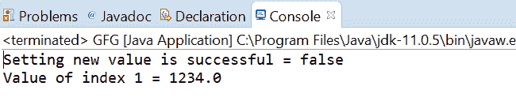
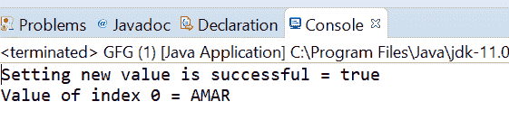

# Java 中的 `AtomicReferenceArray` `weakCompareAndSetVolatile()` 方法示例

> 原文：[https://www.geeksforgeeks.org/atomicreferencearray-weakcompareandsetvolatile-method-in-java-with-examples/](https://www.geeksforgeeks.org/atomicreferencearray-weakcompareandsetvolatile-method-in-java-with-examples/)

`AtomicReferenceArray` 类的 `weakCompareAndSetVolatile()` 方法用于在当前值等于作为参数传递的预期值的情况下，自动将索引 `i` 处的元素值设置为原子引用数组的新值。这个方法用 `VarHandle.weakCompareAndSet(java.lang.Object...)` 指定的内存效果更新这个值。如果向 `AtomicReferenceArray` 设置新值成功，则此方法返回 `true`。

## 语法

```java
public final boolean
       weakCompareAndSetVolatile(int i,
                                 E expectedValue,
                                 E newValue)
```

## 参数

该方法接受以下参数：
- `i`：作为原子引用数组的索引来执行操作。
- `expectedValue`：期望值。
- `newValue`：要设置的新值。

## 返回值

如果成功，该方法返回 `true`。

下面的程序说明了 `weakCompareAndSetVolatile()` 方法：

### 程序 1

```java
// Java program to demonstrate AtomicReferenceArray
// weakCompareAndSetVolatile() method

import java.util.concurrent.atomic.AtomicReferenceArray;

public class GFG {
    public static void main(String[] args)
    {

        // create an atomic reference object.
        AtomicReferenceArray<Double> ref
            = new AtomicReferenceArray<Double>(5);

        // set some value
        ref.set(1, 1234.00);
        ref.set(0, 2234.00);
        ref.set(2, 3234.00);

        // apply weakCompareAndSetVolatile()
        boolean result
            = ref.weakCompareAndSetVolatile(1, 124.00,
                                            234.32);

        // print value
        System.out.println("Setting new value"
                           + " is successful = "
                           + result);

        System.out.println("Value of index 1 = "
                           + ref.get(1));
    }
}
```

输出：


### 程序 2

```java
// Java program to demonstrate AtomicReferenceArray
// weakCompareAndSetVolatile() method

import java.util.concurrent.atomic.AtomicReferenceArray;

public class GFG {
    public static void main(String[] args)
    {

        // create an atomic reference object.
        AtomicReferenceArray<String> ref
            = new AtomicReferenceArray<String>(5);

        // set some value
        ref.set(0, "AMANDIP");
        ref.set(1, "AMAN");

        // apply weakCompareAndSetVolatile()
        boolean result
            = ref.weakCompareAndSetVolatile(
                0,
                "AMARDIP",
                "AMAR");

        // print value
        System.out.println("Setting new value"
                           + " is successful = "
                           + result);

        System.out.println("Value of index 0 = "
                           + ref.get(0));
    }
}
```

输出：


## 参考文献

[https://docs.oracle.com/javase/10/docs/api/java/util/concurrent/atomic/AtomicReferenceArray.html#weakCompareAndSetVolatile(V, V)](https://docs.oracle.com/javase/10/docs/api/java/util/concurrent/atomic/AtomicReferenceArray.html#weakCompareAndSetVolatile(V, V))