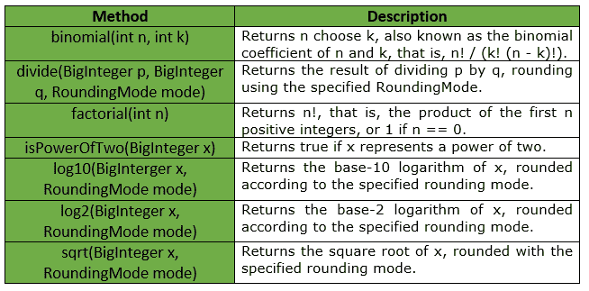

# BigIntegerMath 类（Guava Java）

> 原文：[https://www.geeksforgeeks.org/bigIntegermath-class-guava-java/](https://www.geeksforgeeks.org/bigIntegermath-class-guava-java/)

`BigIntegerMath` 用于对 `BigInteger` 值进行数学运算。基本的独立数学函数根据所涉及的主要数值类型分为 `IntMath`、`LongMath`、`DoubleMath` 和 `BigIntegerMath` 类。这些类具有并行结构，但每个都只支持相关的函数子集。`int` 和 `long` 的类似功能可以分别在 `IntMath` 和 `LongMath` 中找到。

## 声明

声明为：
```java
@GwtCompatible(emulated = true)
public final class BigIntegerMath
   extends Object
```

## 方法表

下表显示了 Guava `BigIntegerMath` 提供的方法：



## 异常

*   `log2`: `IllegalArgumentException` if x <= 0
*   `log10`: `IllegalArgumentException` if x <= 0
*   `sqrt`: `IllegalArgumentException` if x < 0
*   `divide`: `ArithmeticException` 如果 `q == 0`，或者如果 `mode == UNNECESSARY` 且 `a` 不是 `b` 的整数倍
*   `factorial`: `IllegalArgumentException` if n < 0
*   `binomial`: `IllegalArgumentException` if n < 0, k < 0 or k > n

## 示例

### 示例 1

```java
// Java code to show implementation of
// BigIntegerMath Class of Guava
import java.math.*;
import com.google.common.math.BigIntegerMath;

class GFG {

    // Driver code
    public static void main(String args[])
    {
        // Creating an object of GFG class
        GFG obj = new GFG();

        // Function calling
        obj.examples();
    }

    private void examples()
    {
        try {
            // exception will be thrown as 10 is
            // not completely divisible by 3
            // thus rounding is required, and
            // RoundingMode is set as UNNECESSARY
            System.out.println(BigIntegerMath.divide(BigInteger.TEN,
                                    new BigInteger("3"),
                                    RoundingMode.UNNECESSARY));
        }
        catch (ArithmeticException ex) {
            System.out.println("Error Message is : " +
                               ex.getMessage());
        }
    }
}
```

**输出：**

```java
Error Message is : Rounding necessary
```

### 示例 2

```java
// Java code to show implementation of
// BigIntegerMath Class of Guava
import java.math.*;
import com.google.common.math.BigIntegerMath;

class GFG {

    // Driver code
    public static void main(String args[])
    {
        // Creating an object of GFG class
        GFG obj = new GFG();

        // Function calling
        obj.examples();
    }

    private void examples()
    {
        // As 10 is divisible by 5, so
        // no exception is thrown
        System.out.println(BigIntegerMath.divide(BigInteger.TEN,
                                    new BigInteger("5"),
                                    RoundingMode.UNNECESSARY));

        // To compute log to base 10
        System.out.println("Log10 is : " +
             BigIntegerMath.log10(new BigInteger("1000"),
                                 RoundingMode.HALF_EVEN));

        // To compute factorial
        System.out.println("factorial is : " +
                         BigIntegerMath.factorial(7));

        // To compute log to base 2
        System.out.println("Log2 is : " +
           BigIntegerMath.log2(new BigInteger("8"),
                          RoundingMode.HALF_EVEN));

        // To compute square root
        System.out.println("sqrt is : " +
                    BigIntegerMath.sqrt(BigInteger.
                    TEN.multiply(BigInteger.TEN),
                        RoundingMode.HALF_EVEN));
    }
}
```

**输出：**

```java
Log10 is : 3
factorial is : 5040
Log2 is : 3
sqrt is : 10
```

## 参考

Google Guava