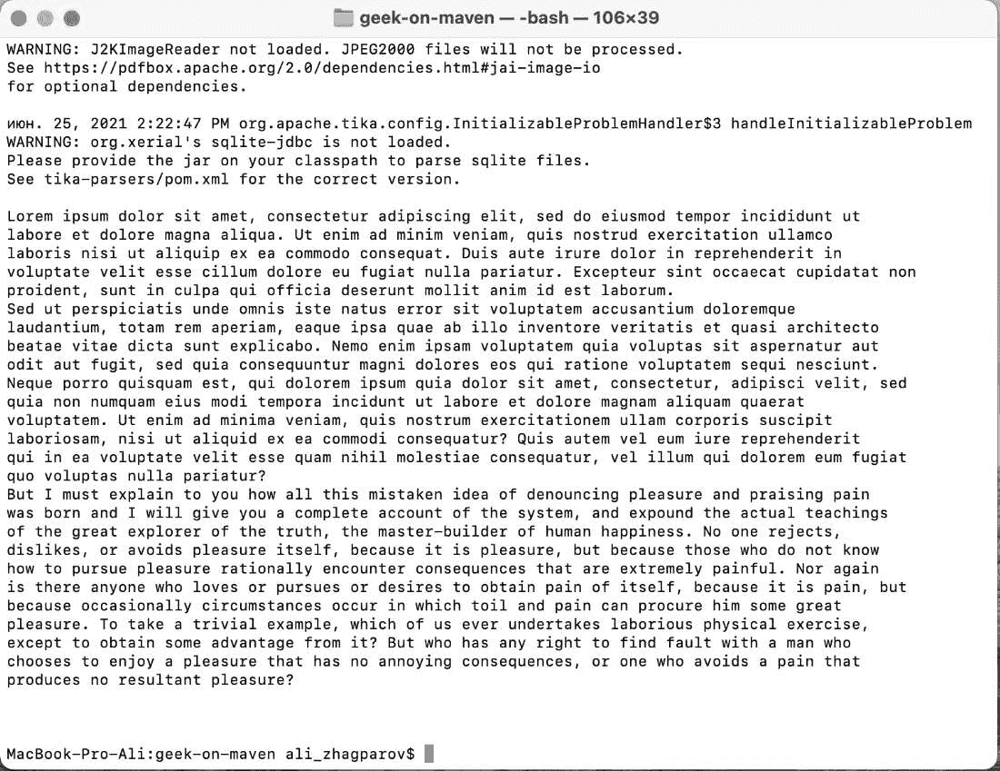
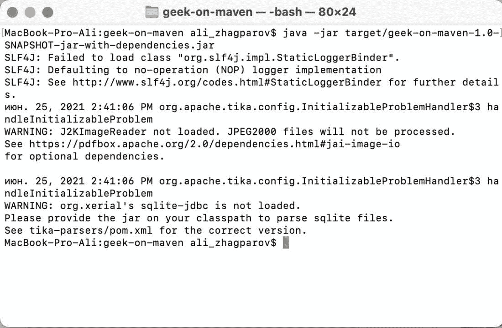
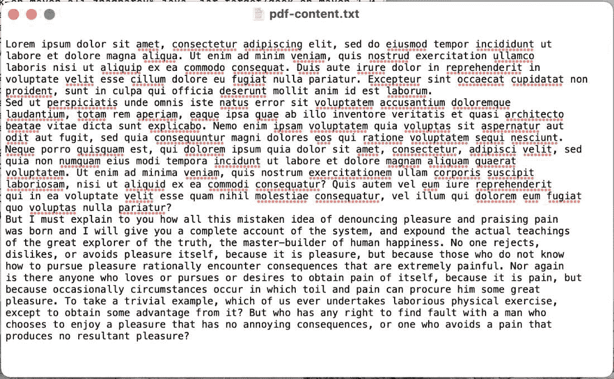

# Java 中的 BodyContentHandler 类

> 原文：[https://www.geeksforgeeks.org/bodycontenthandler-class-in-java/](https://www.geeksforgeeks.org/bodycontenthandler-class-in-java/)

[Apache Tika](https://www.geeksforgeeks.org/parsing-pdfs-in-python-with-tika/) 是一个允许你从不同文档（如 `PDF`、`DOCX` 等）中提取数据的库。在本教程中，我们将使用 `BodyContentHandler` 提取数据。将使用的依赖项如下所示：

```xml
<dependency>
    <groupId>org.apache.tika</groupId>
    <artifactId>tika-parsers</artifactId>
    <version>1.26</version>
</dependency>
```

`BodyContentHandler` 是一个类修饰器，允许你获取 XHTML `<body>` 标签中的所有内容。`<body>` 或 `<body/>` 不计入结果值。

## 构造函数

我们先来讨论一下这个类的各种构造函数：

| 构造函数 | 描述 |
| :--- | :--- |
| `BodyContentHandler()` | 将所有内容写入内部的 `StringBuffer` 区域，只需调用 `toString()` 即可获取内容。默认情况下，最大内容长度为 100,000 个字符。如果达到此限制，将抛出 `SAXException`。 |
| `BodyContentHandler(int writeLimit)` | 将所有内容写入内部的 `StringBuffer`，要获取内容只需调用 `toString()`。`writeLimit` 是可以读取的最大字符数，设置 `-1` 可禁用该限制。如果达到这个限制，将抛出 `SAXException`。 |
| `BodyContentHandler(OutputStream outputStream)` | 将所有内容写入给定的 `OutputStream`。没有内容长度限制。 |
| `BodyContentHandler(Writer writer)` | 将所有内容写入给定的 `Writer`。没有内容长度限制。 |
| `BodyContentHandler(ContentHandler handler)` | 将所有内容传递给给定的 `handler`。 |

## 方法

这个类的方法如下：

| 方法 | 描述 |
| :--- | :--- |
| `MatchingContentHandler` | 允许你传递一个 `XPath` 来获取数据。 |

> **注意：** `BodyContentHandler` 类没有实现 `ContentHandler` 接口的任何方法，它只是描述了 `MatchingContentHandler` 如何通过 `XPath` 获取 XHTML body 内容。

## 实现示例

### 示例 1：将所有内容读入内部字符串缓冲区

```java
// Java Program to Read Everything into Inner String Buffer

// Main class
public class GFG {

    // Method 1
    // To parse the string
    public String parseToStringExample(String fileName)
        throws IOException, TikaException, SAXException
    {
        // Creating an object of InputStream class
        InputStream stream
            = this.getClass()
                  .getClassLoader()
                  .getResourceAsStream(fileName);

        Parser parser = new AutoDetectParser();
        ContentHandler handler = new BodyContentHandler();
        Metadata metadata = new Metadata();
        ParseContext context = new ParseContext();

        // Parsing the string
        parser.parse(stream, handler, metadata, context);

        return handler.toString();
    }

    // Method 2
    // Main driver method
    public static void main(String[] args)
        throws TikaException, IOException, SAXException
    {
        // Creating object of main class in main method
        GFG example = new GFG();

        // Display message for better readability
        System.out.println("Result");

        // Calling the method 1 to parse string by
        // providing file as an argument
        System.out.println(example.parseToStringExample(
            "test-reading.pdf"));
    }
}
```

**输出：**



### 示例 2：将内容写入指定最大内容长度的文件

```java
// Java Program to Write Content into File by
// Specifying the Maximum Content Length

// Main class
// BodyContentHandlerWriteToFileExample
public class GFG {

    // Method 1
    // Main driver method
    public static void main(String[] args)
        throws TikaException, IOException, SAXException
    {
        // Creating an object of the class
        GFG example = new GFG();

        // Calling the Method 2 in main() method and
        // passing the file and directory path as arguments
        // to it
        example.writeParsedDataToFile(
            "test-reading.pdf",
            "/Users/ali_zhagparov/Desktop/pdf-content.txt");
    }

    // Method 2
    // Writing parsed data to a file
    public void
    writeParsedDataToFile(String readFromFileName,
                          String writeToFileName)
        throws IOException, TikaException, SAXException
    {
        // Creating an object of InputStream
        InputStream stream
            = this.getClass()
                  .getClassLoader()
                  .getResourceAsStream(readFromFileName);

        // Creating an object of File class
        File yourFile = new File(writeToFileName);

        // If file is already existing then
        // no operations to be performed
        yourFile.createNewFile();

        FileOutputStream fileOutputStream
            = new FileOutputStream(yourFile, false);
        Parser parser = new AutoDetectParser();
        ContentHandler handler
            = new BodyContentHandler(fileOutputStream);
        Metadata metadata = new Metadata();
        ParseContext context = new ParseContext();

        parser.parse(stream, handler, metadata, context);
    }
}
```

**输出：**

在控制台窗口上看不到任何东西，因为它会记录目录映射，在这种情况下，它会尝试将所有信息写入文件。



该程序的结果是名为 `pdf-content.txt` 的文件，其内容与 `test-reading.pdf` 文件的内容相同：

