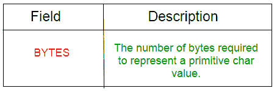
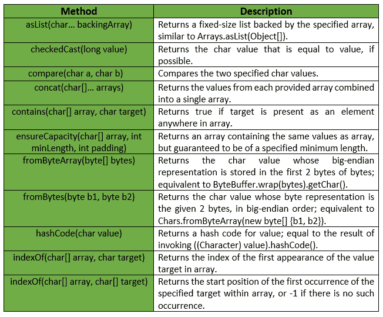
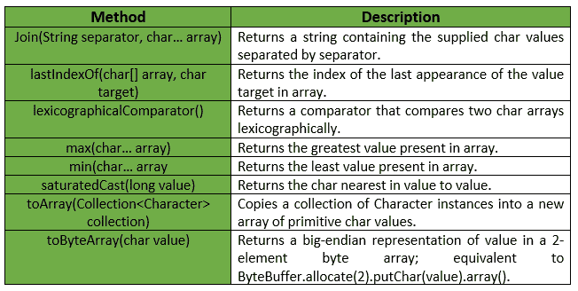

# Chars Class |番石榴| Java

> 原文:[https://www.geeksforgeeks.org/chars-class-guava-java/](https://www.geeksforgeeks.org/chars-class-guava-java/)

## 介绍

`Chars` 是一个用于原语类型 `char` 的实用程序类。它提供了关于字符原语的静态实用方法，这些原语在字符或数组中都找不到。这个类中的所有操作都严格按照数字处理字符值，即它们既不支持 Unicode，也不依赖于区域设置。

## 声明

```java
@GwtCompatible(emulated=true)
public final class Chars
extends Object
```

## 字段摘要

下表显示了番石榴字符类的字段摘要:



## 方法

番石榴 `Chars` 类提供的方法有:


## 异常

*   `checkRepresentable`: 如果值大于 `Character.MAX_VALUE` 或小于 `Character.MIN_VALUE`，则抛出 `IllegalArgumentException`。
*   `min`: 若数组为空，则抛出 `IllegalArgumentException`。
*   `max`: 如果数组为空，则抛出 `IllegalArgumentException`。
*   `fromByteArray`: 如果字节少于 2 个元素，则抛出 `IllegalArgumentException`。
*   `ensureCapacity`: 如果最小长度或填充值为负，则抛出 `IllegalArgumentException`。
*   `toArray`: 如果集合或其任何元素为 `null`，则抛出 `NullPointerException`。

## 其他方法

下表显示了番石榴 `Chars` 类提供的一些其他方法:


## 示例

下面给出了一些示例，显示了番石榴 `Chars` 类的方法的实现:

### 示例 1

```java
// Java code to show implementation
// of Guava Chars.asList() method

import com.google.common.primitives.Chars;
import java.util.*;

class GFG {
    // Driver method
    public static void main(String[] args)
    {
        char arr[] = { 'g', 'e', 'e', 'k', 's' };

        // Using Chars.asList() method which
        // converts array of primitives
        // to array of objects
        List<Character> myList = Chars.asList(arr);

        // Displaying the elements
        System.out.println(myList);
    }
}
```

输出:

```java
[g, e, e, k, s]
```

### 示例 2

```java
// Java code to show implementation
// of Guava Chars.toArray() method

import com.google.common.primitives.Chars;
import java.util.*;

class GFG {
    // Driver method
    public static void main(String[] args)
    {
        List<Character> myList = Arrays.asList('g', 'e', 'e', 'k', 's');

        // Using Chars.toArray() method which
        // converts a List of Chars to an
        // array of char
        char[] arr = Chars.toArray(myList);

        // Displaying the elements
        System.out.println(Arrays.toString(arr));
    }
}
```

输出:

```java
[g, e, e, k, s]
```

### 示例 3

```java
// Java code to show implementation
// of Guava Chars.concat() method

import com.google.common.primitives.Chars;
import java.util.*;

class GFG {
    // Driver method
    public static void main(String[] args)
    {
        char[] arr1 = { 'g', 'e', 'e' };
        char[] arr2 = { 'k', 's' };

        // Using Chars.concat() method which
        // combines arrays from specified
        // arrays into a single array
        char[] arr = Chars.concat(arr1, arr2);

        // Displaying the elements
        System.out.println(Arrays.toString(arr));
    }
}
```

输出:

```java
[g, e, e, k, s]
```

### 示例 4

```java
// Java code to show implementation
// of Guava Chars.contains() method

import com.google.common.primitives.Chars;

class GFG {
    // Driver method
    public static void main(String[] args)
    {
        char[] arr = { 'g', 'e', 'e', 'k', 's' };

        // Using Chars.contains() method which
        // checks if element is present in array
        // or not
        System.out.println(Chars.contains(arr, 'g'));
        System.out.println(Chars.contains(arr, 'm'));
    }
}
```

输出:

```java
true
false
```

### 示例 5

```java
// Java code to show implementation
// of Guava Chars.min() method

import com.google.common.primitives.Chars;

class GFG {
    // Driver method
    public static void main(String[] args)
    {
        char[] arr = { 'g', 'e', 'e', 'k', 's' };

        // Using Chars.min() method
        System.out.println(Chars.min(arr));
    }
}
```

输出:

```java
e
```

### 示例 6

```java
// Java code to show implementation
// of Guava Chars.max() method

import com.google.common.primitives.Chars;

class GFG {
    // Driver method
    public static void main(String[] args)
    {
        char[] arr = { 'g', 'e', 'e', 'k', 's' };

        // Using Chars.max() method
        System.out.println(Chars.max(arr));
    }
}
```

输出:

```java
s
```