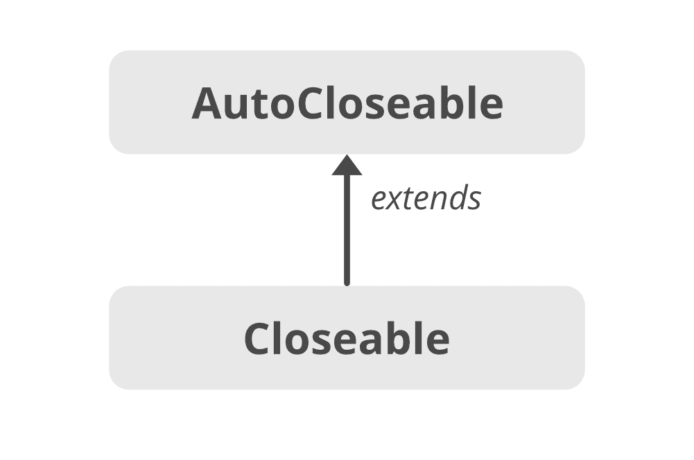

# Java 中的可关闭界面

> 原文:[https://www.geeksforgeeks.org/closeable-interface-in-java/](https://www.geeksforgeeks.org/closeable-interface-in-java/)

`Closeable` 是需要关闭的数据的来源或目的地。当我们需要释放由对象（如打开的文件）持有的资源时，调用 `close()` 方法。它是流类的重要接口之一。`Closeable` 接口在 `JDK 5` 中引入，并在 `java.io` 中定义。从 `JDK 7+` 开始，我们应该使用 `AutoCloseable` 接口。`Closeable` 接口是一个较旧的接口，引入它是为了保持向后兼容性。

## 可关闭界面的层次结构



`Closeable` 接口扩展了 `AutoCloseable` 接口，因此任何实现 `Closeable` 的类也实现了 `AutoCloseable`。

## 申报

```java
public interface Closeable extends AutoCloseable 
{
    public void close() throws IOException;
}
```

## 实现可关闭界面

```java
import java.io.Closeable;
import java.io.IOException;

public class MyCustomCloseableClass implements Closeable {

    @Override
    public void close() throws IOException {
        // close resource
        System.out.println("Closing");
    }
}
```

## 关闭可关闭界面的()方法

调用 `close()` 方法来释放对象持有的资源。如果流已经关闭，那么调用 `close` 方法不会有任何影响。

### 语法

```java
public void close() throws IOException
```

> **注意:** `Closeable` 为**幂等**，表示多次调用 `close()` 方法没有副作用。

## 可关闭界面的限制

`Closeable` 只抛出 `IOException`，不破坏遗留代码是无法更改的。因此，`AutoCloseable` 被引入，因为它可以抛出任何异常。

## 可闭合的超界面

*   `AutoCloseable`

## 可关闭的子接口

*   `AsynchronousByteChannel`
*   `AsynchronousChannel`
*   `ByteChannel`
*   `Channel`
*   `ImageInputStream`
*   `ImageOutputStream`
*   `MulticastChannel`

## 实现类

*   `AbstractSelectableChannel`
*   `AbstractSelector`
*   `BufferedReader`
*   `BufferedWriter`
*   `BufferedInputStream`
*   `BufferedOutputStream`
*   `CheckedInputStream`
*   `CheckedOutputStream`

## 可关闭与可自动关闭

1.  `Closeable` 是由 `JDK 5` 推出的，而 `AutoCloseable` 是由 `JDK 7+` 推出的。
2.  `Closeable` **扩展了** `AutoCloseable`，`Closeable` 主要针对输入输出流。
3.  `Closeable` 扩展 `Exception`，而 `AutoCloseable` 扩展 `Throwable`。
4.  `Closeable` 的接口是**幂等的**（多次调用 `close()` 方法没有任何副作用），而 `AutoCloseable` 不提供这个功能。
5.  `AutoCloseable` 是专门为处理 `try-with-resources` 语句而引入的。由于 `Closeable` 实现了 `AutoCloseable`，因此任何实现 `Closeable` 的类也实现了 `AutoCloseable` 接口，并且可以使用 `try-with-resources` 来关闭文件。

```java
try(FileInputStream fin = new FileInputStream(input)) {
    // Some code here
}
```

## 可关闭试配块的使用

由于 `Closeable` 继承了 `AutoCloseable` 接口的属性，因此实现 `Closeable` 的类也可以使用 `try-with-resources` 块。在 `try-with-resources` 块中可以使用多个资源，并自动关闭它们。在这种情况下，资源将以它们在括号内创建的相反顺序关闭。

```java
// Java program to illustrate
// Automatic Resource Management
// in Java with multiple resource

import java.io.*;
class Resource {
    public static void main(String s[])
    {
        // note the order of opening the resources
        try (Demo d = new Demo(); Demo1 d1 = new Demo1()) {
            int x = 10 / 0;
            d.show();
            d1.show1();
        }
        catch (ArithmeticException e) {
            System.out.println(e);
        }
    }
}

// custom resource 1
class Demo implements Closeable {
    void show() { System.out.println("inside show"); }
    public void close()
    {
        System.out.println("close from demo");
    }
}

// custom resource 2
class Demo1 implements Closeable {
    void show1() { System.out.println("inside show1"); }
    public void close()
    {
        System.out.println("close from demo1");
    }
}
```

### Output

```java
close from demo1
close from demo
java.lang.ArithmeticException: / by zero
```

## 可关闭界面的方法

| 方法 | 描述 |
| --- | --- |
| `close()` | 关闭此流并释放与其关联的任何系统资源。 |