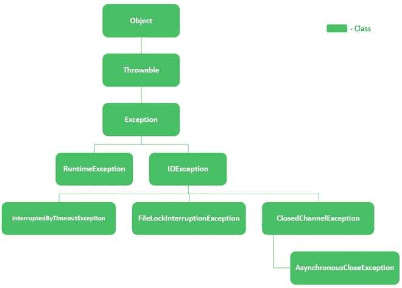
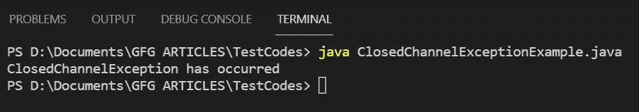

# 用示例关闭 Java 中的通道异常

> 原文：[https://www.geeksforgeeks.org/closedchannelexception-in-java-with-examples/](https://www.geeksforgeeks.org/closedchannelexception-in-java-with-examples/)

当在关闭的通道或对尝试的操作关闭的通道上尝试输入/输出操作时，调用类 `ClosedChannelException`。也就是说，如果引发此异常，并不意味着通道完全关闭，而是对尝试的操作关闭。

**语法：**

```java
public class ClosedChannelException
extends IOException
```

`ClosedChannelException` 的层次结构如下：



现在让我们先看看这个类的构造函数细节，然后再来看它的方法。

<figure class="table">

| constructors | describe |
| --- | --- |
| `ClosedChannelException()` | 构造该类的一个实例。 |

</figure>

现在让我们讨论从 `Throwable` 类继承的方法。它们以表格形式描述如下：

<figure class="table">

| 方法 | 描述 |
| --- | --- |
| [`addSuppressed()`](https://www.geeksforgeeks.org/throwable-addsuppressed-method-in-java-with-examples/?ref=rp) | 将此异常添加到抑制的异常中，以便调度此异常。 |
| [`fillInStackTrace()`](https://www.geeksforgeeks.org/throwable-fillinstacktrace-method-in-java/) | 记录当前线程的堆栈帧的当前状态信息到此 `Throwable` 对象中，并填充执行堆栈跟踪。 |
| [`getCause()`](https://www.geeksforgeeks.org/throwable-getcause-method-in-java-with-examples/?ref=rp) | 如果原因未知，则返回此 `Throwable` 的原因或 `null`。 |
| [`getLocalizedMessage()`](https://www.geeksforgeeks.org/throwable-getlocalizedmessage-method-in-java-with-examples/) | 返回此 `Throwable` 的本地化描述。子类可以覆盖描述。如果子类未覆盖此方法，结果将与 `getMessage()` 相同。 |
| [`getMessage()`](https://www.geeksforgeeks.org/throwable-getmessage-method-in-java-with-examples/?ref=rp) | 返回此 `Throwable` 的详细消息描述。 |
| [`getStackTrace()`](https://www.geeksforgeeks.org/throwable-getstacktrace-method-in-java-with-examples/) | 返回一个堆栈跟踪元素数组，每个元素代表一个堆栈帧。允许访问由 `printStackTrace()` 打印的堆栈跟踪信息。 |
| [`getSuppressed()`](https://www.geeksforgeeks.org/throwable-getsuppressed-method-in-java-with-examples/?ref=rp) | 返回一个数组，其中包含所有被抑制的异常，这些异常是通过 `addSuppressed()` 方法添加到此可抛出对象的。 |
| [`initCause()`](https://www.geeksforgeeks.org/throwable-initcause-method-in-java-with-examples/) | 使用给定值初始化此可抛出对象的原因。 |
| [`printStackTrace()`](https://www.geeksforgeeks.org/throwable-printstacktrace-method-in-java-with-examples/?ref=rp) | 将此 `Throwable` 及其回溯打印到错误输出流。 |
| [`printStackTrace(PrintStream)`](https://www.geeksforgeeks.org/throwable-printstacktrace-method-in-java-with-examples/?ref=rp) | 将此 `Throwable` 及其回溯打印到指定的打印流。 |
| [`printStackTrace(PrintWriter)`](https://www.geeksforgeeks.org/throwable-printstacktrace-method-in-java-with-examples/?ref=rp) | 将此 `Throwable` 及其回溯打印到指定的打印写入器。 |
| [`setStackTrace(StackTraceElement[])`](https://www.geeksforgeeks.org/throwable-setstacktrace-method-in-java-with-examples/?ref=rp) | 设置此 `Throwable` 的堆栈跟踪元素。它专为远程过程调用框架和高级系统设计，允许客户端覆盖默认的堆栈跟踪。 |
| [`toString()`](https://www.geeksforgeeks.org/throwable-tostring-method-in-java-with-examples/?ref=rp) | 返回此 `Throwable` 的简短描述，格式为：对象的类名：对象调用 `getLocalizedMessage()` 的结果。如果 `getLocalizedMessage()` 返回 `null`，则只返回类名。 |

</figure>

> **注意：** *这个*指的是方法被调用的上下文中的对象。

**实现：** 我们本质上是要创建一个通道，关闭它，然后尝试在关闭的通道上执行读操作。这将触发关闭通道异常。步骤如下：

1.  我们将创建一个 `RandomAccessFile` 类的实例，以“读写”模式从您的系统中打开一个文本文件。
2.  现在我们使用 `FileChannel` 类创建一个打开文件的通道。
3.  之后，我们使用 `ByteBuffer` 类创建一个缓冲区来从该通道读取字节数据。
4.  此外，`Charset` 类，我们将编码方案定义为“US-ASCII”。
5.  最后，在我们开始读取这个文件之前，我们关闭通道。

> 因此，当在此通道上尝试读取操作时，将引发 `ClosedChannelException`。我们在 `catch` 块中捕获异常，您可以在其中添加任何特定于您的需求的异常处理，这里我们只打印一条消息。

## 示例代码

```java
// Java Program to Illustrate Working of
// ClosedChannelException

// Importing required classes
// Input output classes
import java.io.IOException;
import java.io.RandomAccessFile;
// Classes from java.nio package
import java.nio.ByteBuffer;
import java.nio.channels.ClosedChannelException;
import java.nio.channels.FileChannel;
import java.nio.charset.Charset;

// Main class
// For ClosedChannelException
public class GFG {

    // Main driver method
    public static void main(String args[])
        throws IOException
    {
        // Try block to check for exceptions
        try {
            // Open a file in your system using the
            // RandomAccessFile class Custom local directory
            // on machine
            RandomAccessFile randomAccessFile
                = new RandomAccessFile(
                    "D:/Documents/textDoc.txt", "rw");

            // Now creating a channel using the FileChannel
            // class to the file opened using the
            // RandomAccessFile class
            FileChannel fileChannel
                = randomAccessFile.getChannel();

            // Create a buffer to read bytes from the
            // channel using the ByteBuffer class
            ByteBuffer byteBuffer
                = ByteBuffer.allocate(512);
            Charset charset = Charset.forName("US-ASCII");

            // Close the file channel
            // We do this so the exception is thrown
            fileChannel.close();

            // Try to read from the fileChannel which is now
            // closed
            while (fileChannel.read(byteBuffer) > 0) {
                byteBuffer.rewind();
                System.out.print(
                    charset.decode(byteBuffer));
                byteBuffer.flip();
            }

            // Closing the connections to free up memory
            // resources using close() method
            randomAccessFile.close();
        }

        // Catch block to handle the exceptions
        // Handling Application specific Exception
        catch (ClosedChannelException e) {
            // Print message if exception is occurred
            System.out.println(
                "ClosedChannelException has occurred");
        }
    }
}
```

### 输出

