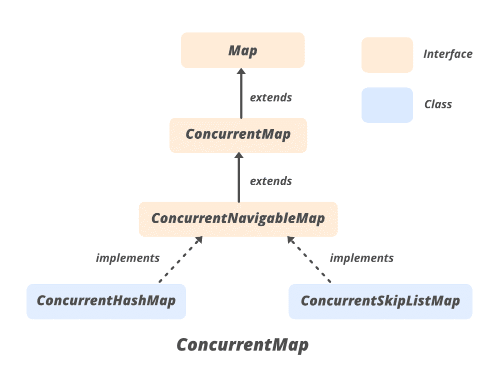

# Java 中的并发映射接口

> 原文：[https://www.geeksforgeeks.org/concurrentmap-interface-java/](https://www.geeksforgeeks.org/concurrentmap-interface-java/)

`ConcurrentMap` 是一个接口，它是 [Java Collections Framework](https://www.geeksforgeeks.org/collections-in-java-2/) 的成员，该框架在 JDK 1.5 中引入，代表一个能够处理对它的并发访问而不影响地图中条目一致性的地图。`ConcurrentMap` 接口在 `java.util.concurrent` 包中提供。除了从 `Map` 超接口继承的方法之外，它还提供了一些额外的方法。它继承了嵌套接口 `Map.Entry<K, V>`。

`HashMap` 操作不同步，`Hashtable` 提供同步。虽然 `Hashtable` 是线程安全的，但它不是很有效。为了解决这个问题，Java Collections 框架在 Java 1.5 中引入了 `ConcurrentMap`。

## 继承层次图



## 声明

```java
public interface ConcurrentMap<K,V> extends Map<K,V>
```

这里 `K` 是关键对象的类型，`V` 是值对象的类型。

*   它扩展了 Java 中的 `Map` 接口。
*   `ConcurrentNavigableMap<K, V>` 是其子接口。
*   `ConcurrentMap` 由 `ConcurrentHashMap`、`ConcurrentSkipListMap` 类实现。
*   并发地图被称为同步地图。

## 实现类

因为它属于 `java.util.concurrent` 包，所以我们必须导入正在使用的类。

```java
import java.util.concurrent.ConcurrentMap
                or
import java.util.concurrent.*
```

`ConcurrentMap` 有两个实现类，分别是 `ConcurrentSkipListMap` 和 `ConcurrentHashMap`。`ConcurrentSkipListMap` 是 `ConcurrentNavigableMap` 接口的可扩展实现，该接口扩展了 `ConcurrentMap` 接口。`ConcurrentSkipListMap` 中的键是按自然顺序排序的，或者是在构造对象时使用比较器排序的。`ConcurrentSkipListMap` 具有用于插入、删除和搜索操作的 `log(n)` 的预期时间成本。它是一个线程安全的类，因此，所有的基本操作都可以同时完成。

### 语法

```java
// ConcurrentMap implementation by ConcurrentHashMap
ConcurrentMap<K, V> numbers = new ConcurrentHashMap<K, V>();

// ConcurrentMap implementation by ConcurrentSkipListMap
ConcurrentMap<?, ?> objectName = new ConcurrentSkipListMap<?, ?>();
```

## 示例

```java
// Java Program to illustrate methods
// of ConcurrentMap interface
import java.util.concurrent.*;

class ConcurrentMapDemo {

    public static void main(String[] args)
    {
        // Since ConcurrentMap is an interface,
        // we create instance using ConcurrentHashMap
        ConcurrentMap<Integer, String> m = new ConcurrentHashMap<Integer, String>();
        m.put(100, "Geeks");
        m.put(101, "For");
        m.put(102, "Geeks");

        // Here we cant add Hello because 101 key
        // is already present
        m.putIfAbsent(101, "Hello");

        // We can remove entry because 101 key
        // is associated with For value
        m.remove(101, "For");

        // Now we can add Hello
        m.putIfAbsent(101, "Hello");

        // We can replace Hello with For
        m.replace(101, "Hello", "For");
        System.out.println("Map contents : " + m);
    }
}
```

### 输出

```java
Map contents : {100=Geeks, 101=For, 102=Geeks}
```

## 基本方法

### 1. 添加元素

`ConcurrentSkipListMap` 的 `put()` 方法是 Java 中的内置函数，它将指定的值与该映射中的指定键相关联。如果映射先前包含键的映射，则替换旧值。

```java
// Java Program to demonstrate adding
// elements

import java.util.concurrent.*;

class AddingElementsExample {
    public static void main(String[] args)
    {
        // Instantiate an object
        // Since ConcurrentMap
        // is an interface so We use
        // ConcurrentSkipListMap
        ConcurrentMap<Integer, Integer> mpp = new ConcurrentSkipListMap<Integer, Integer>();

        // Adding elements to this map
          // using put() method
        for (int i = 1; i <= 5; i++)
            mpp.put(i, i);

        // Print map to the console
        System.out.println("After put(): " + mpp);
    }
}
```

### 输出

```java
After put(): {1=1, 2=2, 3=3, 4=4, 5=5}
```

### 2. 移除元素

`ConcurrentSkipListMap` 的 `remove()` 方法是 Java 中的内置函数，它从该映射中删除指定键的映射。如果该特定键没有映射，则该方法返回 `null`。执行此方法后，地图的大小会减小。

```java
// Java Program to demonstrate removing
// elements

import java.util.concurrent.*;

class RemovingElementsExample {
    public static void main(String[] args)
    {
        // Instantiate an object
        // Since ConcurrentMap
        // is an interface so We use
        // ConcurrentSkipListMap
        ConcurrentMap<Integer, Integer> mpp = new ConcurrentSkipListMap<Integer, Integer>();

        // Adding elements to this map
        // using put method
        for (int i = 1; i <= 5; i++)
            mpp.put(i, i);

        // remove() mapping associated
        // with key 1
        mpp.remove(1);

        System.out.println("After remove(): " + mpp);
    }
}
```

### 输出

```java
After remove(): {2=2, 3=3, 4=4, 5=5}
```

### 3. 访问元素

我们可以使用 `get()` 方法访问 `ConcurrentSkipListMap` 的元素，下面给出了这个例子。

```java
// Java Program to demonstrate accessing
// elements

import java.util.concurrent.*;

class AccessingElementsExample {

    public static void main(String[] args)
    {

        // Instantiate an object
        // Since ConcurrentMap
        // is an interface so We use
        // ConcurrentSkipListMap
        ConcurrentMap<Integer, String> chm = new ConcurrentSkipListMap<Integer, String>();

        // insert mappings using put method
        chm.put(100, "Geeks");
        chm.put(101, "for");
        chm.put(102, "Geeks");
        chm.put(103, "Contribute");

        // Displaying the HashMap
        System.out.println("The Mappings are: ");
        System.out.println(chm);

        // Display the value of 100
        System.out.println("The Value associated to "
                           + "100 is : " + chm.get(100));

        // Getting the value of 103
        System.out.println("The Value associated to "
                           + "103 is : " + chm.get(103));
    }
}
```

### 输出

```java
The Mappings are: 
{100=Geeks, 101=for, 102=Geeks, 103=Contribute}
The Value associated to 100 is : Geeks
The Value associated to 103 is : Contribute
```

### 4. 遍历

我们可以使用 `Iterator` 接口遍历集合框架的任何结构。由于迭代器处理一种类型的数据，我们使用 `Entry<?, ?>` 将两种不同的类型解析成兼容的格式。然后使用 `next()` 方法打印 `ConcurrentSkipListMap` 的元素。

## Java 语言

```java
import java.util.concurrent.*;
import java.util.*;

public class TraversingExample {

    public static void main(String[] args)
    {

        // Instantiate an object
        // Since ConcurrentMap
        // is an interface so We use
        // ConcurrentSkipListMap
        ConcurrentMap<Integer, String> chmap = new ConcurrentSkipListMap<Integer, String>();

        // Add elements using put()
        chmap.put(8, "Third");
        chmap.put(6, "Second");
        chmap.put(3, "First");
        chmap.put(11, "Fourth");

        // Create an Iterator over the
        // ConcurrentSkipListMap
        Iterator<ConcurrentSkipListMap
                     .Entry<Integer, String> > itr
            = chmap.entrySet().iterator();

        // The hasNext() method is used to check if there is
        // a next element The next() method is used to
        // retrieve the next element
        while (itr.hasNext()) {
            ConcurrentSkipListMap
                .Entry<Integer, String> entry
                = itr.next();
            System.out.println("Key = " + entry.getKey()
                               + ", Value = "
                               + entry.getValue());
        }
    }
}
```

### 输出示例

```java
Key = 3, Value = First
Key = 6, Value = Second
Key = 8, Value = Third
Key = 11, Value = Fourth
```

## 并发映射的方法

*   `K` – 地图中按键的类型。
*   `V` – 映射图中映射的值的类型。

<figure class="table">

| 方法 | 描述 |
| --- | --- |
| `compute(K key, BiFunction<? super K, ? super V, ? extends V> remappingFunction)` | 尝试计算指定键及其当前映射值的映射(如果没有当前映射，则为空)。 |
| `computeIfAbsent(K key, Function<? super K, ? extends V> mappingFunction)` | 如果指定的键尚未与值相关联(或映射为 null)，会尝试使用给定的映射函数计算其值，并将其输入到此映射中，除非为 null。 |
| `computeIfPresent(K key, BiFunction<? super K, ? super V, ? extends V> remappingFunction)` | 如果指定键的值存在且不为空，将尝试计算给定键及其当前映射值的新映射。 |
| `forEach(BiConsumer<? super K, ? super V> action)` | 对此映射中的每个条目执行给定的操作，直到所有条目都已处理完毕或该操作引发异常。 |
| `getOrDefault(Object key, V defaultValue)` | 返回指定键映射到的值，如果此映射不包含键映射，则返回默认值。 |
| `merge(K key, V value, BiFunction<? super V, ? super V, ? extends V> remappingFunction)` | 如果指定的键尚未与值相关联或与 null 相关联，则将其与给定的非 null 值相关联。 |
| `putIfAbsent(K key, V value)` | 如果指定的键尚未与值相关联，则将它与给定值相关联。 |
| `remove(Object key, Object value)` | 仅当当前映射到给定值时，才移除键的条目。 |
| `replace(K key, V value)` | 仅当当前映射到某个值时，才替换项。 |
| `replace(K key, V oldValue, V newValue)` | 仅当当前映射到给定值时，替换项。 |
| `replaceAll(BiFunction<? super K, ? super V, ? extends V> function)` | 将每个条目的值替换为对该条目调用给定函数的结果，直到所有条目都已处理完毕或函数引发异常。 |

</figure>

## 从接口 java.util.Map 继承的方法

<figure class="table">

| 方法 | 描述 |
| --- | --- |
| [`clear()`](https://www.geeksforgeeks.org/map-clear-method-in-java-with-example/) | 从此映射中移除所有映射(可选操作)。 |
| [`containsKey(Object key)`](https://www.geeksforgeeks.org/map-containskey-method-in-java-with-examples/) | 如果此映射包含指定键的映射，则返回 true。 |
| [`containsValue(Object value)`](https://www.geeksforgeeks.org/map-containsvalue-method-in-java-with-examples/) | 如果此映射将一个或多个键映射到指定值，则返回 true。 |
| `entry(K k, V v)` | 返回一个不可变的映射。包含给定键和值的条目。 |
| [`entrySet()`](https://www.geeksforgeeks.org/map-entryset-method-in-java-with-examples/) | 返回此映射中包含的映射的集合视图。 |
| [`equals(Object o)`](https://www.geeksforgeeks.org/map-equals-method-in-java-with-examples/) | 将指定的对象与此映射进行比较，看是否相等。 |
| [`get(Object key)`](https://www.geeksforgeeks.org/map-get-method-in-java-with-examples/) | 返回指定键映射到的值，如果此映射不包含键映射，则返回 null。 |
| [`hashCode()`](https://www.geeksforgeeks.org/map-hashcode-method-in-java-with-examples/) | 返回此映射的哈希代码值。 |
| [`isEmpty()`](https://www.geeksforgeeks.org/map-isempty-method-in-java-with-examples/) | 如果此映射不包含键值映射，则返回 true。 |
| [`keySet()`](https://www.geeksforgeeks.org/map-keyset-method-in-java-with-examples/) | 返回此地图中包含的键的集合视图。 |
| `of()` | 返回包含零映射的不可变映射。 |
| `of(K k1, V v1)` | 返回包含单个映射的不可变映射。 |
| `of(K k1, V v1, K k2, V v2)` | 返回包含两个映射的不可变映射。 |
| `of(K k1, V v1, K k2, V v2, K k3, V v3)` | 返回包含三个映射的不可变映射。 |
| `of(K k1, V v1, K k2, V v2, K k3, V v3, K k4, V v4)` | 返回包含四个映射的不可变映射。 |
| `of(K k1, V v1, K k2, V v2, K k3, V v3, K k4, V v4, K k5, V v5)` | 返回包含五个映射的不可变映射。 |
| `of(K k1, V v1, K k2, V v2, K k3, V v3, K k4, V v4, K k5, V v5, K k6, V v6)` | 返回包含六个映射的不可变映射。 |
| `of(K k1, V v1, K k2, V v2, K k3, V v3, K k4, V v4, K k5, V v5, K k6, V v6, K k7, V v7)` | 返回包含七个映射的不可变映射。 |
| `of(K k1, V v1, K k2, V v2, K k3, V v3, K k4, V v4, K k5, V v5, K k6, V v6, K k7, V v7, K k8, V v8)` | 返回包含八个映射的不可变映射。 |
| `of(K k1, V v1, K k2, V v2, K k3, V v3, K k4, V v4, K k5, V v5, K k6, V v6, K k7, V v7, K k8, V v8, K k9, V v9)` | 返回包含九个映射的不可变映射。 |
| `of(K k1, V v1, K k2, V v2, K k3, V v3, K k4, V v4, K k5, V v5, K k6, V v6, K k7, V v7, K k8, V v8, K k9, V v9, K k10, V v10)` | 返回包含十个映射的不可变映射。 |
| `ofEntries(Entry<? extends K, ? extends V>... entries)` | 返回包含从给定条目中提取的键和值的不可变映射。 |
| [`put(K key, V value)`](https://www.geeksforgeeks.org/map-put-method-in-java-with-examples/) | 将指定值与此映射中的指定键相关联(可选操作)。 |
| [`putAll(Map<? extends K, ? extends V> m)`](https://www.geeksforgeeks.org/map-putall-method-in-java-with-examples/) | 将所有映射从指定映射复制到此映射(可选操作)。 |
| [`remove(Object key)`](https://www.geeksforgeeks.org/map-remove-method-in-java-with-examples/) | 从该映射中删除键的映射(如果存在)(可选操作)。 |
| `size()` | 返回此映射中键值映射的数量。 |
| `values()` | 返回此地图中包含的值的集合视图。 |

</figure>

**参考:** [https://docs.oracle.com/en/java/javase/11/docs/api/java.base/java/util/concurrent/ConcurrentMap.html](https://docs.oracle.com/en/java/javase/11/docs/api/java.base/java/util/concurrent/ConcurrentMap.html)