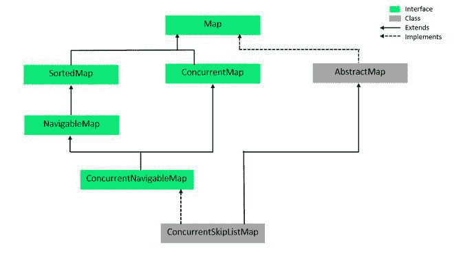

# Java 中的 ConcurrentNavigableMap 接口

> 原文: [https://www.geeksforgeeks.org/concurrentnavigablemap-interface-in-java/](https://www.geeksforgeeks.org/concurrentnavigablemap-interface-in-java/)

`ConcurrentNavigableMap` 接口是 [Java 集合框架](https://www.geeksforgeeks.org/collections-in-java-2/)的成员。它从 [NavigableMap](https://www.geeksforgeeks.org/navigablemap-interface-in-java-with-example/) 接口和 [ConcurrentMap](https://www.geeksforgeeks.org/concurrentmap-interface-java/) 接口扩展而来。`ConcurrentNavigableMap` 提供了对地图元素的线程安全访问，并提供了方便的导航方法。属于 `java.util.concurrent` 包。

**声明:**

```java
public interface ConcurrentNavigableMap<K,V> extends ConcurrentMap<K,V>, NavigableMap<K,V>
```

这里 `K` 为关键对象类型，`V` 为值对象类型。

### 并发导航的层次结构



它实现了 `ConcurrentMap<K,V>`、`Map<K,V>`、`NavigableMap<K,V>`、`SortedMap<K,V>` 接口。`ConcurrentSkipListMap` 实现了 `ConcurrentNavigableMap`。

### 示例:

```java
// Java Program to demonstrate the
// ConcurrentNavigableMap Interface
import java.util.concurrent.ConcurrentNavigableMap;
import java.util.concurrent.ConcurrentSkipListMap;

public class GFG {

    public static void main(String[] args)
    {

        // Instantiate an object
        // Since ConcurrentNavigableMap
        // is an interface so We use
        // ConcurrentSkipListMap
        ConcurrentNavigableMap<Integer, String> cnmap
            = new ConcurrentSkipListMap<Integer, String>();

        // Add elements using put() method
        cnmap.put(1, "First");
        cnmap.put(2, "Second");
        cnmap.put(3, "Third");
        cnmap.put(4, "Fourth");

        // Print the contents on the console
        System.out.println(
            "Mappings of ConcurrentNavigableMap : "
            + cnmap);

        System.out.println("HeadMap(3): "
                           + cnmap.headMap(3));
        System.out.println("TailMap(3): "
                           + cnmap.tailMap(3));
        System.out.println("SubMap(1, 3): "
                           + cnmap.subMap(1, 3));
    }
}
```

**输出:**

```java
Mappings of ConcurrentNavigableMap : {1=First, 2=Second, 3=Third, 4=Fourth}
HeadMap(3): {1=First, 2=Second}
TailMap(3): {3=Third, 4=Fourth}
SubMap(1, 3): {1=First, 2=Second}
```

### 实现类

`ConcurrentNavigableMap` 有一个实现类 `ConcurrentSkipListMap`。`ConcurrentSkipListMap` 是 `ConcurrentNavigableMap` 接口的可扩展实现。`ConcurrentSkipListMap` 中的键是按照自然顺序排序的，或者是在构建对象时使用 [Comparator](https://www.geeksforgeeks.org/comparator-interface-java/) 排序的。`ConcurrentSkipListMap` 具有用于插入、删除和搜索操作的 `O(log n)` 的预期时间成本。它是一个线程安全的类，因此，所有的基本操作都可以同时完成。

**语法:**

```java
ConcurrentSkipListMap<?, ?> objectName = new ConcurrentSkipListMap<?, ?>();
```

**示例:** 在下面给出的代码中，我们简单地实例化了名为 `cslmap` 的 `ConcurrentSkipListMap` 类的一个对象。`put()` 方法用于添加元素，`remove()` 用于删除元素。对于 `remove()` 方法，语法是 `objectName.remove(objectKey)`。`keySet()` 显示了映射中的所有键。

```java
// Java Program to demonstrate the ConcurrentSkipListMap
import java.util.concurrent.*;

public class ConcurrentSkipListMapExample {

    public static void main(String[] args)
    {

        // Instantiate an object of
        // ConcurrentSkipListMap named cslmap
        ConcurrentSkipListMap<Integer, String> cslmap
            = new ConcurrentSkipListMap<Integer, String>();

        // Add elements using put()
        cslmap.put(1, "Geeks");
        cslmap.put(2, "For");
        cslmap.put(3, "Geeks");

        // Print the contents on the console
        System.out.println(
            "The ConcurrentSkipListMap contains: "
            + cslmap);

        // Print the key set using keySet()
        System.out.println(
            "\nThe ConcurrentSkipListMap key set: "
            + cslmap.keySet());

        // Remove elements using remove()
        cslmap.remove(3);

        // Print the contents on the console
        System.out.println(
            "\nThe ConcurrentSkipListMap contains: "
            + cslmap);
    }
}
```

**输出:**

```java
The ConcurrentSkipListMap contains: {1=Geeks, 2=For, 3=Geeks}

The ConcurrentSkipListMap key set: [1, 2, 3]

The ConcurrentSkipListMap contains: {1=Geeks, 2=For}
```

### 并发导航上的基本操作

#### 1. 添加元素

要向并发导航地图添加元素，我们可以使用 `Map` 接口的任何方法。下面的代码展示了如何使用它们。您可以在代码中观察到，当在构建时没有提供比较器时，遵循自然顺序。

```java
// Java Program for adding elements to a
// ConcurrentNavigableMap
import java.util.concurrent.*;

public class AddingElementsExample {

    public static void main(String[] args)
    {

        // Instantiate an object
        // Since ConcurrentNavigableMap is an interface
        // We use ConcurrentSkipListMap
        ConcurrentNavigableMap<Integer, String> cnmap
            = new ConcurrentSkipListMap<Integer, String>();

        // Add elements using put()
        cnmap.put(8, "Third");
        cnmap.put(6, "Second");
        cnmap.put(3, "First");

        // Print the contents on the console
        System.out.println(
            "Mappings of ConcurrentNavigableMap : "
            + cnmap);
    }
}
```

**输出:**

```java
Mappings of ConcurrentNavigableMap : {3=First, 6=Second, 8=Third}
```

#### 2. 移除元素

为了移除元素，我们还使用了 `Map` 接口的方法，因为 `ConcurrentNavigableMap` 是 `Map` 的一个后代。

```java
// Java Program for deleting
// elements from ConcurrentNavigableMap

import java.util.concurrent.*;

public class RemovingElementsExample {

    public static void main(String[] args)
    {

        // Instantiate an object
        // Since ConcurrentNavigableMap
        // is an interface
        // We use ConcurrentSkipListMap
        ConcurrentNavigableMap<Integer, String> cnmap
            = new ConcurrentSkipListMap<Integer, String>();

        // Add elements using put()
        cnmap.put(8, "Third");
        cnmap.put(6, "Second");
        cnmap.put(3, "First");
        cnmap.put(11, "Fourth");

        // Print the contents on the console
        System.out.println(
            "Mappings of ConcurrentNavigableMap : "
            + cnmap);

        // Remove elements using remove()
        cnmap.remove(6);
        cnmap.remove(8);

        // Print the contents on the console
        System.out.println(
            "\nConcurrentNavigableMap, after remove operation : "
            + cnmap);

        // Clear the entire map using clear()
        cnmap.clear();
        System.out.println(
            "\nConcurrentNavigableMap, after clear operation : "
            + cnmap);
    }
}
```

**输出:**

```java
Mappings of ConcurrentNavigableMap : {3=First, 6=Second, 8=Third, 11=Fourth}

ConcurrentNavigableMap, after remove operation : {3=First, 11=Fourth}

ConcurrentNavigableMap, after clear operation : {}
```

#### 3. 访问元素

我们可以使用 `get()` 方法访问 `ConcurrentNavigableMap` 的元素，下面给出了这个例子。

The request was rejected because it was considered high risk

### 在接口 `java.util.SortedMap` 中声明的方法

| 方法 | 描述 |
| --- | --- |
| [`比较器()`](https://www.geeksforgeeks.org/sortedmap-comparator-method-in-java-with-examples/) | 返回用于对该映射中的键进行排序的比较器，如果该映射使用其键的自然排序，则返回 `null`。 |
| [`输入 ySet()`](https://www.geeksforgeeks.org/sortedmap-entryset-method-in-java-with-examples/) | 返回此映射中包含的映射的集合视图。 |
| [`firstKey()`](https://www.geeksforgeeks.org/sortedmap-firstkey-method-in-java/) | 返回当前地图中的第一个(最低的)键。 |
| [`负载力()`](https://www.geeksforgeeks.org/sortedmap-lastkey-method-in-java/) | 返回当前地图中的最后一个(最高的)键。 |
| [`值()`](https://www.geeksforgeeks.org/sortedmap-values-method-in-java-with-examples/) | 返回此地图中包含的值的集合视图。 |