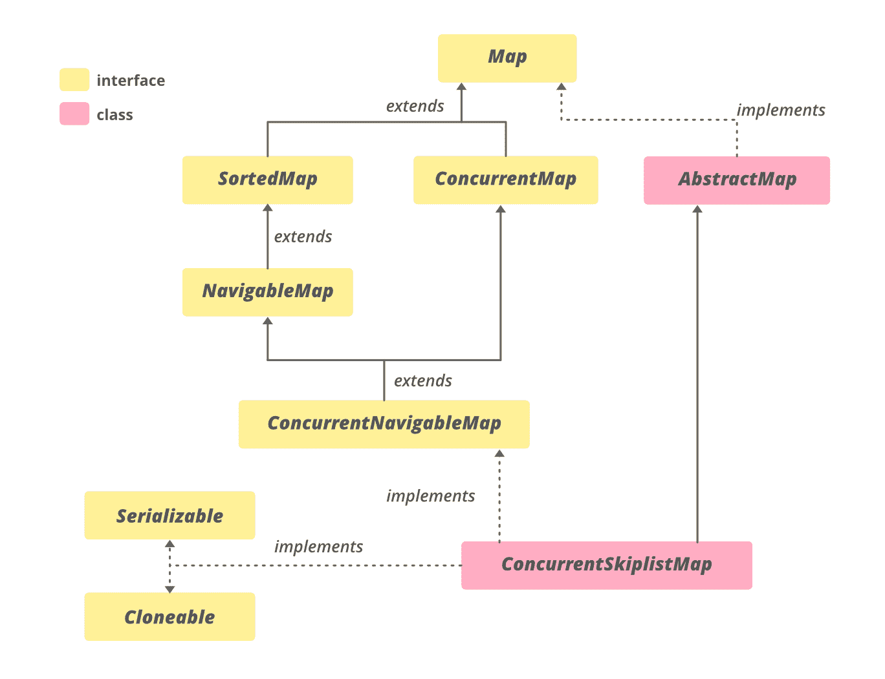

# Java 中的 ConcurrentSkipListMap 示例

> 原文: [https://www.geeksforgeeks.org/concurrentskiplistmap-in-java-with-examples/](https://www.geeksforgeeks.org/concurrentskiplistmap-in-java-with-examples/)

`ConcurrentSkipListMap` 类是 [Java 集合框架](https://www.geeksforgeeks.org/collections-in-java-2/)的成员。在 JDK 1.6 推出，属于 `java.util.concurrent` 包。`ConcurrentSkipListMap` 是 [`ConcurrentNavigableMap`](https://www.geeksforgeeks.org/concurrentnavigablemap-interface-in-java/) 的可扩展实现。所有的元素都是根据自然顺序或施工期间通过的[比较器](https://www.geeksforgeeks.org/comparator-interface-java/)进行排序的。此类使用 [SkipList](https://www.geeksforgeeks.org/skip-list/) 数据结构的并发变体，为插入、移除、更新和访问操作提供 `log(n)` 时间成本。这些操作对于由多个线程并发执行是安全的。

## 申报

> `public class ConcurrentSkipListMap<K,V> extends AbstractMap<K,V> implements ConcurrentNavigableMap<K,V>, Cloneable, Serializable`

这里 `K` 为关键对象类型，`V` 为值对象类型。

## ConcurrentSkipListMap 的层次结构



它实现了 [`Serializable`](https://www.geeksforgeeks.org/serializable-interface-in-java/)、[`Cloneable`](https://www.geeksforgeeks.org/cloneable-interface-in-java/)、[`ConcurrentMap<K, V>`](https://www.geeksforgeeks.org/concurrentmap-interface-java/#:~:text=ConcurrentMap%20is%20an%20interface%20and,util.&text=Map.,-It%20has%20inherited)、[`ConcurrentNavigableMap<K, V>`](https://www.geeksforgeeks.org/concurrentnavigablemap-interface-in-java/)、[`Map<K, V>`](https://www.geeksforgeeks.org/map-interface-java-examples/)、[`NavigableMap<K, V>`](https://www.geeksforgeeks.org/navigablemap-interface-in-java-with-example/)、[`SortedMap<K, V>`](https://www.geeksforgeeks.org/sortedmap-java-examples/) 接口和扩展。

## ConcurrentSkipListMap 的构造函数

**1. `ConcurrentSkipListMap()`**: 构建一个新的空映射，根据键的自然顺序进行排序。

> `ConcurrentSkipListMap<K, V> cslm = new ConcurrentSkipListMap<K, V>();`

**2. `ConcurrentSkipListMap(Comparator<? super K> comparator)`**: 构建一个新的、空的映射，按照指定的比较器排序。

> `ConcurrentSkipListMap<K, V> cslm = new ConcurrentSkipListMap<K, V>(Comparator<? super K> comparator);`

**3. `ConcurrentSkipListMap(Map<? extends K, ? extends V> m)`**: 构建一个包含与给定映射相同的映射的新映射，按照键的自然顺序排序。

> `ConcurrentSkipListMap<K, V> cslm = new ConcurrentSkipListMap<K, V>(Map<? extends K, ? extends V> m);`

**4. `ConcurrentSkipListMap(SortedMap<K, ? extends V> m)`**: 构建包含相同映射的新映射，并使用与指定排序映射相同的顺序。

> `ConcurrentSkipListMap<K, V> cslm = new ConcurrentSkipListMap<K, V>(SortedMap<K, ? extends V> m);`

## 示例

```java
// Java Program to Demonstrate
// ConcurrentSkipListMap

import java.io.*;
import java.util.*;
import java.util.concurrent.*;

class ConcurrentSkipListMapExample {
    public static void main(String[] args)
    {
        // create an instance of ConcurrentSkipListMap
        ConcurrentSkipListMap<String, String> cslm
            = new ConcurrentSkipListMap<String, String>();

        // Add mappings using put method
        cslm.put("3", "Geeks");
        cslm.put("2", "from");
        cslm.put("1", "Hi!");
        cslm.put("5", "Geeks");
        cslm.put("4", "for");

        // print to the console
        System.out.println("Initial Map : " + cslm);

        // print key-value pair whose key is greater than 2
        System.out.println("ceilingEntry-2: "
                           + cslm.ceilingEntry("2"));

        // get the descending key set
        NavigableSet<String> navigableSet = cslm.descendingKeySet();

        System.out.println("descendingKeySet: ");

        // Iterate through the keySet
        Iterator<String> itr = navigableSet.iterator();
        while (itr.hasNext()) {
            String s = (String)itr.next();
            System.out.println(s);
        }

        // print the first mapping
        System.out.println("firstEntry: "
                           + cslm.firstEntry());

        // print the last mapping
        System.out.println("lastEntry: "
                           + cslm.lastEntry());

        // remove the first mapping and print it
        System.out.println("pollFirstEntry: "
                           + cslm.pollFirstEntry());

        // print the first mapping
        System.out.println("now firstEntry: "
                           + cslm.firstEntry());

        // remove the last mapping and print it
        System.out.println("pollLastEntry: "
                           + cslm.pollLastEntry());

        // print the last mapping
        System.out.println("now lastEntry: "
                           + cslm.lastEntry());
    }
}
```

**Output**

```java
Initial Map : {1=Hi!, 2=from, 3=Geeks, 4=for, 5=Geeks}
ceilingEntry-2: 2=from
descendingKeySet: 
1
2
3
4
5
firstEntry: 1=Hi!
lastEntry: 5=Geeks
pollFirstEntry: 1=Hi!
now firstEntry: 2=from
pollLastEntry: 5=Geeks
now lastEntry: 4=for
```

## 基本操作

### 1. 添加映射

`ConcurrentSkipListMap` 的 [`put()`](https://www.geeksforgeeks.org/concurrentskiplistmap-put-method-in-java-with-examples/) 方法将指定的值与该映射中的指定键相关联。如果映射先前包含键的映射，则替换旧值。

```java
// Java Program to demonstrate adding
// mappings to a ConcurrentSkipListMap

import java.util.concurrent.*;

class AddingMappingsExample {
    public static void main(String[] args)
    {

        // Initializing the map
        ConcurrentSkipListMap<Integer, Integer> cslm
            = new ConcurrentSkipListMap<Integer, Integer>();

        // Adding elements to this map
        for (int i = 1; i <= 9; i++)
            cslm.put(i, i);

        // put() operation on the map
        System.out.println("After put(): " + cslm);
    }
}
```

**Output**

```java
After put(): {1=1, 2=2, 3=3, 4=4, 5=5, 6=6, 7=7, 8=8, 9=9}
```

### 2. 移除映射

`ConcurrentSkipListMap` 的 [`remove()`](https://www.geeksforgeeks.org/concurrentskiplistmap-remove-method-in-java-with-examples/) 方法从此映射中删除指定键的映射。如果没有该特定键的映射，则方法返回 `null`。执行此方法后，地图的大小会减小。要删除地图的第一个条目和最后一个条目，我们可以分别使用 `pollFirstEntry()` 和 `pollLastEntry()`。

```java
// Java Program Demonstrate removing
// mappings from ConcurrentSkipListMap

import java.util.concurrent.*;

class RemovingMappingsExample {
    public static void main(String[] args)
    {

        // Initializing the map
        ConcurrentSkipListMap<Integer, Integer> cslm
            = new ConcurrentSkipListMap<Integer, Integer>();

        // Adding elements to this map
        for (int i = 1; i <= 6; i++)
            cslm.put(i, i);

        // remove() operation on the map
        cslm.remove(5);

        // print the modified map
        System.out.println("After remove(): " + cslm);

        // remove the first mapping and print it
        System.out.println("pollFirstEntry: "
                           + cslm.pollFirstEntry());

        // remove the last mapping and print it
        System.out.println("pollLastEntry: "
                           + cslm.pollLastEntry());

          // Print final map
          System.out.println("map contents: " + cslm);
    }
}
```

**Output**

```java
After remove(): {1=1, 2=2, 3=3, 4=4, 6=6}
pollFirstEntry: 1=1
pollLastEntry: 6=6
map contents: {2=2, 3=3, 4=4}
```

### 3. 迭代

我们可以使用迭代器接口遍历集合框架的任何结构。由于迭代器处理一种类型的数据，我们使用 `Entry<?, ?>` 将两种不同的类型解析成兼容的格式。然后使用 `next()` 方法打印 `ConcurrentSkipListMap` 的元素。

## Java 语言(一种计算机语言，尤用于创建网站)

```java
// Java Program to demonstrate iterating
// over ConcurrentSkipListMap

import java.util.concurrent.*;
import java.util.*;

class IteratingExample {
    public static void main(String[] args)
    {
        // create an instance of ConcurrentSkipListMap
        ConcurrentSkipListMap<Integer, Integer> cslm
            = new ConcurrentSkipListMap<>();

        // Add mappings using put method
        for (int i = 0; i < 6; i++) {
            cslm.put(i, i);
        }

        // Create an Iterator over the
        // ConcurrentSkipListMap
        Iterator<ConcurrentSkipListMap
                     .Entry<Integer, Integer> > itr
            = cslm.entrySet().iterator();

        // The hasNext() method is used to check if there is
        // a next element The next() method is used to
        // retrieve the next element
        while (itr.hasNext()) {
            ConcurrentSkipListMap
                .Entry<Integer, Integer> entry
                = itr.next();
            System.out.println("Key = " + entry.getKey()
                               + ", Value = "
                               + entry.getValue());
        }
    }
}
```

Output

```java
Key = 0, Value = 0
Key = 1, Value = 1
Key = 2, Value = 2
Key = 3, Value = 3
Key = 4, Value = 4
Key = 5, Value = 5
```

### ConcurrentSkipListMap 的方法

| 方法 | 描述 |
| --- | --- |
| `ceilingEntry(K key)` | 返回与大于或等于给定键的最小键相关联的键值映射，如果没有这样的条目，则返回 `null`。 |
| `ceilingKey(K key)` | 返回大于或等于给定键的最小键，如果没有这样的键，则返回 `null`。 |
| `clear()` | 从此映射中移除所有映射。 |
| `clone()` | 返回此 `ConcurrentSkipListMap` 实例的浅拷贝。 |
| `compute(K key, BiFunction<? super K,? super V,? extends V> remappingFunction)` | 尝试计算指定键及其当前映射值的映射(如果没有当前映射，则为空)。 |
| `computeIfAbsent(K key, Function<? super K,? extends V> mappingFunction)` | 如果指定的键尚未与值相关联，会尝试使用给定的映射函数计算其值，并将其输入到此映射中，除非为 `null`。 |
| `computeIfPresent(K key, BiFunction<? super K,? super V,? extends V> remappingFunction)` | 如果指定键的值存在，会尝试计算给定键及其当前映射值的新映射。 |
| `containsKey(Object key)` | 如果此映射包含指定键的映射，则返回 `true`。 |
| `containsValue(Object value)` | 如果此映射将一个或多个键映射到指定值，则返回 `true`。 |
| `entrySet()` | 返回此映射中包含的映射的集合视图。 |
| `equals(Object o)` | 将指定的对象与此映射进行比较，看是否相等。 |
| `firstEntry()` | 返回与此映射中最小键相关联的键值映射，如果映射为空，则返回 `null`。 |
| `firstKey()` | 返回当前地图中的第一个(最低的)键。 |
| `floorEntry(K key)` | 返回与小于或等于给定键的最大键相关联的键值映射，如果没有这样的键，则返回 `null`。 |
| `floorKey(K key)` | 返回小于或等于给定键的最大键，如果没有这样的键，则返回 `null`。 |
| `get(Object key)` | 返回指定键映射到的值，如果此映射不包含键映射，则返回 `null`。 |
| `getOrDefault(Object key, V defaultValue)` | 返回指定键映射到的值，如果此映射不包含键映射，则返回给定的默认值。 |
| `headMap(K toKey)` | 返回该地图关键点严格小于 `toKey` 的部分的视图。 |
| `headMap(K toKey, boolean inclusive)` | 返回此地图中键小于(或等于，如果 `inclusive` 为真)`toKey` 的部分的视图。 |
| `higherEntry(K key)` | 返回与严格大于给定键的最小键相关联的键值映射，如果没有这样的键，则返回 `null`。 |
| `higherKey(K key)` | 返回严格大于给定键的最小键，如果没有这样的键，则返回 `null`。 |
| `keySet()` | 返回此地图中包含的键的导航集合视图。 |
| `lastEntry()` | 返回与此映射中最大键相关联的键值映射，如果映射为空，则返回 `null`。 |
| `lastKey()` | 返回当前地图中的最后一个(最高的)键。 |
| `lowerEntry(K key)` | 返回与严格小于给定键的最大键相关联的键值映射，如果没有这样的键，则返回 `null`。 |
| `lowerKey(K key)` | 返回严格小于给定键的最大键，如果没有这样的键，则返回 `null`。 |
| `merge(K key, V value, BiFunction<? super V,? super V,? extends V> remappingFunction)` | 如果指定的键尚未与值相关联，则将它与给定值相关联。 |
| `pollFirstEntry()` | 移除并返回与此映射中最小键关联的键值映射，如果映射为空，则返回 `null`。 |
| `pollLastEntry()` | 移除并返回与此映射中最大键关联的键值映射，如果映射为空，则返回 `null`。 |
| `put(K key, V value)` | 将指定值与此映射中的指定键相关联。 |
| `putIfAbsent(K key, V value)` | 如果指定的键尚未与值相关联，则将它与给定值相关联。 |
| `remove(Object key)` | 从该映射中删除指定键的映射(如果存在)。 |
| `remove(Object key, Object value)` | 仅当当前映射到给定值时，才移除键的条目。 |
| `replace(K key, V value)` | 仅当当前映射到某个值时，才替换项。 |
| `replace(K key, V oldValue, V newValue)` | 仅当当前映射到给定值时，替换项。 |
| `subMap(K fromKey, boolean fromInclusive, K toKey, boolean toInclusive)` | 返回此地图的一部分的视图，其关键点的范围从“从关键点”到“到关键点”。 |
| `subMap(K fromKey, K toKey)` | 返回此地图的一部分的视图，其键的范围从“从键(包含)”到“到键(不包含)”。 |
| `tailMap(K fromKey)` | 返回该映射中键大于或等于 `fromKey` 的部分的视图。 |
| `tailMap(K fromKey, boolean inclusive)` | 返回该映射中键大于(或等于，如果 `inclusive` 为真)`fromKey` 的部分的视图。 |
| `values()` | 返回此地图中包含的值的集合视图。 |

### java.util.AbstractMap 类中声明的方法

| 方法 | 描述 |
| --- | --- |
| `hashCode()` | 返回此映射的哈希代码值。 |
| `isEmpty()` | 如果此映射不包含键值映射，则返回 `true`。 |
| `putAll(Map<? extends K,? extends V> m)` | 将所有映射从指定映射复制到此映射(可选操作)。 |
| `size()` | 返回此映射中键值映射的数量。 |
| `toString()` | 返回此映射的字符串表示形式。 |

### 接口 java.util.concurrent.ConcurrentMap 中声明的方法

| 方法 | 描述 |
| --- | --- |
| `forEach(BiConsumer<? super K,? super V> action)` | 对此映射中的每个条目执行给定的操作，直到所有条目都已处理完毕或该操作引发异常。 |
| `replaceAll(BiFunction<? super K,? super V,? extends V> function)` | 将每个条目的值替换为对该条目调用给定函数的结果，直到所有条目都已处理完毕或函数引发异常。 |

### 在接口 java.util.concurrent.ConcurrentNavigableMap 中声明的方法

| 方法 | 描述 |
| --- | --- |
| `descendingKeySet()` | 返回此映射中包含的键的反向导航集合视图。 |
| `descendingMap()` | 返回此映射中包含的映射的逆序视图。 |
| `navigableKeySet()` | 返回此地图中包含的键的导航集合视图。 |

### 接口 java.util.Map 中声明的方法

| 方法 | 描述 |
| --- | --- |
| `hashCode()` | 返回此映射的哈希代码值。 |
| `isEmpty()` | 如果此映射不包含键值映射，则返回 `true`。 |
| `putAll(Map<? extends K,? extends V> m)` | 将所有映射从指定映射复制到此映射(可选操作)。 |
| `size()` | 返回此映射中键值映射的数量。 |

### 在接口 java.util.SortedMap 中声明的方法

| 方法 | 描述 |
| --- | --- |
| `comparator()` | 返回用于对该映射中的键进行排序的比较器，如果该映射使用其键的自然排序，则返回 `null`。 |

**参考:** [https://docs.oracle.com/en/java/javase/11/docs/api/java.base/java/util/concurrent/ConcurrentSkipListMap.html](https://docs.oracle.com/en/java/javase/11/docs/api/java.base/java/util/concurrent/ConcurrentSkipListMap.html)