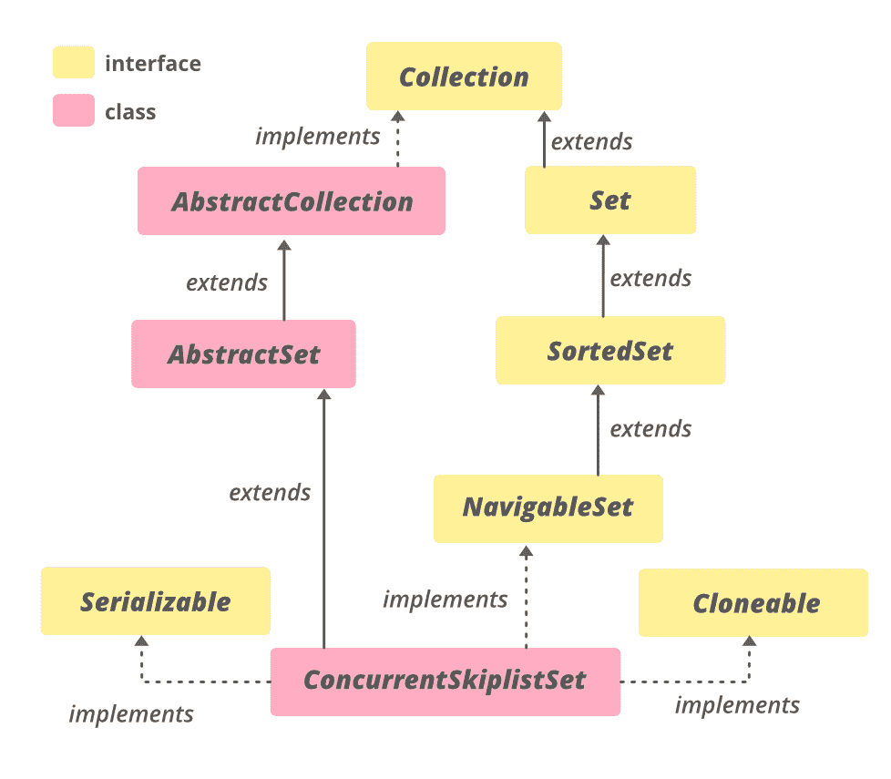

# Java 中的 ConcurrentSkipListSet 示例

> 原文：[https://www.geeksforgeeks.org/concurrentskiplistset-in-java-with-examples/](https://www.geeksforgeeks.org/concurrentskiplistset-in-java-with-examples/)

Java 中的 `ConcurrentSkipListSet` 类是 [Java 集合框架](https://www.geeksforgeeks.org/collections-in-java-2/)的一部分，实现了 `Set` 接口和 `AbstractSet` 类。它提供了 Java 中[navigable set 的可扩展并发版本](https://www.geeksforgeeks.org/navigableset-java-examples/)。`ConcurrentSkipListSet` 的实现基于 `ConcurrentSkipListMap`。`ConcurrentSkipListSet` 中的元素默认按照它们的自然顺序进行排序，或者通过在集合创建时提供的[比较器](https://www.geeksforgeeks.org/comparator-interface-java/)进行排序，这取决于所使用的构造函数。

由于它实现了 `SortedSet<E>` 和 `NavigableSet<E>`，所以它类似于 [TreeSet](https://www.geeksforgeeks.org/treeset-in-java-with-examples/) ，增加了并发的特性。因为它是线程安全的，所以可以由多个线程同时使用，而 `TreeSet` 不是线程安全的。

## 继承层次



## 类声明

```java
public class ConcurrentSkipListSet<E>
    extends AbstractSet<E>
        implements NavigableSet<E>, Cloneable, Serializable

Where E is the type of elements maintained by this collection
```

## ConcurrentSkipListSet 上的一些要点

*   它实现了 `Serializable`、`Cloneable`、`Iterable<E>`、`Collection<E>`、`NavigableSet<E>`、`Set<E>`、`SortedSet<E>` 接口。
*   它不允许空元素，因为空参数和返回值不能与没有元素可靠地区分开。
*   它的实现为包含、添加和移除操作及其变体提供了平均 `log(n)` 时间成本。
*   它是线程安全的。
*   当需要对集合进行并发修改时，应该优先于实现 `Set` 接口。

## 构造函数

**1. `ConcurrentSkipListSet()`**：此构造函数用于构造一个空集合。

> `ConcurrentSkipListSet<E> set = new ConcurrentSkipListSet<E>();`

**2. `ConcurrentSkipListSet(Collection<E> c)`**：这个构造函数用来构造一个集合，集合的元素作为参数传递。

> `ConcurrentSkipListSet<E> set = new ConcurrentSkipListSet<E>(Collection<E> c);`

**3. `ConcurrentSkipListSet(Comparator<E> comparator)`**：这个构造函数用于构造一个新的空集合，它根据指定的比较器对其元素进行排序。

> `ConcurrentSkipListSet<E> set = new ConcurrentSkipListSet<E>(Comparator<E> comparator);`

**4. `ConcurrentSkipListSet(SortedSet<E> s)`**：这个构造函数用来构造一个新的集合，这个集合包含相同的元素，并且使用与指定的排序集合相同的顺序。

> `ConcurrentSkipListSet<E> set = new ConcurrentSkipListSet<E>(SortedSet<E> s);`

### 例 1

```java
// Java program to demonstrate ConcurrentSkipListSet

import java.util.*;
import java.util.concurrent.ConcurrentSkipListSet;

class ConcurrentSkipListSetLastExample1 {
    public static void main(String[] args)
    {

        // Initializing the set using
        // ConcurrentSkipListSet()
        ConcurrentSkipListSet<Integer> set
            = new ConcurrentSkipListSet<Integer>();

        // Adding elements to this set
        set.add(78);
        set.add(64);
        set.add(12);
        set.add(45);
        set.add(8);

        // Printing the ConcurrentSkipListSet
        System.out.println("ConcurrentSkipListSet: " + set);

        // Initializing the set using
        // ConcurrentSkipListSet(Collection)
        ConcurrentSkipListSet<Integer> set1
            = new ConcurrentSkipListSet<Integer>(set);

        // Printing the ConcurrentSkipListSet1
        System.out.println("ConcurrentSkipListSet1: "
                           + set1);

        // Initializing the set using
        // ConcurrentSkipListSet()
        ConcurrentSkipListSet<String> set2
            = new ConcurrentSkipListSet<>();

        // Adding elements to this set
        set2.add("Apple");
        set2.add("Lemon");
        set2.add("Banana");
        set2.add("Apple");

        // creating an iterator
        Iterator<String> itr = set2.iterator();

        System.out.print("Fruits Set: ");
        while (itr.hasNext()) {
            System.out.print(itr.next() + " ");
        }
    }
}
```

**输出：**

```java
ConcurrentSkipListSet: [8, 12, 45, 64, 78]
ConcurrentSkipListSet1: [8, 12, 45, 64, 78]
Fruits Set: Apple Banana Lemon 
```

### 例 2

```java
// Java program to demonstrate ConcurrentSkipListSet

import java.util.concurrent.ConcurrentSkipListSet;

class ConcurrentSkipListSetLastExample1 {

    public static void main(String[] args)
    {

        // Initializing the set using ConcurrentSkipListSet()
        ConcurrentSkipListSet<Integer>
            set = new ConcurrentSkipListSet<Integer>();

        // Adding elements to this set
        // using add() method
        set.add(78);
        set.add(64);
        set.add(12);
        set.add(45);
        set.add(8);

        // Printing the ConcurrentSkipListSet
        System.out.println("ConcurrentSkipListSet: "
                           + set);

        // Printing the highest element of the set
        // using last() method
        System.out.println("The highest element of the set: "
                           + set.last());

        // Retrieving and removing first element of the set
        System.out.println("The first element of the set: "
                           + set.pollFirst());

        // Checks if 9 is present in the set
        // using contains() method
        if (set.contains(9))
            System.out.println("9 is present in the set.");
        else
            System.out.println("9 is not present in the set.");

        // Printing the size of the set
        // using size() method
        System.out.println("Number of elements in the set = "
                           + set.size());
    }
}
```

**输出：**

```java
ConcurrentSkipListSet: [8, 12, 45, 64, 78]
The highest element of the set: 78
The first element of the set: 8
9 is not present in the set.
Number of elements in the set = 4
```

## ConcurrentSkipListSet 的方法

| 方法 | 描述 |
| --- | --- |
| [`add(E e)`](https://www.geeksforgeeks.org/concurrentskiplistset-add-method-in-java/#:~:text=add()%20method%20is%20an,an%20element%20in%20this%20set.&text=Parameters%3A%20The%20function%20accepts%20a,returns%20a%20True%20boolean%20value.) | 如果指定的元素尚不存在，则将该元素添加到该集合中。 |
| [`ceiling(E e)`](https://www.geeksforgeeks.org/concurrentskiplistset-ceiling-method-in-java/) | 返回该集合中大于或等于给定元素的最少元素，如果没有这样的元素，则返回 `null`。 |
| [`clear()`](https://www.geeksforgeeks.org/concurrentskiplistset-clear-method-in-java/) | 从该集中移除所有元素。 |
| [`clone()`](https://www.geeksforgeeks.org/concurrentskiplistset-clone-method-in-java/) | 返回此 `ConcurrentSkipListSet` 实例的浅拷贝。 |
| [`comparator()`](https://www.geeksforgeeks.org/concurrentskiplistset-comparator-method-in-java-with-examples/) | 返回用于对该集合中的元素进行排序的比较器，如果该集合使用其元素的自然排序，则返回 `null`。 |
| [`contains(Object o)`](https://www.geeksforgeeks.org/concurrentskiplistset-contains-method-in-java/) | 如果此集合包含指定的元素，则返回 `true`。 |
| [`descendingIterator()`](https://www.geeksforgeeks.org/concurrentskiplistset-descendingiterator-method-in-java/) | 以降序返回该集合中元素的迭代器。 |
| [`descendingSet()`](https://www.geeksforgeeks.org/concurrentskiplistset-descendingset-method-in-java/) | 返回此集合中包含的元素的逆序视图。 |
| [`equals(Object o)`](https://www.geeksforgeeks.org/concurrentskiplistset-equals-method-in-java/) | 将指定的对象与此相等集进行比较。 |
| [`first()`](https://www.geeksforgeeks.org/concurrentskiplistset-first-method-in-java/) | 返回当前集合中的第一个(最低的)元素。 |
| [`floor(E e)`](https://www.geeksforgeeks.org/concurrentskiplistset-floor-method-in-java/) | 返回该集合中小于或等于给定元素的最大元素，如果没有这样的元素，则返回 `null`。 |
| [`headSet(E toElement)`](https://www.geeksforgeeks.org/concurrentskiplistset-headset-method-in-java/) | 返回该集合中元素严格小于 `toElement` 的部分的视图。 |
| [`headSet(E toElement, boolean inclusive)`](https://www.geeksforgeeks.org/concurrentskiplistset-headset-method-in-java/) | 返回该集合中元素小于(或等于，如果 `inclusive` 为真)`toElement` 的部分的视图。 |
| [`higher(E e)`](https://www.geeksforgeeks.org/concurrentskiplistset-higher-method-in-java/) | 返回该集合中严格大于给定元素的最小元素，如果没有这样的元素，则返回 `null`。 |
| [`isEmpty()`](https://www.geeksforgeeks.org/concurrentskiplistset-isempty-method-in-java/) | 以升序返回该集合中元素的迭代器。 |
| [`last()`](https://www.geeksforgeeks.org/concurrentskiplistset-last-method-in-java/) | 返回当前集合中的最后一个(最高的)元素。 |
| [`lower(E e)`](https://www.geeksforgeeks.org/concurrentskiplistset-lower-method-in-java-with-examples/) | 返回该集合中严格小于给定元素的最大元素，如果没有这样的元素，则返回 `null`。 |
| [`pollFirst()`](https://www.geeksforgeeks.org/concurrentskiplistset-pollfirst-method-in-java/) | 检索并移除第一个(最低的)元素，如果该集合为空，则返回 `null`。 |
| [`pollLast()`](https://www.geeksforgeeks.org/concurrentskiplistset-polllast-method-in-java/) | 检索并移除最后一个(最高的)元素，如果该集合为空，则返回 `null`。 |
| [`remove(Object o)`](https://www.geeksforgeeks.org/concurrentskiplistset-remove-method-in-java/#:~:text=concurrent.,is%20present%20in%20this%20set.&text=Parameters%3A%20The%20function%20accepts%20a,the%20object%20to%20be%20removed.) | 如果存在指定的元素，则从该集中移除该元素。 |
| [`removeAll(Collection<?> c)`](https://www.geeksforgeeks.org/concurrentskiplistset-removeall-method-in-java/) | 从该集合中移除指定集合中包含的所有元素。 |
| [`size()`](https://www.geeksforgeeks.org/concurrentskiplistset-size-method-in-java/) | 返回该集合中的元素数量。 |
| [`spliterator()`](https://www.geeksforgeeks.org/concurrentskiplistset-spliterator-method-in-java/) | 返回此集合中元素的拆分器。 |
| [`subSet(E fromElement, boolean inclusive, E toElement, boolean toInclusive)`](https://www.geeksforgeeks.org/concurrentskiplistset-subset-method-in-java/) | 返回该集合中元素范围从“从元素”到“到元素”的部分的视图。 |
| [`subSet(E fromElement, E toElement)`](https://www.geeksforgeeks.org/concurrentskiplistset-subset-method-in-java/) | 返回该集合的一部分的视图，该集合的元素范围为从元素(包含)到元素(不包含)。 |
| [`tailSet(E fromElement)`](https://www.geeksforgeeks.org/concurrentskiplistset-tailset-method-in-java-with-examples/) | 返回该集合中元素大于或等于 `fromElement` 的部分的视图。 |
| [`tailSet(E fromElement, boolean inclusive)`](https://www.geeksforgeeks.org/concurrentskiplistset-tailset-method-in-java-with-examples/) | 返回该集合中元素大于(或等于，如果 `inclusive` 为真)`fromElement` 的部分的视图。 |

### 从 `java.util.AbstractSet` 类继承的方法

| 方法 | 描述 |
| --- | --- |
| [`hashCode()`](https://www.geeksforgeeks.org/abstractset-hashcode-method-in-java-with-examples/) | 返回该集合的哈希代码值。 |

### 从 `java.util.AbstractCollection` 类继承的方法

| 方法 | 描述 |
| --- | --- |
| [`addAll(Collection<? extends E> c)`](https://www.geeksforgeeks.org/abstractcollection-addall-method-in-java-with-examples/) | 将指定集合中的所有元素添加到此集合中(可选操作)。 |
| [`containsAll(Collection<?> c)`](https://www.geeksforgeeks.org/abstractcollection-containsall-method-in-java-with-examples/) | 如果此集合包含指定集合中的所有元素，则返回 `true`。 |
| [`retainAll(Collection<?> c)`](https://www.geeksforgeeks.org/abstractcollection-retainall-method-in-java-with-examples/) | 仅保留此集合中包含在指定集合中的元素(可选操作)。 |
| [`toArray()`](https://www.geeksforgeeks.org/abstractcollection-toarray-method-in-java-with-examples/) | 返回包含此集合中所有元素的数组。 |
| [`toArray(T[] a)`](https://www.geeksforgeeks.org/abstractcollection-toarray-method-in-java-with-examples/) | 返回包含此集合中所有元素的数组；返回数组的运行时类型是指定数组的运行时类型。 |
| [`toString()`](https://www.geeksforgeeks.org/abstractcollection-tostring-method-in-java-with-examples/) | 返回此集合的字符串表示形式。 |

### 从接口 `java.util.Set` 继承的方法

| 方法 | 描述 |
| --- | --- |
| [`addAll(Collection<? extends E> c)`](https://www.geeksforgeeks.org/set-addall-method-in-java-with-examples/) | 如果指定集合中的所有元素尚不存在，则将它们添加到该集合中(可选操作)。 |
| [`containsAll(Collection<?> c)`](https://www.geeksforgeeks.org/set-containsall-method-in-java-with-examples/) | 如果此集合包含指定集合的所有元素，则返回 `true`。 |
| [`hashCode()`](https://www.geeksforgeeks.org/set-hashcode-method-in-java-with-examples/) | 返回该集合的哈希代码值。 |
| [`retainAll(Collection<?> c)`](https://www.geeksforgeeks.org/set-retainall-method-in-java-with-example/) | 仅保留该集合中包含在指定集合中的元素(可选操作)。 |
| [`toArray()`](https://www.geeksforgeeks.org/set-toarray-method-in-java-with-example/) | 返回包含该集合中所有元素的数组。 |
| [`toArray(T[] a)`](https://www.geeksforgeeks.org/set-toarray-method-in-java-with-example/) | 返回包含该集合中所有元素的数组；返回数组的运行时类型是指定数组的运行时类型。 |

### 从接口 `java.util.Collection` 继承的方法

| 方法 | 描述 |
| --- | --- |
| `parallelStream()` | 以此集合为源返回一个可能并行的流。 |
| `removeIf(Predicate<? super E> filter)` | 移除此集合中满足给定谓词的所有元素。 |
| `stream()` | 返回以此集合为源的顺序流。 |

### 从接口 `java.lang.Iterable` 继承的方法

| 方法 | 描述 |
| --- | --- |
| [`forEach(Consumer<? super T> action)`](https://www.geeksforgeeks.org/iterable-foreach-method-in-java-with-examples/) | 对 `Iterable` 的每个元素执行给定的操作，直到所有元素都被处理完或者该操作引发异常。 |