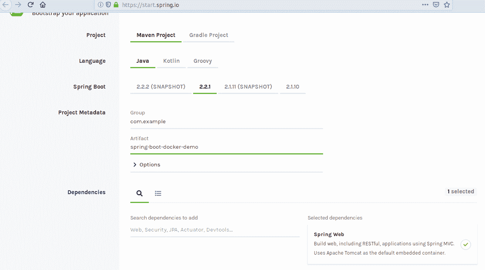
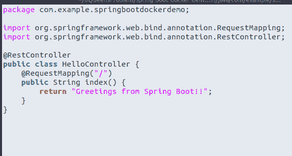
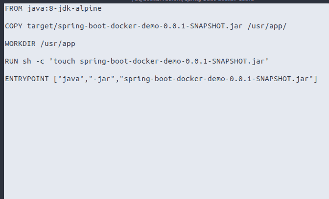
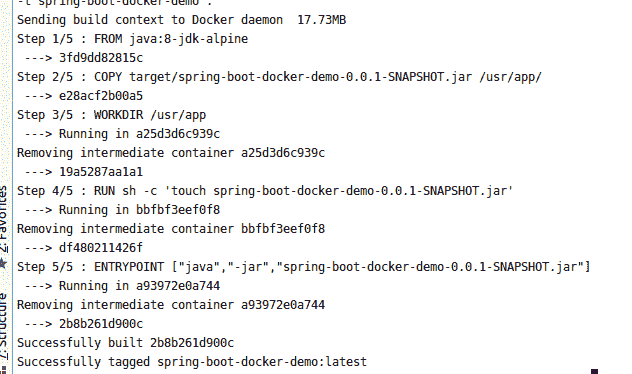
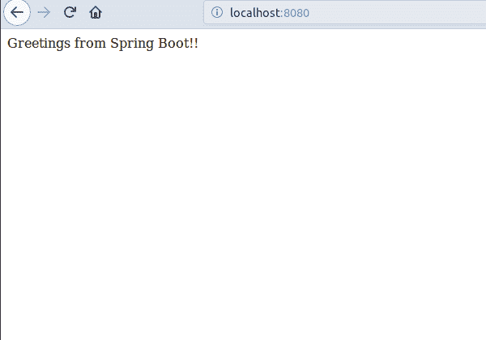

# 容器化 Java 应用程序

## 使用 Dockerfile 创建 Spring Boot 应用程序

> 原文：[https://www.geeksforgeeks.org/containerizing-java-applications-creating-a-spring-boot-app-using-dockerfile/](https://www.geeksforgeeks.org/containerizing-java-applications-creating-a-spring-boot-app-using-dockerfile/)

本文的目标是通过使用 [Dockerfile](https://www.geeksforgeeks.org/containerization-using-docker/) 创建一个 [Spring Boot 应用程序](https://www.geeksforgeeks.org/introduction-to-spring-boot/)，轻松地将一个 Java 应用程序容器化。

步骤如下：

1.  设置 Spring Boot 应用程序
2.  创建 Dockerfile
3.  构建项目 jar
4.  使用 Dockerfile 构建 Docker 映像
5.  运行映像

让我们详细检查一下上面的步骤：

1.  **设置 Spring Boot 应用程序**：首先，使用 [Spring Initializr](https://start.spring.io/) 创建一个非常基础的 Spring Boot 问候项目，并添加 Web 依赖项。

    [](https://media.geeksforgeeks.org/wp-content/uploads/20191113144456/Setting-up-spring-boot-app.png)

    该项目包括一个简单的 REST 控制器和一个简单的问候信息。

    [](https://media.geeksforgeeks.org/wp-content/uploads/20191113144454/simple-rest-controller-with-a-simple-greeting-message.png)

    要运行此应用程序，请使用命令：

    ```
    mvn spring-boot:run
    ```

2.  **创建 Dockerfile**：Dockerfile 是一个文本文档，其中包含 Docker 读取并按顺序执行以构建容器映像的命令。

    [](https://media.geeksforgeeks.org/wp-content/uploads/20191113144452/Dockerfile1.png)

    *   `FROM`：关键字 `FROM` 告诉 Docker 使用给定的基础镜像作为构建基础。在这种情况下，`java:8` 被用作基础镜像，而 `jdk-alpine` 被用作标签。标签可以被认为是一个版本。
    *   `COPY`：将 `.jar` 文件复制到构建镜像内的 `/usr/app`。
    *   `WORKDIR`：`WORKDIR` 指令为 Dockerfile 中的任何 `RUN`、`CMD`、`ENTRYPOINT`、`COPY` 和 `ADD` 指令设置工作目录。这里工作目录切换到 `/usr/app`。
    *   `RUN`：`RUN` 指令运行任何提到的命令。
    *   `ENTRYPOINT`：告诉 Docker 如何运行应用程序。制作数组作为 `java -jar spring-boot-docker-demo.jar`。

3.  **构建项目 jar**：现在运行 `mvn install` 在 `target` 目录中构建一个 `.jar` 文件。
4.  **构建 Docker 映像**：执行命令 `docker build -t spring-boot-docker-demo .`

    [](https://media.geeksforgeeks.org/wp-content/uploads/20191113144451/Building-Docker-Image.png)

5.  **运行构建的映像**：执行命令 `docker run spring-boot-docker-demo`

    [](https://media.geeksforgeeks.org/wp-content/uploads/20191113144449/Output98.png)

**Github 存储库**：[Spring Boot Docker Demo](https://github.com/theexplorist/Spring-Boot-Docker-Demo)