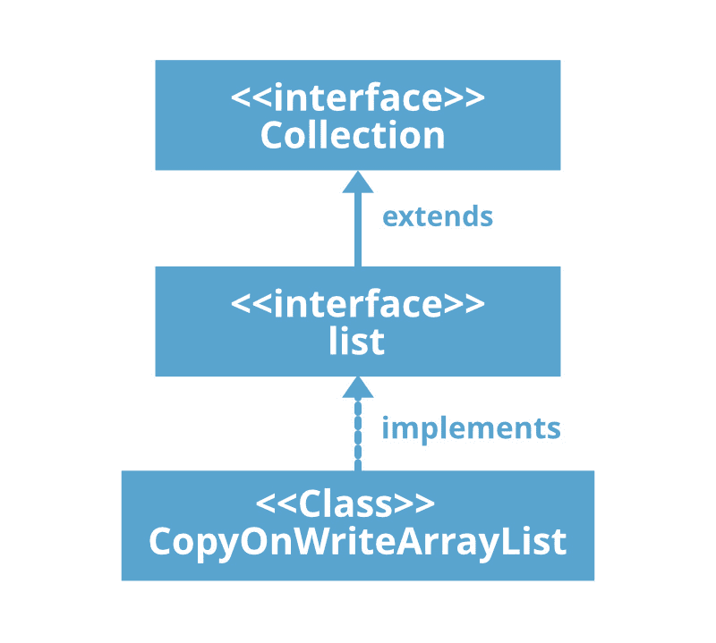

# Java 中的 CopyOnWriteArrayList

> 原文: [https://www.geeksforgeeks.org/copyonwritearraylist-in-java/](https://www.geeksforgeeks.org/copyonwritearraylist-in-java/)

`CopyOnWriteArrayList` 类在 JDK 1.5 中引入，实现了 [`List` 接口](https://www.geeksforgeeks.org/list-interface-java-examples/)。它是 [`ArrayList`](https://www.geeksforgeeks.org/arraylist-in-java/) 的增强版，其中所有修改（添加、设置、删除等）都是通过制作一个新副本来实现的。在 `java.util.concurrent` 包中找到。它是为在并发环境中使用而创建的数据结构。



## 以下是关于 CopyOnWriteArrayList 的几点:

*   顾名思义，`CopyOnWriteArrayList` 创建底层数组列表的克隆副本，对于特定点的每个更新操作，两者都将自动同步，这由 JVM 负责。因此，对正在执行读取操作的线程没有影响。
*   使用成本很高，因为每次更新操作都会创建一个克隆副本。因此，如果我们频繁的操作是读操作，那么 `CopyOnWriteArrayList` 是最好的选择。
*   带下划线的数据结构是一个可增长的数组。
*   这是数组列表的线程安全版本。
*   保留插入，允许重复、空和异构对象。
*   关于 `CopyOnWriteArrayList` 最重要的一点是 `CopyOnWriteArrayList` 的[迭代器](https://www.geeksforgeeks.org/iterators-in-java/)不能执行移除操作，否则我们会得到运行时异常，表示 `UnsupportedOperationException`。在 `CopyOnWriteArrayList` 迭代器上 `add()` 和 `set()` 方法也会引发 `UnsupportedOperationException`。同样，`CopyOnWriteArrayList` 的迭代器永远不会抛出 `ConcurrentModificationException`。

## 声明:

```java
public class CopyOnWriteArrayList<E> extends Object implements List<E>, RandomAccess, Cloneable, Serializable
```

这里，`E` 是这个集合中的元素类型。

**注意:** 类实现 `Serializable`、`Cloneable`、`Iterable<E>`、`Collection<E>`、[`List<E>`](https://www.geeksforgeeks.org/list-interface-java-examples/)、`RandomAccess` 接口。

## 构造方法:

### 1. `CopyOnWriteArrayList()`
创建一个空列表。

```java
CopyOnWriteArrayList c = new CopyOnWriteArrayList();
```

### 2. `CopyOnWriteArrayList(Collection obj)`
创建一个包含指定集合元素的列表，按照集合迭代器返回元素的顺序。

```java
CopyOnWriteArrayList c = new CopyOnWriteArrayList(Collection obj);
```

### 3. `CopyOnWriteArrayList(Object[] obj)`
创建一个包含给定数组副本的列表。

```java
CopyOnWriteArrayList c = new CopyOnWriteArrayList(Object[] obj);
```

## 示例:

### Java 代码示例 1

```java
// Java program to illustrate
// CopyOnWriteArrayList class
import java.util.*;
import java.util.concurrent.CopyOnWriteArrayList;

public class ConcurrentDemo extends Thread {

    static CopyOnWriteArrayList<String> l
        = new CopyOnWriteArrayList<String>();

    public void run()
    {
        // Child thread trying to
        // add new element in the
        // Collection object
        l.add("D");
    }

    public static void main(String[] args)
        throws InterruptedException
    {
        l.add("A");
        l.add("B");
        l.add("c");

        // We create a child thread
        // that is going to modify
        // ArrayList l.
        ConcurrentDemo t = new ConcurrentDemo();
        t.run();

        Thread.sleep(1000);

        // Now we iterate through
        // the ArrayList and get
        // exception.
        Iterator itr = l.iterator();
        while (itr.hasNext()) {
            String s = (String)itr.next();
            System.out.println(s);
            Thread.sleep(1000);
        }
        System.out.println(l);
    }
}
```

**Output**

```java
A
B
c
D
[A, B, c, D]
```

## 迭代 CopyOnWriteArrayList:
我们可以使用 [`iterator()`](https://www.geeksforgeeks.org/copyonwritearraylist-iterator-method-in-java/) 方法迭代 `CopyOnWriteArrayList`。需要注意的重要一点是，我们创建的迭代器是原始列表的不可变快照。因为这个属性，我们可以看到 **GfG** 在第一次迭代时是不打印的。

### Java 代码示例 2

```java
// Java program to illustrate
// CopyOnWriteArrayList class
import java.io.*;
import java.util.*;
import java.util.concurrent.*;

class Demo {
    public static void main(String[] args)
    {

        CopyOnWriteArrayList<String> list
            = new CopyOnWriteArrayList<>();

        // Initial Iterator
        Iterator itr = list.iterator();
        list.add("GfG");
        System.out.println("List contains: ");
        while (itr.hasNext())
            System.out.println(itr.next());

        // iterator after adding an element
        itr = list.iterator();
        System.out.println("List contains:");
        while (itr.hasNext())
            System.out.println(itr.next());
    }
}
```

**Output**

```java
List contains: 
List contains:
GfG
```

## CopyOnWriteArrayList 的方法:

| 方法 | 描述 |
| --- | --- |
| [`add(E e)`](https://www.geeksforgeeks.org/copyonwritearraylist-add-method-in-java/) | 将指定的元素追加到此列表的末尾。 |
| [`add(int index, E element)`](https://www.geeksforgeeks.org/copyonwritearraylist-add-method-in-java/) | 在列表中的指定位置插入指定元素。 |
| [`addAll(Collection<? extends E> c)`](https://www.geeksforgeeks.org/copyonwritearraylist-addall-method-in-java-with-examples/) | 按照指定集合的迭代器返回的顺序，将指定集合中的所有元素追加到该列表的末尾。 |
| [`addAll(int index, Collection<? extends E> c)`](https://www.geeksforgeeks.org/copyonwritearraylist-addall-method-in-java-with-examples/) | 从指定位置开始，将指定集合中的所有元素插入此列表。 |
| [`addAllAbsent(Collection<? extends E> c)`](https://www.geeksforgeeks.org/copyonwritearraylist-addallabsent-method-in-java-with-examples/) | 按照指定集合的迭代器返回的顺序，将指定集合中尚未包含在此列表中的所有元素追加到此列表的末尾。 |
| [`addIfAbsent(E e)`](https://www.geeksforgeeks.org/copyonwritearraylist-addifabsent-method-in-java/) | 追加元素（如果不存在）。 |
| [`clear()`](https://www.geeksforgeeks.org/copyonwritearraylist-clear-method-in-java/#:~:text=The%20clear()%20method%20of,after%20the%20function%20is%20called.&text=Parameters%3A%20The%20function%20does%20not%20accept%20any%20parameters.) | 从此列表中移除所有元素。 |
| [`clone()`](https://www.geeksforgeeks.org/copyonwritearraylist-clone-method-in-java/) | 返回此列表的浅拷贝。 |
| [`contains(Object o)`](https://www.geeksforgeeks.org/copyonwritearraylist-contains-method-in-java/) | 如果此列表包含指定的元素，则返回 `true`。 |
| [`containsAll(Collection<?> c)`](https://www.geeksforgeeks.org/copyonwritearraylist-containsall-method-in-java/) | 如果此列表包含指定集合的所有元素，则返回 `true`。 |
| [`equals(Object o)`](https://www.geeksforgeeks.org/copyonwritearraylist-equals-method-in-java-with-examples/) | 将指定的对象与该列表进行比较，看是否相等。 |
| [`forEach(Consumer<? super E> action)`](https://www.geeksforgeeks.org/copyonwritearraylist-foreach-method-in-java-with-examples/) | 对 `Iterable` 的每个元素执行给定的操作，直到所有元素都被处理完或者该操作引发异常。 |
| [`get(int index)`](https://www.geeksforgeeks.org/copyonwritearraylist-get-method-in-java/#:~:text=The%20get(index)%20method%20of,element%20at%20the%20specified%20index.&text=Parameters%3A%20The%20function%20accepts%20a,element%20at%20the%20given%20index.) | 返回列表中指定位置的元素。 |
| [`hashCode()`](https://www.geeksforgeeks.org/copyonwritearraylist-hashcode-method-in-java/) | 返回此列表的哈希代码值。 |
| [`indexOf(E e, int index)`](https://www.geeksforgeeks.org/copyonwritearraylist-indexof-method-in-java/) | 返回列表中指定元素的第一个匹配项的索引，从索引向前搜索，如果找不到该元素，则返回 -1。 |
| [`indexOf(Object o)`](https://www.geeksforgeeks.org/copyonwritearraylist-indexof-method-in-java/) | 返回此列表中指定元素的第一个匹配项的索引，如果此列表不包含该元素，则返回 -1。 |
| [`isEmpty()`](https://www.geeksforgeeks.org/copyonwritearraylist-isempty-method-in-java/) | 如果此列表不包含任何元素，则返回 `true`。 |
| [`iterator()`](https://www.geeksforgeeks.org/copyonwritearraylist-iterator-method-in-java/) | 以正确的顺序返回列表中元素的迭代器。 |
| [`lastIndexOf(E e, int index)`](https://www.geeksforgeeks.org/copyonwritearraylist-lastindexof-method-in-java/) | 返回列表中指定元素最后一次出现的索引，从索引开始向后搜索，如果找不到该元素，则返回 -1。 |
| [`lastIndexOf(Object o)`](https://www.geeksforgeeks.org/copyonwritearraylist-lastindexof-method-in-java/) | 返回此列表中指定元素最后一次出现的索引，如果此列表不包含该元素，则返回 -1。 |
| [`listIterator()`](https://www.geeksforgeeks.org/copyonwritearraylist-listiterator-method-in-java/) | 返回列表中元素的列表迭代器（按正确的顺序）。 |
| [`listIterator(int index)`](https://www.geeksforgeeks.org/copyonwritearraylist-listiterator-method-in-java/) | 从列表中的指定位置开始，返回列表中元素的列表迭代器（按正确的顺序）。 |
| [`remove(int index)`](https://www.geeksforgeeks.org/copyonwritearraylist-remove-method-in-java-with-examples/#:~:text=The%20remove(Object%20o)%20method,is%20present%20in%20the%20list.&text=Parameters%3A%20This%20method%20accepts%20a%20mandatory%20parameter%20o%2C%20the%20element,from%20the%20list%2C%20if%20present.) | 移除列表中指定位置的元素。 |
| [`remove(Object o)`](https://www.geeksforgeeks.org/copyonwritearraylist-remove-method-in-java-with-examples/#:~:text=The%20remove(Object%20o)%20method,is%20present%20in%20the%20list.&text=Parameters%3A%20This%20method%20accepts%20a%20mandatory%20parameter%20o%2C%20the%20element,from%20the%20list%2C%20if%20present.) | 从列表中删除指定元素的第一个匹配项（如果存在）。 |
| [`removeAll(Collection<?> c)`](https://www.geeksforgeeks.org/copyonwritearraylist-removeall-method-in-java-with-examples/) | 从此列表中移除指定集合中包含的所有元素。 |
| [`removeIf(Predicate<? super E> filter)`](https://www.geeksforgeeks.org/copyonwritearraylist-removeif-method-in-java-with-examples/) | 移除此列表中满足给定谓词的所有元素。 |
| [`replaceAll(UnaryOperator<E> operator)`](https://www.geeksforgeeks.org/copyonwritearraylist-replaceall-method-in-java-with-examples/) | 将此列表中的每个元素替换为将运算符应用于该元素的结果。 |
| [`retainAll(Collection<?> c)`](https://www.geeksforgeeks.org/copyonwritearraylist-retainall-method-in-java-with-examples/) | 仅保留此列表中包含在指定集合中的元素。 |
| [`set(int index, E element)`](https://www.geeksforgeeks.org/copyonwritearraylist-set-method-in-java-with-examples/) | 用指定的元素替换列表中指定位置的元素。 |
| [`size()`](https://www.geeksforgeeks.org/copyonwritearraylist-size-method-in-java/) | 返回此列表中的元素数。 |
| [`sort(Comparator<? super E> c)`](https://www.geeksforgeeks.org/copyonwritearraylist-sort-method-in-java-with-examples/) | 使用提供的 `Comparator` 对此列表进行排序。 |
| [`spliterator()`](https://www.geeksforgeeks.org/copyonwritearraylist-spliterator-method-in-java-with-examples/) | 返回此列表中元素的 `Spliterator`。 |
| [`subList(int fromIndex, int toIndex)`](https://www.geeksforgeeks.org/copyonwritearraylist-sublist-method-in-java-with-examples/) | 返回此列表中 `fromIndex`（包含）和 `toIndex`（不包含）之间的部分视图。 |
| [`toArray()`](https://www.geeksforgeeks.org/copyonwritearraylist-toarray-method-in-java-with-examples/) | 返回包含此列表中所有元素的数组，顺序正确（从第一个元素到最后一个元素）。 |
| [`toArray(T[] a)`](https://www.geeksforgeeks.org/copyonwritearraylist-toarray-method-in-java-with-examples/) | 返回包含此列表中所有元素的数组，顺序正确（从第一个元素到最后一个元素）；返回数组的运行时类型是指定数组的运行时类型。 |
| [`toString()`](https://www.geeksforgeeks.org/copyonwritearraylist-tostring-method-in-java-with-examples/) | 返回此列表的字符串表示形式。 |

# CopyOnWriteArrayList 类方法

| 方法 | 描述 |
| --- | --- |
| [`removeAll(Collection<?> c)`](https://www.geeksforgeeks.org/copyonwritearraylist-removeall-method-in-java-with-examples/#:~:text=The%20removeAll()%20method%20in,CopyOnArrayList%20object%20you%20call%20on.&text=Parameter%3A%20The%20method%20accepts%20only,removed%20from%20the%20calling%20object.) | 从此列表中移除指定集合中包含的所有元素。 |
| [`removeIf(Predicate<? super E> filter)`](https://www.geeksforgeeks.org/copyonwritearraylist-removeif-method-in-java-with-examples/#:~:text=The%20removeIf()%20method%20of,that%20satisfies%20the%20specified%20condition.&text=Parameters%3A%20This%20method%20accepts%20a,are%20removed%20from%20this%20List.) | 移除此集合中满足给定谓词的所有元素。 |
| [`replaceAll(UnaryOperator<E> operator)`](https://www.geeksforgeeks.org/copyonarraylist-replaceall-method-in-java-with-examples/) | 将列表中的每个元素替换为对该元素应用运算符的结果。 |
| [`retainAll(Collection<?> c)`](https://www.geeksforgeeks.org/copyonwritearraylist-retainall-method-in-java-with-examples/) | 仅保留此列表中包含在指定集合中的元素。 |
| [`set(int index, E element)`](https://www.geeksforgeeks.org/copyonwritearraylist-set-method-in-java-with-examples/#:~:text=The%20set(E%20e)%20method,replaced%20by%20the%20new%20element.) | 用指定的元素替换列表中指定位置的元素。 |
| [`size()`](https://www.geeksforgeeks.org/copyonwritearraylist-size-method-in-java/#:~:text=The%20size()%20method%20of,of%20elements%20in%20the%20list.&text=Parameters%3A%20The%20function%20does%20not,the%20size%20of%20the%20list.) | 返回此列表中的元素数量。 |
| `sort(Comparator<? super E> c)` | 根据指定比较器引发的顺序对该列表进行排序。 |
| [`spliterator()`](https://www.geeksforgeeks.org/copyonwritearraylist-spliterator-method-in-java/) | 返回列表中元素的拆分器。 |
| [`subList(int fromIndex, int toIndex)`](https://www.geeksforgeeks.org/copyonwritearraylist-sublist-method-in-java-with-examples/) | 返回此列表中从索引(包括)到索引(不包括)之间的部分的视图。 |
| [`toArray()`](https://www.geeksforgeeks.org/copyonwritearraylist-toarray-method-in-java/) | 返回一个数组，该数组按正确的顺序(从第一个元素到最后一个元素)包含列表中的所有元素。 |
| [`toArray(T[] a)`](https://www.geeksforgeeks.org/copyonwritearraylist-toarray-method-in-java/) | 返回一个数组，该数组包含此列表中按正确顺序排列的所有元素(从第一个到最后一个元素)；返回数组的运行时类型是指定数组的运行时类型。 |
| [`toString()`](https://www.geeksforgeeks.org/copyonwritearraylist-tostring-method-in-java/) | 返回此列表的字符串表示形式。 |

## 从接口 `java.util.Collection` 继承的方法

| 方法 | 描述 |
| --- | --- |
| `parallelStream()` | 以此集合为源返回一个可能并行的流。 |
| `stream()` | 返回以此集合为源的顺序流。 |

## 注意
当我们更喜欢在并发环境中使用类似数组列表的数据结构时，我们应该使用 `CopyOnWriteArrayList`。

## 必读
*   [`ArrayList` 和 `CopyOnWriteArrayList` 的区别](https://www.geeksforgeeks.org/difference-arraylist-copyonwritearraylist/)