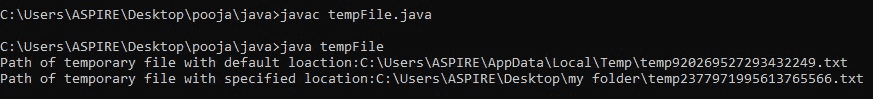
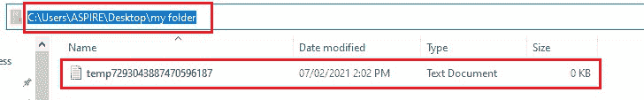
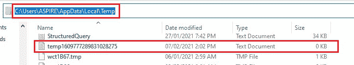

# 用Java创建一个临时文件

> 原文：[https://www.geeksforgeeks.org/create-a-temporary-file-in-java/](https://www.geeksforgeeks.org/create-a-temporary-file-in-java/)

在Java中，我们可以使用名为`File.createTempFile()`的现有方法创建一个临时文件，该方法在指定的目录中创建新的空文件。`createTempFile()`函数在给定的目录中创建一个临时文件（如果没有提到目录，则选择默认目录），该函数使用作为参数传递的前缀和后缀生成文件名。如果后缀为空，则函数使用`.tmp`作为后缀。然后，该函数返回创建的文件。

**场景：**有两种场景可以创建临时文件。

1.  `createTempFile(prefix, suffix, directory)`
2.  `createTempFile(prefix, suffix, null)`

## 方法—场景1

此方法在指定的目录中创建新的空文件，使用给定的前缀和后缀生成其名称。

**语法：**

```java
public static File createTempFile(String prefix, String suffix, File directory)
```

**参数：**取3个参数——`prefix`、`suffix`、`directory`。

1.  `prefix`：前缀字符串用于生成文件名，长度必须至少为三个字符。
2.  `suffix`：后缀字符串用于生成文件名。可能是`.txt`或`null`。在`null`的情况下，将使用`.tmp`。
3.  `directory`：要在其中创建文件的目录，如果要使用默认的临时文件目录，则为`null`。

**返回类型：**表示新创建的空文件的抽象路径名。

**异常：**

*   `IllegalArgumentException`：如果`prefix`参数包含少于三个字符。
*   `IOException`：如果无法创建文件。
*   `SecurityException`：如果安全管理器存在，并且其`SecurityManager`和`checkWrite()`方法不允许创建文件。

## 方法—场景2

这个方法在默认的临时文件目录中创建新的空文件，使用给定的前缀和后缀来生成它的名称。调用这个方法相当于调用`createTempFile(prefix, suffix, null)`。

**语法：**

```java
public static File createTempFile(String prefix, String suffix)
```

**参数：**只需要两个参数——`prefix`和`suffix`。

1.  `prefix`：前缀字符串用于生成文件名，长度必须至少为三个字符。
2.  `suffix`：后缀字符串用于生成文件名。可能是`.txt`或`null`。在`null`的情况下，将使用`.tmp`。

**返回类型：**表示新创建的空文件的抽象路径名。

**异常：**

1.  `IllegalArgumentException`：如果`prefix`参数包含的字符少于三个。
2.  `IOException`：如果无法创建文件。
3.  `SecurityException`：如果安全管理器存在，并且其`SecurityManager`和`checkWrite()`方法不允许创建文件。

## 示例

```java
// Java Program to Create a Temporary File in Java

// Importing all input output classes
import java.io.File;
import java.io.IOException;

// Class
public class GFG {

    // Main driver method
    public static void main(String[] args)
        throws IOException
    {
        // Try block to check for exceptions
        try {
            // Step 1
            // Creating temporary file with default location
            // by creating an object of File type
            File obj1 = File.createTempFile("temp", ".txt");

            // Step 2
            // Obtaining absolute path of the path
            // returned by createTempFile() function
            String path = obj1.getAbsolutePath();

            // Step 3
            // Print and display the default path of
            // temporary file
            System.out.println(
                "Path of temporary file with default location:"
                + path);

            // Step 4
            // Creating temporary file with specified
            // location again by creating another object of
            // File type which is custom local directory
            File obj2 = File.createTempFile(
                "temp", ".txt",
                new File(
                    "C:/Users/ASPIRE/Desktop/my folder"));

            // Step 5
            // Obtaining absolute path of the path
            // returned by createTempFile() function
            path = obj2.getAbsolutePath();

            // Step 6
            // Print and display the specified path of
            // temporary file
            System.out.println(
                "Path of temporary file with specified location:"
                + path);
        }

        // Catch block to handle exception if occurs
        catch (IOException e) {
            // Print the line number where exception occur
            // using printStackTrace() method
            e.printStackTrace();
        }
    }
}
```

**输出：**



**下面的快照也附加在本地计算机的这些目录中，如下所示：**

**在给定路径创建临时文件的情况**



**在默认路径下创建临时文件的情况**

