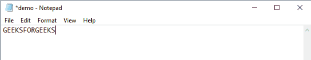
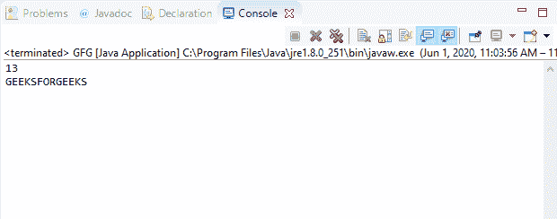
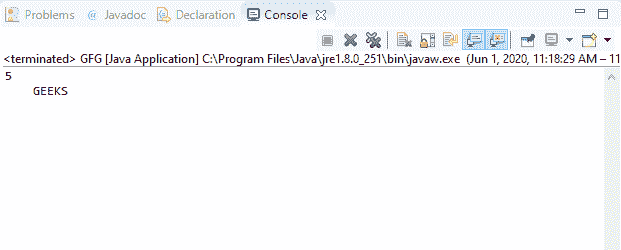

# Java 中的 DataInputStream read()方法，带示例

> 原文: [https://www.geeksforgeeks.org/datainputstream-read-method-in-java-with-examples/](https://www.geeksforgeeks.org/datainputstream-read-method-in-java-with-examples/)

Java 中 `DataInputStream` 类的 `read()` 方法有两种类型:

## 1. `read(byte[] b)` 方法

`DataInputStream` 类的 `read(byte[] b)` 方法用于从输入流读取字节并将其存储到字节数组缓冲区 `b` 中。此 `read()` 方法以整数类型返回实际读取的字节数。如果输入流结束且没有更多数据可读，则此方法返回 -1。如果字节数组为 `null`，此方法将抛出异常。

**语法:**

```java
public final int read(byte[] b)
               throws IOException
```

**覆盖:** 该方法覆盖 `FilterInputStream` 类的 `read()` 方法。

**参数:** 该方法接受一个参数 `b`，该参数代表数据要读入的字节数组。

**返回值:** 此方法返回实际读取的字节数。如果输入流结束并且没有更多数据可供读取，则返回 -1。

**异常:**

*   `NullPointerException` – 如果字节数组为空，它会抛出 `NullPointerException`。
*   `IOException` – 如果流关闭或发生其他输入/输出错误，该方法将抛出 `IOException`。

下面的程序说明了 IO 包中 `DataInputStream` 类的 `read(byte[])` 方法:

**程序:** 假设存在文件 `c:/demo.txt`。

```java
// Java program to illustrate
// DataInputStream read(byte[]) method
import java.io.*;
public class GFG {
    public static void main(String[] args)
        throws IOException
    {
        // Create input stream 'demo.txt'
        // for reading containing
        // text "GEEKSFORGEEKS"
        FileInputStream inputStream
            = new FileInputStream(
                "c:/demo.txt");

        // Convert inputStream to
        // DataInputStream
        DataInputStream dataInputStr
            = new DataInputStream(
                inputStream);

        // Count the total bytes
        // form the input stream
        int count = inputStream.available();

        // Create byte array
        byte[] b = new byte[count];

        // Read data into byte array
        int bytes = dataInputStr.read(b);

        // Print number of bytes
        // actually read
        System.out.println(bytes);

        for (byte by : b) {
            // Print the character
            System.out.print((char)by);
        }
    }
}
```

**Input:** [](https://media.geeksforgeeks.org/wp-content/uploads/20200601110642/INPUT_GEEKSFORGEEKS8.png)
**Output:** [](https://media.geeksforgeeks.org/wp-content/uploads/20200601110711/data_read-1.png)

## 2. `read(byte[] b, int offset, int length)` 方法

`DataInputStream` 类的 `read(byte[] b, int offset, int length)` 方法用于从输入流读取指定数量的字节并将其存储到字节数组缓冲区 `b` 中。此 `read()` 方法以整数类型返回实际读取的字节数。如果输入流结束且没有更多数据可读，则此方法返回 -1。如果字节数组为 `null`，此方法将抛出异常。

**语法:**

```java
public final int read(byte[] b,
                      int offset,
                      int length)
               throws IOException
```

**覆盖:** 该方法覆盖 `FilterInputStream` 类的 `read()` 方法。

**参数:** 该方法接受三个参数:

*   `b` – 表示数据要读入的字节数组。
*   `offset` – 表示字节数组中的起始索引。
*   `length` – 表示要读取的字节总数。

**返回值:** 此方法返回实际读取的字节数。如果输入流结束并且没有更多数据可供读取，则返回 -1。

**异常:**

*   `NullPointerException` – 如果字节数组为空，它会抛出 `NullPointerException`。
*   如果 `offset` 为负或 `length` 为负或 `length` 大于字节数组长度和 `offset` 之差，则抛出 `IndexOutOfBoundsException`。
*   `IOException` – 如果流关闭或发生其他输入/输出错误，该方法将抛出 `IOException`。

下面的程序说明了 IO 包中 `DataInputStream` 类的 `read(byte[], int, int)` 方法:

**程序:** 假设存在文件 `c:/demo.txt`。

```java
// Java program to illustrate
// DataInputStream read(byte[], int, int) method
import java.io.*;
public class GFG {
    public static void main(String[] args)
        throws IOException
    {
        // Create input stream 'demo.txt'
        // for reading containing
        // text "GEEKSFORGEEKS"
        FileInputStream inputStream
            = new FileInputStream(
                "c:/demo.txt");

        // Convert inputStream to
        // DataInputStream
        DataInputStream dataInputStr
            = new DataInputStream(
                inputStream);

        // Count the total bytes
        // form the input stream
        int count = inputStream.available();

        // Create byte array
        byte[] b = new byte[count];

        // Read data into byte array
        int bytes = dataInputStr.read(b, 4, 5);

        // Print number of bytes
        // actually read
        System.out.println(bytes);

        for (byte by : b) {
            // Print the character
            System.out.print((char)by);
        }
    }
}
```

**Input:** [](https://media.geeksforgeeks.org/wp-content/uploads/20200601110642/INPUT_GEEKSFORGEEKS8.png)
**Output:** [](https://media.geeksforgeeks.org/wp-content/uploads/20200601112039/data_read-2.png)

**参考资料:**
1.  [https://docs.oracle.com/javase/10/docs/api/java/io/DataInputStream.html#read(byte%5B%5D)](https://docs.oracle.com/javase/10/docs/api/java/io/DataInputStream.html#read(byte%5B%5D))
2.  [https://docs.oracle.com/javase/10/docs/api/java/io/DataInputStream.html#read(byte%5B%5D, int, int)](https://docs.oracle.com/javase/10/docs/api/java/io/DataInputStream.html#read(byte%5B%5D, int, int))