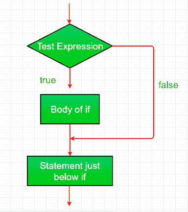
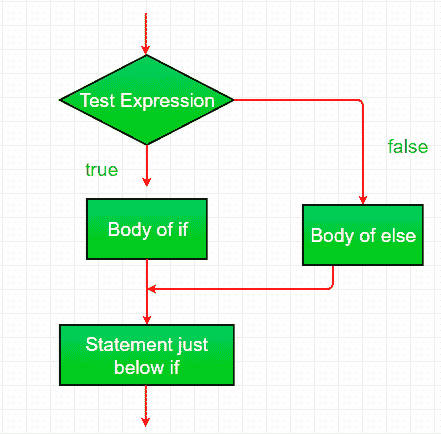
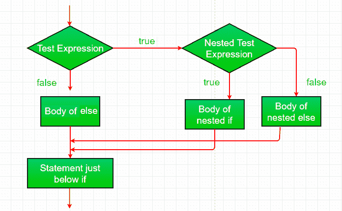
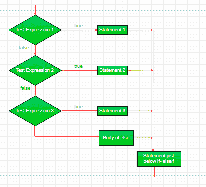
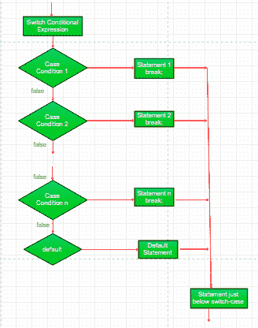
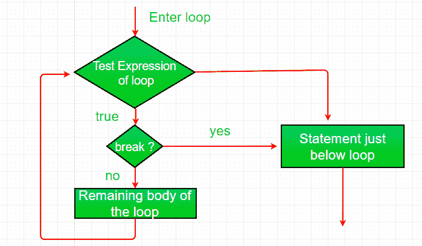
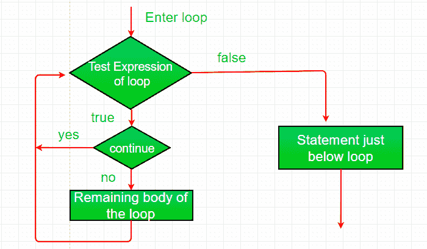

# Java 中的决策(if，if-else，switch，break，continue，jump)

> 原文:[https://www.geeksforgeeks.org/decision-making-javaif-else-switch-break-continue-jump/](https://www.geeksforgeeks.org/decision-making-javaif-else-switch-break-continue-jump/)

编程中的决策类似于现实生活中的决策。在编程中，我们也面临一些情况，当满足某些条件时，我们希望执行某个代码块。
一种编程语言根据一定的条件，使用控制语句来控制程序的执行流程。这些用于使执行流程前进，并根据程序状态的变化进行转移。

## Java 的选择声明

*   [if](#if)
*   [if-else](#if-else)
*   [nested-if](#nested-if)
*   [if-else-if](#if-else-if)
*   [switch-case](#switch-case)
*   [jump](#jump) – break, continue, return

这些语句允许您根据仅在运行时已知的条件来控制程序的执行流程。

### if

**[if](https://www.geeksforgeeks.org/java-if-statement-with-examples/)**: `if` 语句是最简单的决策语句。它用于决定是否执行某个语句或语句块，即如果某个条件为真，则执行语句块，否则不执行。

**语法**:

```java
if(condition) 
{
   // Statements to execute if
   // condition is true
}
```

这里，评估后的 `condition` 不是真就是假。`if` 语句接受布尔值——如果值为真，则它将执行其下的语句块。
如果我们没有在 `if(condition)` 之后提供花括号“{”和“}”，那么默认情况下 `if` 语句将认为紧接的 one 语句在其块内。例如，

```java
if(condition)
   statement1;
   statement2;

// Here if the condition is true, if block 
// will consider only statement1 to be inside 
// its block.
```

流程图:


例:

```java
// Java program to illustrate If statement
class IfDemo
{
    public static void main(String args[])
    {
        int i = 10;

        if (i > 15)
            System.out.println("10 is less than 15");

        // This statement will be executed
        // as if considers one statement by default
        System.out.println("I am Not in if");
    }
}
```

输出:

```java
I am Not in if
```

### if-else

**[if-else](https://www.geeksforgeeks.org/java-if-else-statement-with-examples/)**: 单独的 `if` 语句告诉我们，如果条件为真，它将执行一个语句块，如果条件为假，则不会执行。但是，如果我们想在条件为假时做其他事情怎么办。这时就用到了 `else` 语句。我们可以将 `else` 语句与 `if` 语句结合使用，以便在条件为假时执行一个代码块。

**语法**:

```java
if (condition)
{
    // Executes this block if
    // condition is true
}
else
{
    // Executes this block if
    // condition is false
}
```



例:

```java
// Java program to illustrate if-else statement
class IfElseDemo
{
    public static void main(String args[])
    {
        int i = 10;

        if (i < 15)
            System.out.println("i is smaller than 15");
        else
            System.out.println("i is greater than 15");
    }
}
```

输出:

```java
i is smaller than 15
```

### nested-if

一个嵌套的 `if` 是作为另一个 `if` 或 `else` 的目标的 `if` 语句。嵌套 `if` 语句意味着一个 `if` 语句内部还有 `if` 语句。是的，Java 允许我们在 `if` 语句内部嵌套 `if` 语句。即，我们可以在一个 `if` 语句内部放置另一个 `if` 语句。

语法:

```java
if (condition1) 
{
   // Executes when condition1 is true
   if (condition2) 
   {
      // Executes when condition2 is true
   }
}
```



例:

```java
// Java program to illustrate nested-if statement
class NestedIfDemo
{
    public static void main(String args[])
    {
        int i = 10;

        if (i == 10)
        {
            // First if statement
            if (i < 15)
                System.out.println("i is smaller than 15");

            // Nested - if statement
            // Will only be executed if statement above
            // it is true
            if (i < 12)
                System.out.println("i is smaller than 12 too");
            else
                System.out.println("i is greater than 15");
        }
    }
}
```

输出:

```java
i is smaller than 15
i is smaller than 12 too
```

### if-else-if

**[if-else-if 阶梯:](https://www.geeksforgeeks.org/java-if-else-if-ladder-with-examples/)** 在这里，用户可以在多个选项中进行选择。`if` 语句从上到下执行。一旦控制 `if` 的条件之一为真，就执行与该 `if` 关联的语句，并绕过阶梯的其余部分。如果这些条件都不成立，那么将执行最后的 `else` 语句。

```java
if (condition)
    statement;
else if (condition)
    statement;
.
.
else
    statement;
```



例:

```java
// Java program to illustrate if-else-if ladder
class ifelseifDemo
{
    public static void main(String args[])
    {
        int i = 20;

        if (i == 10)
            System.out.println("i is 10");
        else if (i == 15)
            System.out.println("i is 15");
        else if (i == 20)
            System.out.println("i is 20");
        else
            System.out.println("i is not present");
    }
}
```

输出:

```java
i is 20
```

### switch-case

**[switch-case](https://www.geeksforgeeks.org/switch-statement-in-java/)** `switch` 语句是一个多路分支语句。它提供了一种简单的方法，根据表达式的值将执行分派到代码的不同部分。

语法:

```java
switch (expression)
{
  case value1:
    statement1;
    break;
  case value2:
    statement2;
    break;
  .
  .
  case valueN:
    statementN;
    break;
  default:
    statementDefault;
}
```

*   `expression` 的类型可以是 `byte`、`short`、`int`、`char` 或枚举。从 JDK7 开始，`expression` 也可以是 `String` 类型。
*   不允许使用重复的 `case` 值。
*   `default` 语句是可选的。
*   `break` 语句在 `switch` 内部用于终止语句序列。
*   `break` 语句是可选的。如果省略，执行将继续到下一个 `case`。



例:

```java
// Java program to illustrate switch-case
class SwitchCaseDemo
{
    public static void main(String args[])
    {
        int i = 9;
        switch (i)
        {
        case 0:
            System.out.println("i is zero.");
            break;
        case 1:
            System.out.println("i is one.");
            break;
        case 2:
            System.out.println("i is two.");
            break;
        default:
            System.out.println("i is greater than 2.");
        }
    }
}
```

输出:

```java
i is greater than 2.
```

### jump

Java 支持三种跳转语句: `break`，`continue` 和 `return`。这三个语句将控制权转移到程序的其他部分。

#### break

**[Break:](https://www.geeksforgeeks.org/break-statement-in-java/)** 在 Java 中，`break` 主要用于:
*   在 `switch` 语句中终止一个序列(如上所述)。
*   退出循环。
*   用作 `goto` 的“文明”形式。

**使用 `break` 退出循环**

使用 `break`，我们可以绕过条件表达式和循环体中的任何剩余代码，强制立即终止循环。
注意:`Break` 在一组嵌套循环中使用时，只会从最里面的循环中断开。



例:

```java
// Java program to illustrate using
// break to exit a loop
class BreakLoopDemo
{
    public static void main(String args[])
    {
        // Initially loop is set to run from 0-9
        for (int i = 0; i < 10; i++)
        {
            // terminate loop when i is 5.
            if (i == 5)
                break;

            System.out.println("i: " + i);
        }
        System.out.println("Loop complete.");
    }
}
```

输出:

```java
i: 0
i: 1
i: 2
i: 3
i: 4
Loop complete.
```

**使用 `break` 作为 `goto` 的一种形式**

Java 没有 `goto` 语句，因为它提供了一种以任意和非结构化方式进行分支的方法。Java 使用标签。标签用于标识代码块。

语法:

```java
label:
{
  statement1;
  statement2;
  statement3;
  .
  .
}
```

现在，`break`语句可以用于跳出目标块。
注意：您不能打断任何没有为封闭块定义的标签。
语法：
```java
break label;
```

示例：
```java
// Java program to illustrate using break with goto
class BreakLabelDemo
{
    public static void main(String args[])
    {
        boolean t = true;

        // label first
        first:
        {
            // Illegal statement here as label second is not
            // introduced yet break second;
            second:
            {
                third:
                {
                    // Before break
                    System.out.println("Before the break statement");

                    // break will take the control out of
                    // second label
                    if (t)
                        break second;
                    System.out.println("This won't execute.");
                }
                System.out.println("This won't execute.");
            }

            // First block
            System.out.println("This is after second block.");
        }
    }
}
```

输出：
```java
Before the break.
This is after second block.
```

## Continue
有时，强制循环提前迭代是很有用的。也就是说，你可能希望继续运行循环，但在当前这次迭代中停止处理循环体内的剩余代码。这实际上相当于跳转到循环体末尾的`goto`语句。`continue`语句执行的就是这样的操作。


示例：
```java
// Java program to illustrate using
// continue in an if statement
class ContinueDemo
{
    public static void main(String args[])
    {
        for (int i = 0; i < 10; i++)
        {
            // If the number is even
            // skip and continue
            if (i%2 == 0)
                continue;

            // If number is odd, print it
            System.out.print(i + " ");
        }
    }
}
```

输出：
```java
1 3 5 7 9
```

## Return
`return`语句用于显式地从方法中返回。也就是说，它导致程序控制权转移回该方法的调用者。

示例：
```java
// Java program to illustrate using return
class Return
{
    public static void main(String args[])
    {
        boolean t = true;
        System.out.println("Before the return.");

        if (t)
            return;

        // Compiler will bypass every statement
        // after return
        System.out.println("This won't execute.");
    }
}
```

输出：
```java
Before the return.
```

本文由 **[Anuj Chauhan](https://www.facebook.com/anuj0503)** 和 Harsh Aggarwal 投稿。如果你喜欢 GeeksforGeeks 并想投稿，你也可以使用 [contribute.geeksforgeeks.org](http://www.contribute.geeksforgeeks.org) 写一篇文章或者把你的文章邮寄到 `contribute@geeksforgeeks.org`。看到你的文章出现在极客博客主页上，帮助其他极客。

如果你发现任何不正确的地方，或者你想分享更多关于上面讨论的话题的信息，请写评论。