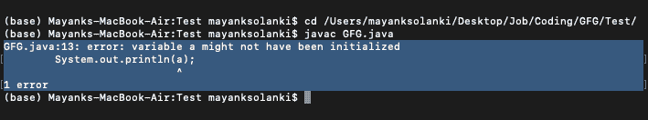

# Java 中分配给基本数据类型的默认值

> 原文：[https://www.geeksforgeeks.org/default-values-assigned-to-primitive-data-types-in-java/](https://www.geeksforgeeks.org/default-values-assigned-to-primitive-data-types-in-java/)

原语数据类型是 Java 中内置的数据类型，无需使用任何新的关键字就可以直接使用。正如我们所知，Java 对原始数据类型的处理是不同的，因此包装类的概念也起了作用。但是在这里，我们将完全专注于数据类型。因此，在 Java 中，有 8 种基本数据类型，如下表所示，以及它们相应的大小。

| 数据类型 | 大小 |
| --- | --- |
| byte | 1 byte |
| short | 2 bytes |
| int | 4 bytes |
| long | 8 bytes |
| float | 4 bytes |
| double | 8 bytes |
| char | 2 bytes |
| boolean | 1 bit |

现在，这里的默认值是由编译器分配给变量的值，这些变量被声明但没有被初始化或给定值。根据数据类型的返回类型，它们是不同的，如下所示，其中分配给不同原始数据类型的变量的默认值在表中给出。然而，依赖这样的默认值并不被认为是一种好的编程风格。

| 数据类型 | 默认值 |
| --- | --- |
| byte | 0 |
| short | 0 |
| int | 0 |
| long | 0L |
| float | 0.0f |
| double | 0.0d |
| char | '\u0000' |
| boolean | false |

现在我们知道初始化一个变量意味着在使用变量之前给它一个初始值。所以，为了先使用默认值，先声明带有数据类型和名称的变量（如 `int x`，这里 `int` 是数据类型，`x` 是变量的名称），如果在使用前不声明变量，会导致编译时错误。现在要使用变量的默认值，不要初始化它，也就是不要给它赋值。

### 示例 1

```java
// Java Program to Print Default Value Assigned
// to Primitive Datatype

// Importing input output classes
import java.io.*;

// Main class
public class GFG {

    // Global class variable
    static int a;

    // Main driver method
    public static void main(String[] args)
    {
        // Trying to print the default value
        // assigned to variable
        System.out.println(a);
    }
}
```

**输出：**

```
0
```

输出解释：

这里的 `a` 是一个类成员变量，或者你可以说是一个实例变量，编译器会将其初始化为默认值。

> **注意：** 如果变量（`a`）不是类成员，就会出现问题，因为编译器从不为未初始化的局部变量赋值。

在这种情况下，将出现一个指向变量 `a` 的错误，该变量 `a` 可能尚未初始化。这是因为这里的 `a` 是 `main()` 方法局部变量，在使用之前必须初始化。编译器从不为未初始化的局部变量赋值。如果您还没有在声明变量的地方初始化它，请在使用它之前给变量赋值，否则会导致编译时错误。

为了更好地理解类变量，如下例所示。

### 示例 2

```java
// Java Program to Print Default Value Assigned
// to Primitive Datatype

// Main class
public class GFG {

    // Main driver method
    public static void main(String[] args)
    {
        // Declaring class member variable
        // (inside a local scope)
        int a;

        // Trying to printing the default value assigned
        System.out.println(a);
    }
}
```

**输出：**

