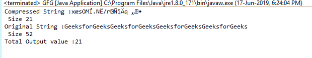

## Deflater.getTotalOut() 函数详解（带示例）

> 原文：[https://www.geeksforgeeks.org/deflater-gettotalout-function-in-java-with-examples/](https://www.geeksforgeeks.org/deflater-gettotalout-function-in-java-with-examples/)

在 `java.util.zip` 包中，`Deflater` 类的 `getTotalOut()` 函数返回到目前为止已输出的压缩字节总数。

### 功能签名

```java
public int getTotalOut()
```

### 语法

```java
d.getTotalOut();
```

### 参数
该函数不需要参数。

### 返回类型
该函数返回一个整数值，表示已输出的压缩字节总数。

### 异常
该函数不抛出任何异常。

### 示例 1

```java
// Java program to describe the use
// of getTotalOut() function

import java.util.zip.*;
import java.io.UnsupportedEncodingException;

class GFG {
    public static void main(String args[])
        throws UnsupportedEncodingException
    {
        // deflater
        Deflater d = new Deflater();

        // get the text
        String pattern = "GeeksforGeeks", text = "";

        // generate the text
        for (int i = 0; i < 4; i++)
            text += pattern;

        // set the Input for deflator
        d.setInput(text.getBytes("UTF-8"));

        // finish
        d.finish();

        // output bytes
        byte output[] = new byte[1024];

        // compress the data
        int size = d.deflate(output);

        // compressed String
        System.out.println("Compressed String :"
                           + new String(output)
                           + "\n Size " + size);

        // original String
        System.out.println("Original String :"
                           + text + "\n Size "
                           + text.length());

        // get the total number of
        // compressed bytes Output so far
        System.out.println("Total Output value :"
                           + d.getTotalOut());

        // end
        d.end();
    }
}
```

### 输出

```java
Compressed String :x?sOM?.N?/r???q??
 Size 21
Original String :GeeksforGeeksGeeksforGeeksGeeksforGeeksGeeksforGeeks
 Size 52
Total Output value :21
```



### 注意
当输入长度大于 `Integer.MAX_VALUE` 时可能会出现问题，结果可能会溢出。在这种情况下，我们应该使用 `getBytesRead()` 函数。

### 参考
[https://docs.oracle.com/javase/7/docs/api/java/util/zip/Deflater.html#getTotalOut()](https://docs.oracle.com/javase/7/docs/api/java/util/zip/Deflater.html#getTotalOut())