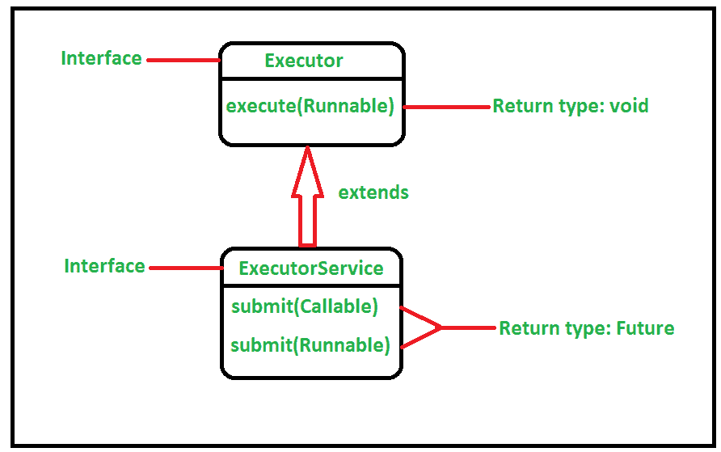
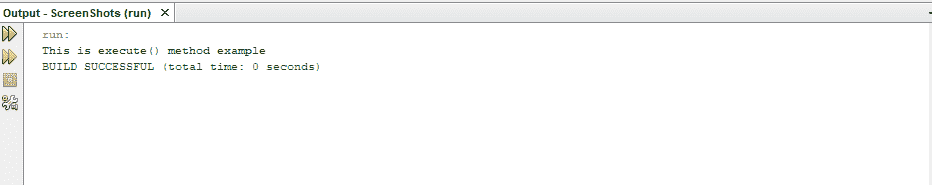
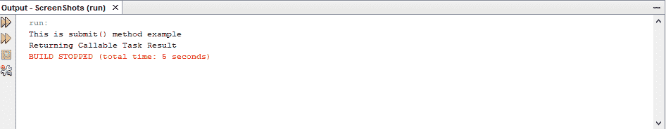

# Java中ExecutorService的`execute()`和`submit()`方法的区别

> 原文：[https://www.geeksforgeeks.org/difference-between-executorservice-execute-and-submit-method-in-java/](https://www.geeksforgeeks.org/difference-between-executorservice-execute-and-submit-method-in-java/)

[`ExecutorService`](https://www.geeksforgeeks.org/java-util-concurrent-executorservice-interface-with-examples/)接口通过添加帮助管理和控制线程执行的方法来扩展[`Executor`](https://www.geeksforgeeks.org/java-util-concurrent-executor-interface-with-examples/)。它在[`java.util.concurrent`](https://www.geeksforgeeks.org/tag/java-concurrent-package/)包中定义。它定义了执行返回结果的线程、一组线程和确定关闭状态的方法。在本文中，我们将看到名为`execute()`和`submit()`的这两种方法之间的区别。

在Java中，为了执行异步任务，通常实现`Runnable`[接口](https://www.geeksforgeeks.org/interfaces-in-java/)。其中一个可用的接口是[`Executor`](https://www.geeksforgeeks.org/java-util-concurrent-executor-interface-with-examples/)接口。`Executor`接口包含`execute()`方法。除此之外，还有另一个可用的接口，即扩展`Executor`接口的`ExecutorService`接口。此接口包含`submit()`方法。下图说明了这两个接口之间的关系。

[](https://media.geeksforgeeks.org/wp-content/uploads/20200603173523/execute-2.png)

**`execute()`方法：** 该函数在未来某个时间执行给定的命令。根据`Executor`实现的判断，该命令可以在新线程、池线程或调用线程中执行。这个方法是一个`void`方法，意味着它不返回任何结果。一旦在`execute()`方法中分配了任务，我们就不会得到任何响应，并且可以忘记任务。下面是`execute`方法的实现。

```java
// Java program to demonstrate
// the behavior of the
// execute() method

import java.util.concurrent.*;
public class GFG {

    public static void main(String[] args)
        throws Exception
    {

        // Creating the object of the
        // Executor Service
        ExecutorService executorService
            = Executors.newSingleThreadExecutor();

        // execute() method cannot return
        // anything because it's return type
        // is void.

        // By using execute(), we are accepting
        // a Runnable task
        executorService.execute(new Runnable() {

            // Override the run method
            public void run()
            {
                System.out.println(
                    "This is execute() "
                    + "method example");
            }
        });

        // This method performs all the
        // previously submitted tasks
        // before termination
        executorService.shutdown();
    }
}
```

**输出：**

[](https://media.geeksforgeeks.org/wp-content/cdn-uploads/20200622105613/execute.png)

**`submit()`方法：** 该函数在未来某个时间执行给定的命令。根据`Executor`实现的判断，该命令可以在新线程、池线程或调用线程中执行。与`execute`方法不同，此方法返回`Future`。在Java中，[`Future`](https://www.geeksforgeeks.org/callable-future-java/)代表异步计算的结果。`Future`对象用于在执行开始后处理任务。因此，当我们需要执行的结果时，那么我们可以使用`submit()`方法获取`Future`对象。为了得到结果，我们可以使用`Future`上的`get()`方法。`get()`方法返回一个[`Object`](https://www.geeksforgeeks.org/classes-objects-java/)。如果我们在任务完成之前调用`get()`方法，它将阻塞直到结果准备好，并可能抛出[受检异常](https://www.geeksforgeeks.org/types-of-exception-in-java-with-examples/)。或者，如果任务完成，则`Future`对象保存一个返回的结果，然后可以在以后使用。以下是`submit`方法的实现：

```java
// Java program to demonstrate
// the behavior of the
// submit() method

import java.util.concurrent.*;
public class GFG {
    public static void main(String[] args)
        throws Exception
    {

        // Creating the object of the
        // Executor service interface
        ExecutorService executorService
            = Executors.newFixedThreadPool(1);

        // submit() method can return the
        // result of the computation
        // because it has a return type of Future.

        // By using submit(), we are
        // accepting a Callable task
        Future obj
            = executorService.submit(new Callable() {

                // Overriding the call method
                  public Object call()
                  {
                      System.out.println(
                          "This is submit() "
                          + "method example");

                      return "Returning Callable "
                          + "Task Result";
                  }
              });

        // This method will return the result
        // if the task has finished perfectly.
        // The submit() method returns a
        // Java Future object which is
        // used to check when the Runnable
        // has completed.
        // As it implements Future,
        // get() method is called
        // to get the result
        System.out.println(obj.get());
        executorService.shutdown();
    }
}
```

**输出：**

[](https://media.geeksforgeeks.org/wp-content/cdn-uploads/20200622105633/submit.png)

下表演示了`execute`方法和`submit`方法之间的区别：

| `execute`方法 | `submit`方法 |
| --- | --- |
| 此方法在`Executor`接口中声明。 | 此方法在`ExecutorService`接口中声明。 |
| 此方法只能接受`Runnable`的任务。 | 此方法可以接受`Runnable`和`Callable`的任务。 |
| 此方法的返回类型为`void`。 | 此方法的返回类型为`Future`。 |
| 当我们不关心结果，但希望代码由线程池的工作线程并行运行时，就使用这个方法。 | 当我们关心结果并需要从已经执行的任务中得到结果时，就使用这种方法。 |