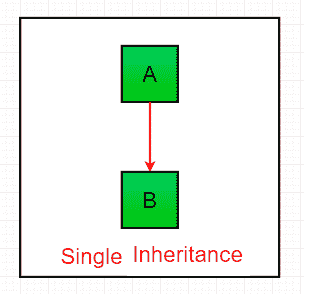
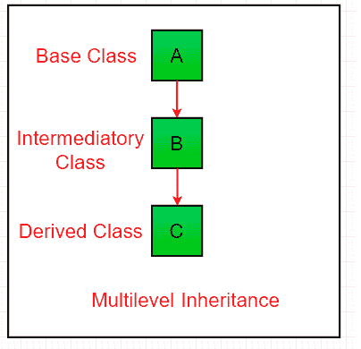
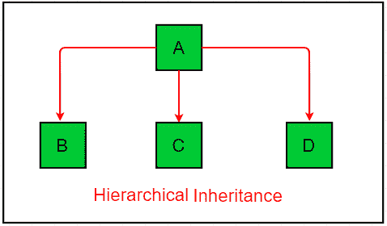

# Java 中继承和接口的区别

> 原文: [https://www.geeksforgeeks.org/difference-between-inheritance-and-interface-in-java/](https://www.geeksforgeeks.org/difference-between-inheritance-and-interface-in-java/)

[Java](https://www.geeksforgeeks.org/java/) 是目前最流行、应用最广泛的编程语言之一。多年来，Java 一直是最流行的编程语言之一。Java 是[面向对象](https://www.geeksforgeeks.org/object-oriented-programming-oops-concept-in-java/)。但是，它不被认为是纯面向对象的，因为它支持原始数据类型(如 `int`、`char` 等)。在本文中，我们将了解 java 中最重要的两个概念继承和接口之间的区别。

## 接口

[接口](https://www.geeksforgeeks.org/interfaces-in-java/)是类的蓝图。它们指定一个类必须做什么，而不是如何做。像类一样，接口可以有方法和变量，但是在接口中声明的方法默认是抽象的(即它们只包含方法签名，而不包含方法的主体)。接口用于实现完整的[抽象](https://www.geeksforgeeks.org/abstraction-in-java-2/)。

## 继承

[继承](https://www.geeksforgeeks.org/inheritance-in-java/)是 java 中的一种机制，通过这种机制，一个类可以继承另一个类的特性。java 中有多种可能的继承。它们是:

1.  **单继承:** 在单继承中，子类继承一个超类的特性。在下图中，类 `A` 作为派生类 `B` 的基类。

    

2.  **多级继承:** 在多级继承中，一个派生类将继承一个基类，并且该派生类也作为其他类的基类。在下图中，类 `A` 作为派生类 `B` 的基类，而 `B` 又作为派生类 `C` 的基类。在 Java 中，一个类不能直接访问其祖父类的成员。

    

3.  **层次继承:** 在层次继承中，一个类作为多个子类的超类(基类)。在下图中，类 `A` 作为派生类 `B`、`C` 和 `D` 的基类。

    

## 继承与接口的区别

下表描述了继承和接口之间的区别:

| 种类 | 继承 | 接口 |
| :--- | :--- | :--- |
| 描述 | 继承是 java 中允许一个类继承另一个类的特性的机制。 | 接口是类的蓝图。它指定一个类必须做什么，而不是如何做。像类一样，接口可以有方法和变量，但是接口中声明的方法默认是抽象的(只有方法签名，没有主体)。 |
| 使用 | 它用于获取另一个类的特征。 | 它用于提供全面的抽象。 |
| 语法 | `class subclass_name extends superclass_name { }` | `interface <interface_name>{ }` |
| 继承数量 | 它用于提供 4 种类型的继承。(多级、简单、混合和分层继承) | 它用于提供 1 种类型的继承(多重)。 |
| 关键字 | 它使用 `extends` 关键字。 | 它使用 `implements` 关键字。 |
| 继承 | 如果我们使用继承，我们可以继承比接口更少的类。 | 如果我们使用接口，我们可以继承比继承多得多的类。 |
| 方法定义 | 在继承的情况下，可以在类中定义方法。 | 在接口的情况下，不能在类中定义方法(除非使用 `static` 和 `default` 关键字)。 |
| 过载 | 如果我们试着扩展很多课程，它会覆盖整个系统。 | 不管我们实现多少类，系统都不会过载。 |
| 提供的功能 | 它不提供松耦合的功能 | 它提供了松耦合的功能。 |
| 多重继承 | 我们不能进行多重继承(导致编译时错误)。 | 我们可以使用接口进行多重继承。 |