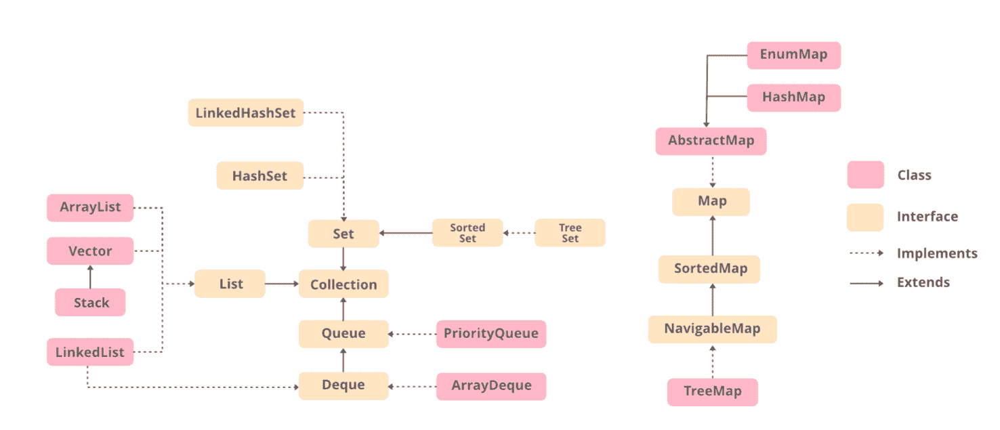

# Java 中列表和数组列表的区别

> 原文: [https://www.geeksforgeeks.org/difference-between-list-and-arraylist-in-java/](https://www.geeksforgeeks.org/difference-between-list-and-arraylist-in-java/)

集合是表示为单个单元的一组单个对象。Java 提供了[集合框架](https://www.geeksforgeeks.org/collections-in-java-2/)，该框架定义了几个类和接口，将一组对象表示为一个单元。该框架由`List`接口和`ArrayList`类组成。本文讨论了`List`和`ArrayList`的区别。


[`List`](https://www.geeksforgeeks.org/list-interface-java-examples/) 是[集合](https://www.geeksforgeeks.org/collections-in-java-2/)的子[接口](https://www.geeksforgeeks.org/interfaces-in-java/)。它是对象的有序集合，其中可以存储重复的值。因为`List`保留了插入顺序，所以它允许元素的位置访问和插入。`List`接口由[`ArrayList`](https://www.geeksforgeeks.org/arraylist-in-java/)、[`LinkedList`](https://www.geeksforgeeks.org/linked-list-in-java/)、[`Vector`](https://www.geeksforgeeks.org/java-util-vector-class-java/)、[`Stack`](https://www.geeksforgeeks.org/stack-class-in-java/)等类实现。`List`是一个接口，`List`的实例可以通过实现各种类来创建。

如果上面所说的听起来令人困惑，那么请参考下图，在实现`List`接口之前，您可以很容易地发现由类组成的层次结构和`List`接口。



## 示例

```java
// Java program to demonstrate the
// working of a List with ArrayList
// class

// Importing all utility classes
import java.util.*;

// Main class
public class GFG {

    // Main driver method
    public static void main(String[] args)
    {
        // Creating an object of List class
        // Declaring an object of String type with
        // reference to ArrayList class
        // Type safe list
        List<String> al = new ArrayList<String>();

        // Adding elements using add() method
        // Custom input elements
        al.add("Geeks");
        al.add("for");
        al.add("Geeks");

        // Print and display the elements in
        // ArrayList class object
        System.out.println(al);
    }
}
```

**输出**

```java
[Geeks, for, Geeks]
```

现在讨论 Java 中`ArrayList`的下一个概念。所以`ArrayList`基本上是集合框架的一部分，并且存在于`java.util`包中。它为我们提供了 Java 中的动态数组。这个类实现了`List`接口。与`List`类似，如果从集合中移除对象，则当集合增大或缩小时，`ArrayList`的大小会自动增大。Java `ArrayList`允许我们随机访问列表。`ArrayList`不能用于基本类型，如`int`、`char`等。对于这种情况，我们需要一个[包装类](https://www.geeksforgeeks.org/wrapper-classes-java/)。下面是一个演示`ArrayList`实现的例子。

**语法:**

```java
new ArrayList();
```

这只是在堆内存中创建新内存。为了访问对象，我们需要一个引用变量，因为这是面向对象编程中的一个经验法则。

```java
ArrayList obj = new ArrayList();
```

到目前为止，我们只创建了一个对象，但是没有定义`ArrayList`对象中会有什么类型的元素。所以像往常一样，我们将使用标识符来传递`String`类型、`Integer`类型、两者或一些其他类型。如下图所示。

```java
ArrayList<Integer> obj = new ArrayList<>();
ArrayList<String> obj = new ArrayList<>();
```

> **注意:** 在向`ArrayList`添加元素时，如果我们确实在一个索引处添加了元素，比如`i`，那么在我们的`ArrayList`中，所有元素都向右移动，在添加之前位于`i`的前一个元素现在将位于`i+1`索引处。它不会像我们在数组中看到的那样被取代。

到目前为止，我们已经通过对语法的上述理解，了解了声明以及如何初始化一个`List`，现在让我们在程序中实现同样的东西，以获得更好的理解。

**示例:**

```java
// Java Program to Demonstrate
// Working of an ArrayList class

// Importing all classes from java.util package
import java.util.*;

// Main class
class GFG {

    // Main driver method
    public static void main(String[] args)
    {
        // Creating an ArrayList of String type
        // Type safe ArrayList
        ArrayList<String> al = new ArrayList<String>();

        // Adding elements to above object created
        // Custom input elements
        al.add("Geeks");
        al.add("for");
        al.add("Geeks");

        // Print and display the elements of ArrayList
        System.out.println(al);

        // adding element at index where
        // element is already present
        al.add(1, "Hi");

        // Print and display the elements of ArrayList
        System.out.println(al);
    }
}
```

**输出**

```java
[Geeks, for, Geeks]
[Geeks, Hi, for, Geeks]
```

现在让我们来讨论一下 Java 中两个类之间的区别，如上所述，它们是`List`类和`ArrayList`类，下面以表格形式显示如下，以便于理解。

### Java 中的 List 与 ArrayList

| 特性 | `List` | `ArrayList` |
| --- | --- | --- |
| 本质 | `List`是一个接口 | `ArrayList`是一个类 |
| 继承关系 | `List`接口扩展了`Collection`框架 | `ArrayList`扩展了`AbstractList`类并实现了`List`接口 |
| 实例化 | `List`无法直接实例化。 | `ArrayList`可以被实例化。 |
| 用途 | `List`接口用于创建与其索引号相关联的元素(对象)列表。 | `ArrayList`类用于创建包含对象的动态数组。 |
| 数据结构 | `List`接口创建存储在序列中的元素集合，并使用索引来标识和访问这些元素。 | `ArrayList`创建一个对象数组，该数组可以动态增长。 |