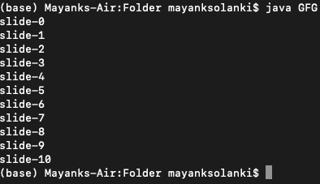
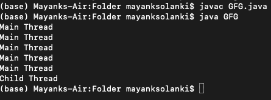

# Java中sleep和yield方法的区别

> 原文：[https://www.geeksforgeeks.org/difference-between-sleep-and-yield-method-in-java/](https://www.geeksforgeeks.org/difference-between-sleep-and-yield-method-in-java/)

在Java中，如果一个线程在特定的时间内不想执行任何操作，那么我们应该使用`sleep()`方法，这将导致当前正在执行的线程停止指定的毫秒数。

**语法：**

```java
public static native void sleep(long ms) throws InterruptedException;
// 上述方法使线程休眠指定的毫秒数
```

```java
public static void sleep(long ms, int ns) throws InterruptedException;
// 上述方法也使线程休眠指定的毫秒数加上指定的纳秒数
```

**方法1：`sleep()`方法**

Java中的每一个`sleep()`方法都会抛出一个`InterruptedException`，这是一个受检异常，因此每当我们强制使用`sleep`方法时，我们都应该通过`try-catch`或`throws`关键字来处理它，否则我们会得到编译时错误。

**实现：** 这里，我们在`println`语句之后，让主线程休眠5秒。所以每张幻灯片打印需要5秒钟。

**示例**

```java
// Java程序说明sleep方法

// 导入所有输入输出类
import java.io.*;
// 导入java.util包中的所有工具类
import java.util.*;

// 主类
class GFG {

    // 主驱动方法
    public static void main(String[] args)
        throws InterruptedException
    {
        // 使用简单的for循环进行迭代
        for (int i = 0; i <= 10; i++) {
            // 打印当前线程幻灯片
            System.out.println("slide-" + i);
            // 将主线程休眠5秒
            Thread.sleep(5000);
        }
        // 此后每5秒将打印一张幻灯片
    }
}
```

**输出：**



> 注意：此处幻灯片-1将在5000毫秒后在幻灯片-0后打印，因此请务必注意所有其他幻灯片。因此，在运行时状态下，显示的输出将花费一定的执行时间。

**方法2：`yield()`方法**

它会导致暂停当前正在执行的线程，以便有机会等待具有相同优先级的线程。如果没有等待线程或者所有等待线程的优先级都很低，那么同一个线程可以继续执行。如果多个线程以相同的优先级等待，那么哪个等待线程会有机会，我们不能说，这取决于线程调度器。当线程再次获得机会时，它会屈服，这也取决于线程调度器。

**语法：**

```java
public static native void yield();
```

**实现：**

```java
// Java程序说明yield()方法

// 导入输入输出类
import java.io.*;
// 导入所有工具类
import java.util.*;

// 类1
// 辅助类，扩展Thread类
// 通过扩展Thread类在我们的myThread类中创建一个线程
class myThread extends Thread {
    // 辅助类中的方法
    // 声明run方法
    public void run() {
        // 显示消息
        System.out.println("Child Thread");
        // 调用yield()方法
        Thread.yield();
    }
}

// 类2
// 主类
class GFG {
    // 主驱动方法
    public static void main(String[] args)
        throws InterruptedException
    {
        // 在上面辅助类的main()方法中创建线程对象
        myThread t = new myThread();
        // 使用start()方法启动上面创建的线程
        t.start();
        // 使用for循环迭代
        // 自定义大小等于5
        for (int i = 0; i < 5; i++) {
            // 显示消息
            System.out.println("Main Thread");
        }
    }
}
```



**输出解释：**

在上面的程序中，如果我们注释掉`Thread.yield()`行，两个线程会同时执行，我们不能期望哪个线程会先完成。如果我们不注释`Thread.yield()`方法，那么因为主线程将获得更多次机会，并且首先完成主线程的机会很高。

最后，我们完成了这两种方法，让我们最后总结一下它们之间的区别。

| 属性 | yield方法 | sleep方法 |
| --- | --- | --- |
| 目的 | 如果一个线程想要暂停它的执行来给剩余的具有相同优先级的线程机会，那么我们应该使用`yield`方法。 | 如果一个线程在特定的时间内不想执行任何操作，那么我们应该使用`sleep`方法。 |
| 重载 | 这个方法没有重载。 | `sleep`方法被重载。 |
| 异常 | 这个方法不会抛出异常。 | 此方法抛出`InterruptedException`。 |
| 本地方法 | 此方法是本地的。 | 在这两个重载方法中，只有`sleep(long ms)`是本地的，而另一个不是。 |
| 放弃监视器 | 这种方法放弃了监视器。 | 这个方法不会导致当前正在执行的线程放弃监视器。 |