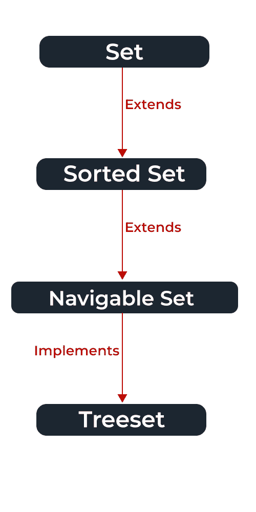

# Java 中 TreeSet 和 SortedSet 的区别

> 原文：`https://www.geeksforgeeks.org/difference-between-treeset-and-sortedset-in-java/`

## TreeSet 简介

[`TreeSet`](https://www.geeksforgeeks.org/treeset-in-java-with-examples/) 是 [`NavigableSet`](https://www.geeksforgeeks.org/navigableset-java-examples/) 接口的实现之一。它的底层数据结构是一棵[红黑树](https://www.geeksforgeeks.org/red-black-tree-set-1-introduction-2/)。元素以升序存储，与 [`SortedSet`](https://www.geeksforgeeks.org/sortedset-java-examples/) 相比，`TreeSet` 中有更多的方法可用。我们也可以使用 [`Comparator`](https://www.geeksforgeeks.org/comparator-interface-java/) 来更改排序参数。例如，根据使用的构造函数，在设置创建时提供比较器。

## TreeSet 实现的接口

*   它还实现了 `NavigableSet` 接口。
*   [`NavigableSet`](https://www.geeksforgeeks.org/navigableset-java-examples/) 扩展 `SortedSet` 和 [`Set`](https://www.geeksforgeeks.org/set-in-java/) 接口。



## 示例

```java
// Java Program to Illustrate TreeSet

// Importing required classes
import java.util.*;

// Main class
class GFG {

// Main driver method
    public static void main(String args[]) {

// Creating an empty TreeSet of string type elements
        TreeSet<String> al = new TreeSet<String>();

// Adding elements
        // using add() method
        al.add("Welcome");
        al.add("to");
        al.add("Geeks for Geeks");

// Traversing elements via help of iterators
        Iterator<String> itr = al.iterator();

// Holds true until there is element remaining in object
        while (itr.hasNext()) {

// Moving onto next element with help of next() method
            System.out.println(itr.next());
        }
    }
}
```

**输出**

```java
Geeks for Geeks
Welcome
to
```