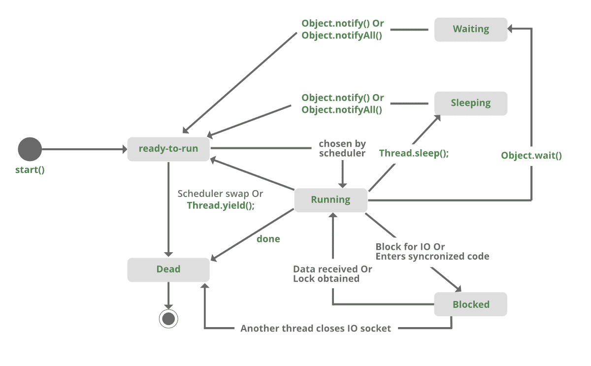

# Java 中等待和睡眠的区别

> 原文: [https://www.geeksforgeeks.org/difference-between-wait-and-sleep-in-java/](https://www.geeksforgeeks.org/difference-between-wait-and-sleep-in-java/)

**`sleep()`:** 此方法用于以毫秒为单位暂停当前线程执行指定时间。在这里，线程不会失去它对监视器的所有权，并继续它的执行。

**`wait()`:** 此方法在 `Object` 类中定义。它告诉调用线程(也称为当前线程)等待，直到另一个线程为此对象调用 `notify()` 或 `notifyAll()` 方法，线程等待，直到它重新获得监视器的所有权并继续执行。

| `wait()` | `sleep()` |
| --- | --- |
| `wait()` 方法属于 `Object` 类。 | `sleep()` 方法属于 `Thread` 类。 |
| `wait()` 方法在同步期间释放锁定。 | `sleep()` 方法不会在同步过程中释放对象上的锁。 |
| 只能从同步上下文中调用 `wait()`。 | 不需要从同步上下文中调用 `sleep()`。 |
| `wait()` 不是静态方法。 | `sleep()` 是一个静态方法。 |
| `wait()` 有三种重载方法：<br> * `wait()`<br> * `wait(long timeout)`<br> * `wait(long timeout, int nanos)` | `sleep()` 有两种重载方法：<br> * `sleep(long millis)` 毫秒<br> * `sleep(long millis, int nanos)` 纳秒 |
| `public final void wait(long timeout)` | `public static void sleep(long millis) throws InterruptedException` |

**`sleep()` 方法示例:**

```java
synchronized(monitor)
{
    Thread.sleep(1000);  // Here Lock Is Held By The Current Thread
    //after 1000 milliseconds, current thread will wake up, or after we call interrupt() method
}
```

**`wait()` 方法示例:**

```java
synchronized(monitor)
{
    monitor.wait();  // Here Lock Is Released By Current Thread
}
```

**`wait()` 和 `sleep()` 方法的相似性:**

1.  两者都使当前线程进入不可运行状态。
2.  两者都是原生方法。

调用 `wait()` 和 `sleep()` 方法的以下代码片段:

```java
synchronized(monitor){
    while(condition == true)
    {
        monitor.wait();  //releases monitor lock
    }

    Thread.sleep(100); //puts current thread on Sleep
}
```



**程序:**

```java
// Java program to demonstrate the difference
// between wait and sleep

class GfG{

    private static Object LOCK = new Object();

    public static void main(String[] args)
        throws InterruptedException {

        Thread.sleep(1000);

        System.out.println("Thread '" + Thread.currentThread().getName() +
                "' is woken after sleeping for 1 second");

        synchronized (LOCK)
        {
            LOCK.wait(1000);

            System.out.println("Object '" + LOCK + "' is woken after" +
                    " waiting for 1 second");
        }
    }
}
```

**Output**

```java
Thread 'main' is woken after sleeping for 1 second
Object 'java.lang.Object@1d81eb93' is woken after waiting for 1 second
```