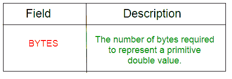
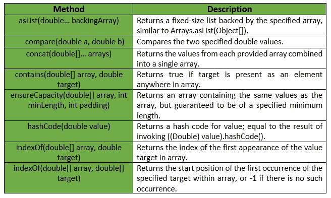
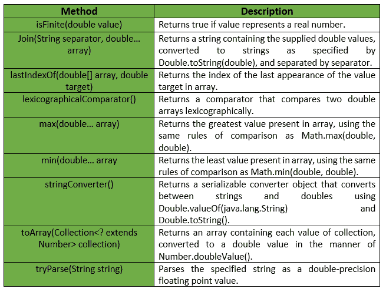

# Doubles 类（Guava Java）

> 原文：[https://www.geeksforgeeks.org/doubles-class-guava-java/](https://www.geeksforgeeks.org/doubles-class-guava-java/)

`Doubles` 是一个用于原始类型 `double` 的效用类。它提供了属于双精度原语的 `静态实用方法`，这些方法在双精度原语或数组中都找不到。

**声明：**

```java
@GwtCompatible(emulated=true)
public final class Doubles
extends Object
```

下表显示了 Guava `Doubles` 类的方法摘要：



Guava `Doubles` 类提供的方法有：



**异常：**

*   `min`：如果数组为空，抛出 `IllegalArgumentException`。
*   `max`：如果数组为空，抛出 `IllegalArgumentException`。
*   `ensureCapacity`：如果最小长度或填充值为负，则抛出异常。
*   `toArray`：如果集合或其任何元素为 `null`，则抛出 `NullPointerException`。

下表显示了 Guava `Doubles` 类提供的一些其他方法：



下面给出了一些示例，显示了 Guava `Doubles` 类方法的实现：

**示例 1：**

```java
// Java code to show implementation
// of Guava Doubles.asList() method

import com.google.common.primitives.Doubles;
import java.util.*;

class GFG {
    // Driver method
    public static void main(String[] args)
    {
        double arr[] = { 2.6, 4.6, 1.2, 2.4, 1.5 };

// Using Doubles.asList() method which
        // converts array of primitives to array of objects
        List<Double> myList = Doubles.asList(arr);

// Displaying the elements
        System.out.println(myList);
    }
}
```

输出：

```java
[2.6, 4.6, 1.2, 2.4, 1.5]
```

**示例 2：**

```java
// Java code to show implementation
// of Guava Doubles.toArray() method

import com.google.common.primitives.Doubles;
import java.util.*;

class GFG {
    // Driver method
    public static void main(String[] args)
    {
        List<Double> myList = Arrays.asList(2.6, 4.6, 1.2, 2.4, 1.5);

// Using Doubles.toArray() method which
        // converts a List of Doubles to an
        // array of double
        double[] arr = Doubles.toArray(myList);

// Displaying the elements
        System.out.println(Arrays.toString(arr));
    }
}
```

输出：

```java
[2.6, 4.6, 1.2, 2.4, 1.5]
```

**示例 3：**

```java
// Java code to show implementation
// of Guava Doubles.concat() method

import com.google.common.primitives.Doubles;
import java.util.*;

class GFG {
    // Driver method
    public static void main(String[] args)
    {
        double[] arr1 = { 2.6, 4.6, 1.2 };
        double[] arr2 = { 2.4, 1.5 };

// Using Doubles.concat() method which
        // combines arrays from specified
        // arrays into a single array
        double[] arr = Doubles.concat(arr1, arr2);

// Displaying the elements
        System.out.println(Arrays.toString(arr));
    }
}
```

输出：

```java
[2.6, 4.6, 1.2, 2.4, 1.5]
```

**示例 4：**

```java
// Java code to show implementation
// of Guava Doubles.contains() method

import com.google.common.primitives.Doubles;

class GFG {
    // Driver method
    public static void main(String[] args)
    {
        double[] arr = { 2.6, 4.6, 1.2, 2.4, 1.5 };

// Using Doubles.contains() method which
        // checks if element is present in array
        // or not
        System.out.println(Doubles.contains(arr, 2.5));
        System.out.println(Doubles.contains(arr, 1.5));
    }
}
```

输出：

```java
false
true
```

**示例 5：**

```java
// Java code to show implementation
// of Guava Doubles.min() method

import com.google.common.primitives.Doubles;

class GFG {
    // Driver method
    public static void main(String[] args)
    {
        double[] arr = { 2.6, 4.6, 1.2, 2.4, 1.5 };

// Using Doubles.min() method
        System.out.println(Doubles.min(arr));
    }
}
```

输出：

```java
1.2
```

**示例 6：**

```java
// Java code to show implementation
// of Guava Doubles.max() method

import com.google.common.primitives.Doubles;

class GFG {
    // Driver method
    public static void main(String[] args)
    {
        double[] arr = { 2.6, 4.6, 1.2, 2.4, 1.5 };

// Using Doubles.max() method
        System.out.println(Doubles.max(arr));
    }
}
```

输出：

```java
4.6
```