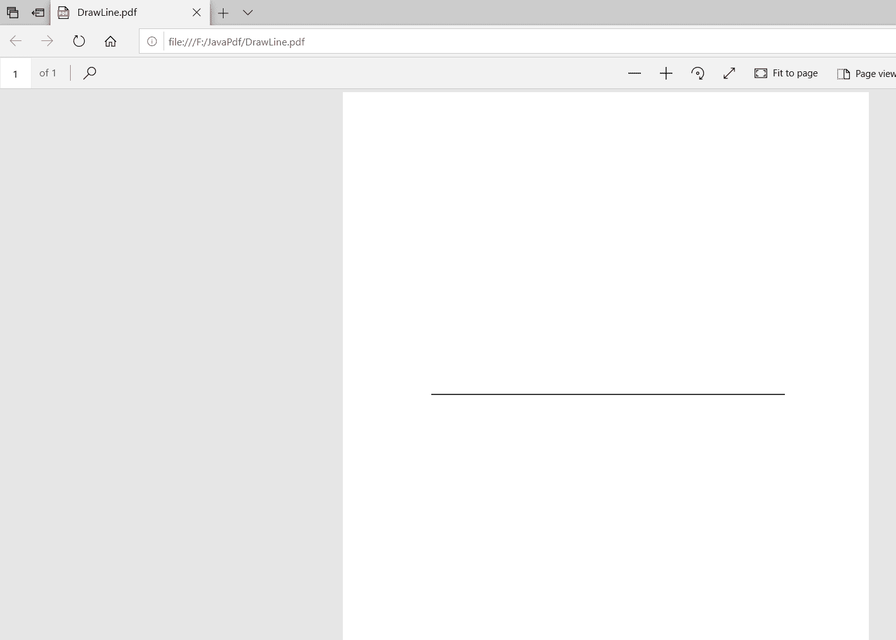

# 用 Java 在 PDF 文档中画线

> 原文：[https://www.geeksforgeeks.org/drawing-a-line-in-a-pdf-document-using-java/](https://www.geeksforgeeks.org/drawing-a-line-in-a-pdf-document-using-java/)

在本文中，我们将学习如何使用 Java 在 PDF 文档中画线。为了在 PDF 中画线，我们将使用 iText 库。这些是使用 Java 在 PDF 中画线应该遵循的步骤。

## 步骤

### 1. 创建 `PdfWriter` 对象

`PdfWriter` 类表示 PDF 的文档编写器。这个类的构造函数接受一个字符串，即创建 PDF 的文件的路径。

```java
// importing the PdfWriter class.
import com.itextpdf.kernel.pdf.PdfWriter;

// path where the pdf is to be created.
String path = "F:/JavaPdf/DrawLine.pdf";
PdfWriter pdfwriter = new PdfWriter(path);
```

### 2. 创建 `PdfDocument` 对象

`PdfDocument` 类是在 iText 中表示 PDF 文档的类，要以写模式实例化这个类，您需要将一个类别为 `PdfWriter` 的对象（即上面代码中的 `pdfwriter`）传递给它的构造函数。

```java
// Creating a PdfDocument  object.
// passing PdfWriter object constructor of pdfDocument.
PdfDocument pdfdocument = new PdfDocument(pdfwriter);
```

### 3. 创建 `Document` 对象

`Document` 类是创建自给自足的 PDF 时的根元素。此类的一个构造函数接受 `PdfDocument` 类（即 `pdfdocument`）类型的对象。

```java
// Creating a Document and passing pdfDocument object
Document document = new Document(pdfdocument);
```

### 4. 创建一个 `PdfCanvas` 对象

在实例化 `PdfCanvas` 对象之前，我们必须创建一个新的 `PdfPage` 对象，因为我们需要将 `PdfPage` 对象传递给 `PdfCanvas` 类的构造函数。

```java
// Creating a new page
PdfPage pdfPage = pdfdocument.addNewPage();

// instantiating a PdfCanvas object
PdfCanvas canvas = new PdfCanvas(pdfPage);
```

### 5. 画线并关闭路径笔画，文档

使用 `Canvas` 类的 `moveTo()` 方法设置直线的起点，并使用 `Canvas` 类的 `lineTo()` 方法绘制直到终点。

```java
// starting point of the line
canvas.moveTo(100, 300);

// Drawing the line till the end point.
canvas.lineTo(500, 300);

// Close the path stroke
canvas.closePathStroke();

// Close the document
document.close();
```

## 完整代码示例

使用 Java 在 PDF 文档中画线的代码。

```java
import com.itextpdf.kernel.pdf.PdfDocument;
import com.itextpdf.kernel.pdf.PdfPage;
import com.itextpdf.kernel.pdf.PdfWriter;
import com.itextpdf.kernel.pdf.canvas.PdfCanvas;
import com.itextpdf.layout.Document;

public class DrawLine {
    public static void main(String args[]) throws Exception
    {
        try {
            // path where the pdf is to be created.
            String path = "F:/JavaPdf/DrawLine.pdf";
            PdfWriter pdfwriter = new PdfWriter(path);

            // Creating a PdfDocument object.
            // passing PdfWriter object constructor of
            // pdfDocument.
            PdfDocument pdfdocument
                = new PdfDocument(pdfwriter);

            // Creating a Document and passing pdfDocument
            // object
            Document document = new Document(pdfdocument);

            // Creating a new page
            PdfPage pdfPage = pdfdocument.addNewPage();

            // instantiating a PdfCanvas object
            PdfCanvas canvas = new PdfCanvas(pdfPage);

            // starting point of the line
            canvas.moveTo(100, 500);

            // Drawing the line till the end point.
            canvas.lineTo(500, 500);

            // close the path stroke
            canvas.closePathStroke();

            // Close the document
            document.close();
            System.out.println(
                "drawn the line successfully");
        }
        catch (Exception e) {
            System.out.println(
                "Failed to draw the line due to " + e);
        }
    }
}
```

## 依赖关系

执行以下程序的依赖关系：

```java
kernel-7.1.13.jar
layout-7.1.13.jar
```

## 编译与运行

使用以下命令编译并执行程序：

```bash
javac DrawLine.java
java DrawLine
```

## 输出结果

```java
drawn the line successfully
```

## PDF 效果

