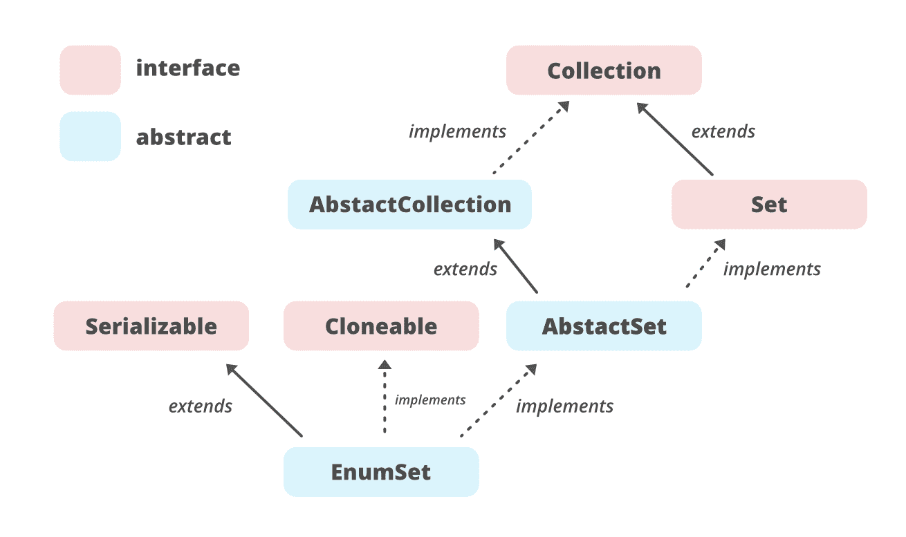

# Java 中的枚举

> 原文: [https://www.geeksforgeeks.org/enumset-class-java/](https://www.geeksforgeeks.org/enumset-class-java/)

**先决条件:** [Java 中的枚举](https://www.geeksforgeeks.org/enum-in-java/)

**枚举**是[设置接口](https://www.geeksforgeeks.org/set-in-java/)的专门实现之一，用于[枚举类型](https://www.geeksforgeeks.org/enum-in-java/)。`EnumSet`的几个`重要特性`如下:

*   它扩展了[抽象集](https://www.geeksforgeeks.org/abstractset-class-in-java-with-examples/#:~:text=The%20AbstractSet%20class%20in%20Java,implementation%20of%20the%20Set%20interface.)类，并在 Java 中实现了[集接口](https://www.geeksforgeeks.org/set-in-java/)。
*   枚举类是 [Java 集合框架](https://www.geeksforgeeks.org/collections-in-java-2/)的成员&是不同步的。
*   这是一个高性能的集合实现，比 [`HashSet`](https://www.geeksforgeeks.org/hashset-in-java/) 快得多。
*   枚举集中的所有元素必须来自单个[枚举类型](https://www.geeksforgeeks.org/enum-in-java/)，该类型在显式或隐式创建集合时指定。
*   它不允许`空对象`，如果我们这样做，它会抛出`空指针异常`。
*   它使用一个`故障安全`迭代器，所以如果在迭代时集合被修改，它不会抛出`ConcurrentModificationException`。

**枚举的层次结构**

```java
java.lang.Object
   ↳ java.util.AbstractCollection<E>
        ↳ java.util.AbstractSet<E>
             ↳ java.util.EnumSet<E>
```

这里，`E`是存储的元素类型。



**申报:**

```java
public abstract class EnumSet<E extends Enum<E>>
```

这里，`E`指定元素。e 必须扩展枚举，这强制要求元素必须是指定的[枚举类型](https://www.geeksforgeeks.org/enum-in-java/)。

**例:**

## 创建EnumSet对象

```java
// Java program to illustrate working
// of EnumSet and its functions.
import java.util.EnumSet;

enum Gfg { CODE, LEARN, CONTRIBUTE, QUIZ, MCQ };

public class EnumSetExample {

      // Main Method
    public static void main(String[] args)
    {
        // Creating a set
        EnumSet<Gfg> set1, set2, set3, set4;

        // Adding elements
        set1 = EnumSet.of(Gfg.QUIZ, Gfg.CONTRIBUTE,
                          Gfg.LEARN, Gfg.CODE);
        set2 = EnumSet.complementOf(set1);
        set3 = EnumSet.allOf(Gfg.class);
        set4 = EnumSet.range(Gfg.CODE, Gfg.CONTRIBUTE);
        System.out.println("Set 1: " + set1);
        System.out.println("Set 2: " + set2);
        System.out.println("Set 3: " + set3);
        System.out.println("Set 4: " + set4);
    }
}
```

**Output:**

```java
Set 1: [CODE, LEARN, CONTRIBUTE, QUIZ]
Set 2: [MCQ]
Set 3: [CODE, LEARN, CONTRIBUTE, QUIZ, MCQ]
Set 4: [CODE, LEARN, CONTRIBUTE]
```

**1。创建枚举对象**

因为枚举是一个抽象类，所以我们不能直接创建它的实例。它有许多静态工厂方法，允许我们创建一个实例。JDK 提供了两种不同的枚举实现

*   `RegularEnumSet`
*   `JumboEnumSet`

这些都是包私有的，由位向量支持。

`RegularEnumSet`使用一个`long`对象来存储表达式的元素。`long`元素的每个位代表一个枚举值。由于`long`的大小是 64 位，因此它最多可以存储 64 个不同的元素。

`JumboEnumSet`使用一个`long`元素数组来存储枚举的元素。与正则表达式的唯一区别是，`JumboEnumSet`使用一个`long`数组来存储位向量，从而允许超过 64 个值。

工厂方法根据元素的数量创建一个实例，

```java
if (universe.length <= 64)
    return new RegularEnumSet<>(elementType, universe);
else
    return new JumboEnumSet<>(elementType, universe);
```

`EnumSet`不提供任何公共构造函数，实例是使用静态工厂方法创建的，如

*   [`allOf(Class<E>)`](https://www.geeksforgeeks.org/enumset-allof-method-in-java/#:~:text=util.,elements%20in%20the%20specified%20elementType.)
*   [`noneOf(Class<E>)`](https://www.geeksforgeeks.org/enumset-noneof-method-in-java/#:~:text=EnumSet.,set%20of%20the%20type%20elementType.&text=Parameters%3A%20The%20method%20accepts%20one,type%20for%20this%20enum%20set.)
*   [`range(E, E)`](https://www.geeksforgeeks.org/enumset-range-method-in-java/#:~:text=The%20java.,specified%20range%20in%20the%20parameters.)
*   [`of()`](https://www.geeksforgeeks.org/enumset-of-method-in-java/#:~:text=of(E%20ele1%2C%20E%20ele2,the%20new%20elements%20are%20added.)

## 添加元素

```java
// Java program to create
// an EnumSet

import java.util.*;

class CreateEnumSet {

    enum Game { CRICKET, HOCKEY, TENNIS }

    public static void main(String[] args)
    {

        // Creating an EnumSet using allOf()
        EnumSet<Game> games = EnumSet.allOf(Game.class);

          // printing EnumSet elements to the console
        System.out.println("EnumSet: " + games);
    }
}
```

**Output**

```java
EnumSet: [CRICKET, HOCKEY, TENNIS]
```

**2。添加元素:**我们可以使用`add()`和`addAll()`方法向枚举中添加元素。

```java
// Java program to add
// elements to an EnumSet

import java.util.EnumSet;

class AddElementsToEnumSet {

    enum Game { CRICKET, HOCKEY, TENNIS }

    public static void main(String[] args)
    {

        // Creating an EnumSet using allOf()
        EnumSet<Game> games1 = EnumSet.allOf(Game.class);

        // Creating an EnumSet using noneOf()
        EnumSet<Game> games2 = EnumSet.noneOf(Game.class);

        // Using add method
        games2.add(Game.HOCKEY);

          // printing the elements to the console
        System.out.println("EnumSet Using add(): "
                           + games2);

        // Using addAll() method
        games2.addAll(games1);

          // printing the elements to the console
        System.out.println("EnumSet Using addAll(): "
                           + games2);
    }
}
```

**Output**

```java
EnumSet Using add(): [HOCKEY]
EnumSet Using addAll(): [CRICKET, HOCKEY, TENNIS]
```

**3。访问元素:**我们可以使用`iterator()`方法访问枚举元素。

## 访问元素

```java
// Java program to access the
// elements of EnumSet
import java.util.EnumSet;
import java.util.Iterator;

class AccessingElementsOfEnumSet {

    enum Game { CRICKET, HOCKEY, TENNIS }

    public static void main(String[] args)
    {

        // Creating an EnumSet using allOf()
        EnumSet<Game> games = EnumSet.allOf(Game.class);

          // create an iterator on games
        Iterator<Game> iterate = games.iterator();

          // Iterate and print elements to
          // the console
        System.out.print("EnumSet: ");
        while (iterate.hasNext()) {
            System.out.print(iterate.next());
            System.out.print(", ");
        }
    }
}
```

**Output**

```java
EnumSet: CRICKET, HOCKEY, TENNIS,
```

**4。移除元素:**我们可以使用`remove()`和`removeAll()`方法移除元素。

## 移除元素

```java
// Java program to remove
// Elements from EnumSet

import java.util.EnumSet;

class RemovingElementsOfEnumSet {

    enum Game { CRICKET, HOCKEY, TENNIS }

    public static void main(String[] args)
    {

        // Creating EnumSet using allOf()
        EnumSet<Game> games = EnumSet.allOf(Game.class);
        System.out.println("EnumSet: " + games);

        // Using remove()
        boolean value1 = games.remove(Game.CRICKET);

          // printing elements to the console
        System.out.println("Is CRICKET removed? " + value1);

        // Using removeAll()
        boolean value2 = games.removeAll(games);

          // printing elements to the console
        System.out.println("Are all elements removed? "
                           + value2);
    }
}
```

**Output**

```java
EnumSet: [CRICKET, HOCKEY, TENNIS]
Is CRICKET removed? true
Are all elements removed? true
```

### 枚举法

这里，`E`是元素的类型。

#### EnumSet 类中的方法

| 方法 | 描述 |
| --- | --- |
| `allOf(Class<E> elementType)` | 创建包含指定元素类型中所有元素的枚举集。 |
| `clone()` | 返回此集合的副本。 |
| `complementOf(EnumSet<E> s)` | 创建与指定枚举集具有相同元素类型的枚举集，最初包含指定集中不包含的该类型的所有元素。 |
| `copyOf(Collection<E> c)` | 创建从指定集合初始化的枚举集。 |
| `copyOf(EnumSet<E> s)` | 创建与指定枚举集具有相同元素类型的枚举集，最初包含相同的元素(如果有)。 |
| `noneOf(Class<E> elementType)` | 创建具有指定元素类型的空枚举集。 |
| `of(E e)` | 创建最初包含指定元素的枚举集。 |
| `of(E e1, E e2)` | 创建最初包含指定元素的枚举集。 |
| `of(E first, E... rest)` | 创建最初包含指定元素的枚举集。 |
| `of(E e1, E e2, E e3)` | 创建最初包含指定元素的枚举集。 |
| `of(E e1, E e2, E e3, E e4)` | 创建最初包含指定元素的枚举集。 |
| `of(E e1, E e2, E e3, E e4, E e5)` | 创建最初包含指定元素的枚举集。 |
| `range(E from, E to)` | 创建一个枚举集，该枚举集最初包含由两个指定端点定义的范围内的所有元素。 |

### java.util.AbstractSet 类中声明的方法

| 方法 | 描述 |
| --- | --- |
| `equals(Object o)` | 将指定的对象与此相等集进行比较。 |
| `hashCode()` | 返回该集合的哈希代码值。 |
| `removeAll(Collection<?> c)` | 从此集合中移除指定集合中包含的所有元素(可选操作)。 |

### 接口 java.util.Collection 中声明的方法

| 方法 | 描述 |
| --- | --- |
| `parallelStream()` | 以此集合为源返回一个可能并行的流。 |
| `removeIf(Predicate<? super E> filter)` | 移除此集合中满足给定谓词的所有元素。 |
| `stream()` | 返回以此集合为源的顺序流。 |
| `toArray(IntFunction<T[]> generator)` | 使用提供的生成器函数分配返回的数组，返回包含此集合中所有元素的数组。 |

### 在接口 java.lang.Iterable 中声明的方法

| 方法 | 描述 |
| --- | --- |
| `forEach(Consumer<? super T> action)` | 对 Iterable 的每个元素执行给定的操作，直到所有元素都被处理完或者该操作引发异常。 |

### 接口 java.util.Set 中声明的方法

| 方法 | 描述 |
| --- | --- |
| `add(E e)` | 如果指定元素尚不存在，则将指定元素添加到该集合中(可选操作)。 |
| `addAll(Collection<? extends E> c)` | 如果指定元素尚不存在，则将指定元素添加到该集合中(可选操作)。 |
| `clear()` | 从此集合中移除所有元素(可选操作)。 |
| `contains(Object o)` | 如果此集合包含指定的元素，则返回 true。 |
| `containsAll(Collection<?> c)` | 如果此集合包含指定集合的所有元素，则返回 true。 |
| `isEmpty()` | 如果此集合不包含元素，则返回 true。 |
| `iterator()` | 返回该集合中元素的迭代器。 |
| `remove(Object o)` | 如果存在指定的元素，则从该集中移除该元素(可选操作)。 |
| `retainAll(Collection<?> c)` | 仅保留该集合中包含在指定集合中的元素(可选操作)。 |
| `size()` | 返回该集合中的元素数量(其基数)。 |
| `spliterator()` | 在该集合中的元素上创建一个拆分器。 |
| `toArray()` | 返回包含该集合中所有元素的数组。 |
| `toArray(T[] a)` | 返回包含该集合中所有元素的数组；返回数组的运行时类型是指定数组的运行时类型。 |

### java.util.AbstractCollection 类中声明的方法

| 方法 | 描述 |
| --- | --- |
| [`add(E e)`](https://www.geeksforgeeks.org/abstractcollection-add-method-in-java-with-examples/#:~:text=The%20add()%20method%20in,already%20present%20in%20the%20Collection.) | 确保此集合包含指定的元素(可选操作)。 |
| [`addAll(Collection<? extends E> c)`](https://www.geeksforgeeks.org/abstractcollection-addall-method-in-java-with-examples/) | 将指定集合中的所有元素添加到此集合中(可选操作)。 |
| [`clear()`](https://www.geeksforgeeks.org/abstractcollection-clear-method-in-java-with-examples/) | 从此集合中移除所有元素(可选操作)。 |
| [`contains(Object o)`](https://www.geeksforgeeks.org/abstractcollection-contains-method-in-java-with-examples/) | 如果此集合包含指定的元素，则返回 true。 |
| [`containsAll(Collection<?> c)`](https://www.geeksforgeeks.org/abstractcollection-containsall-method-in-java-with-examples/) | 如果此集合包含指定集合中的所有元素，则返回 true。 |
| [`isEmpty()`](https://www.geeksforgeeks.org/abstractcollection-isempty-method-in-java-with-examples/) | 如果此集合不包含元素，则返回 true。 |
| [`iterator()`](https://www.geeksforgeeks.org/absractcollection-iterator-method-in-java-with-examples/) | 返回此集合中包含的元素的迭代器。 |
| [`remove(Object o)`](https://www.geeksforgeeks.org/abstractcollection-remove-method-in-java-with-examples/#:~:text=The%20remove(Object%20O)%20method,particular%20element%20from%20a%20Collection.&text=Parameters%3A%20The%20parameter%20O%20is,be%20removed%20from%20the%20collection.) | 从该集合中移除指定元素的单个实例(如果存在)(可选操作)。 |
| [`retainAll(Collection<?> c)`](https://www.geeksforgeeks.org/abstractcollection-retainall-method-in-java-with-examples/) | 仅保留此集合中包含在指定集合中的元素(可选操作)。 |
| [`toArray()`](https://www.geeksforgeeks.org/abstractcollection-toarray-method-in-java-with-examples/) | 返回包含此集合中所有元素的数组。 |
| [`toArray(T[] a)`](https://www.geeksforgeeks.org/abstractcollection-toarray-method-in-java-with-examples/) | 返回包含此集合中所有元素的数组；返回数组的运行时类型是指定数组的运行时类型。 |
| [`toString()`](https://www.geeksforgeeks.org/abstractcollection-tostring-method-in-java-with-examples/) | 返回此集合的字符串表示形式。 |

### 使用 EnumSet 的好处

*   由于使用`RegularEnumSet`和`JumboEnumSet`实现，枚举集中的所有方法都使用按位算术运算实现。
*   `EnumSet`比`HashSet`更快，因为我们不需要计算任何`hashCode`来找到合适的桶。
*   计算在恒定的时间内执行，所需的空间非常少。

本文由 [**Pratik Agarwal**](https://www.facebook.com/Pratik.Agarwal01) 供稿。如果你喜欢 GeeksforGeeks 并想投稿，你也可以使用[write.geeksforgeeks.org](https://write.geeksforgeeks.org)写一篇文章或者把你的文章邮寄到 review-team@geeksforgeeks.org。看到你的文章出现在极客网的主页上，帮助其他极客。如果你发现任何不正确的地方，或者你想分享更多关于上面讨论的话题的信息，请写评论。