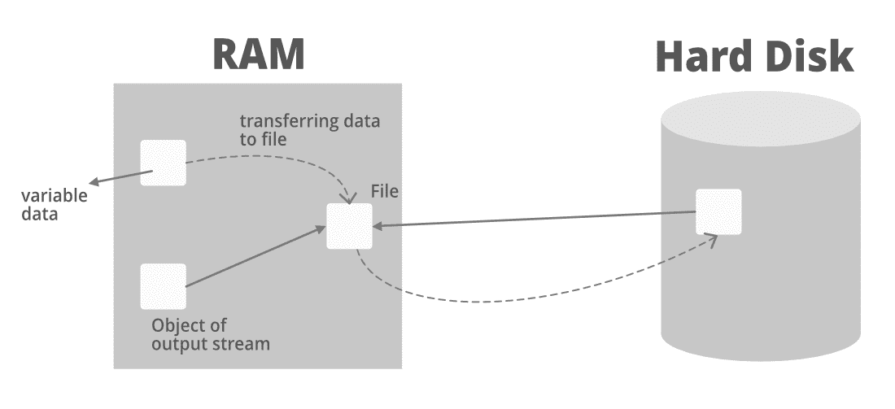
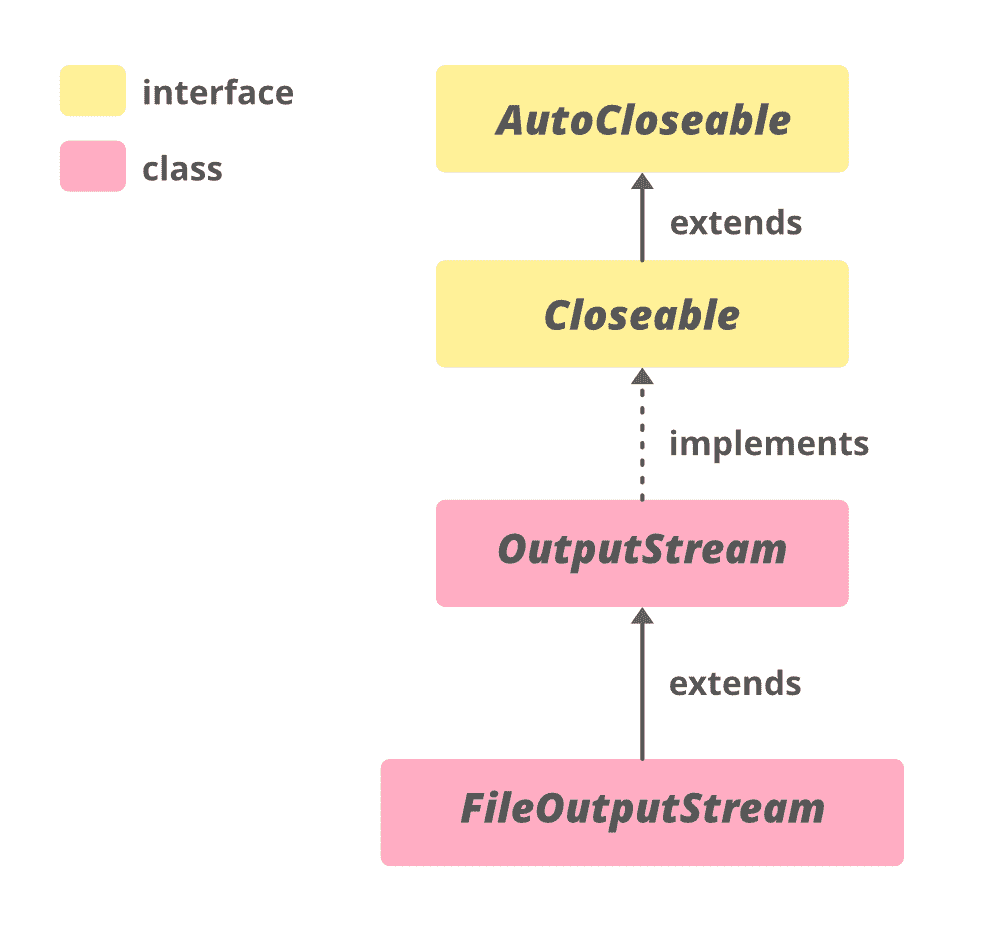
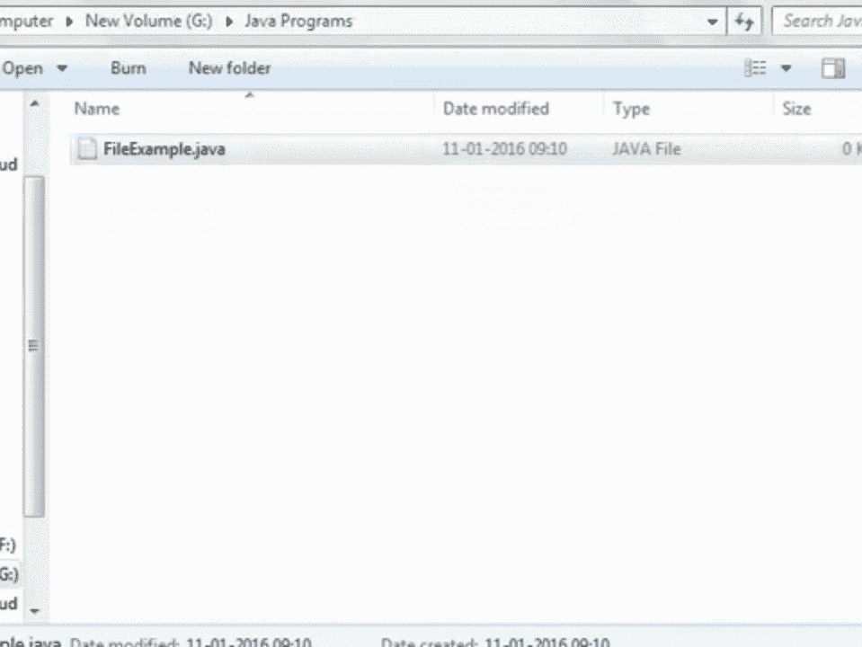
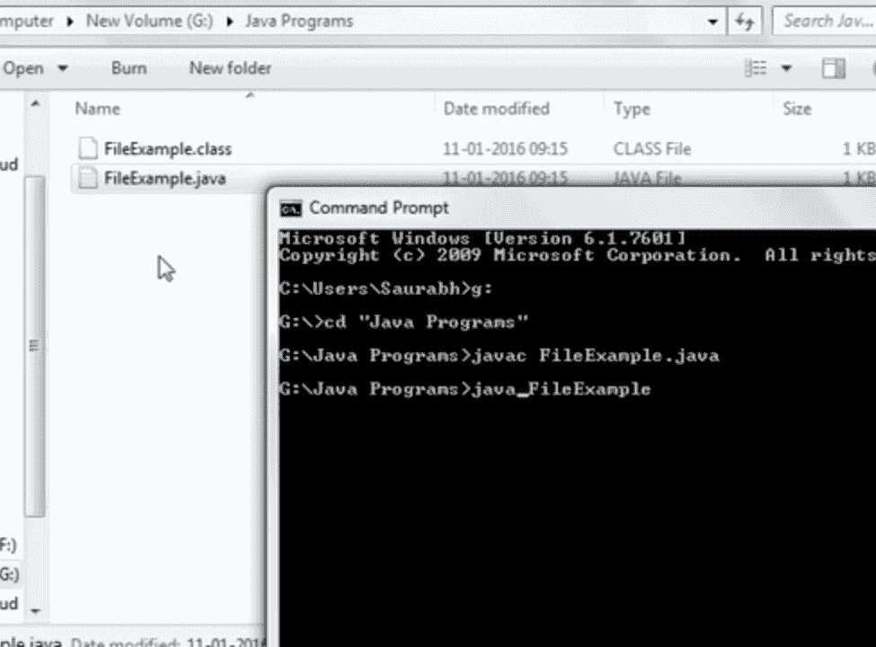
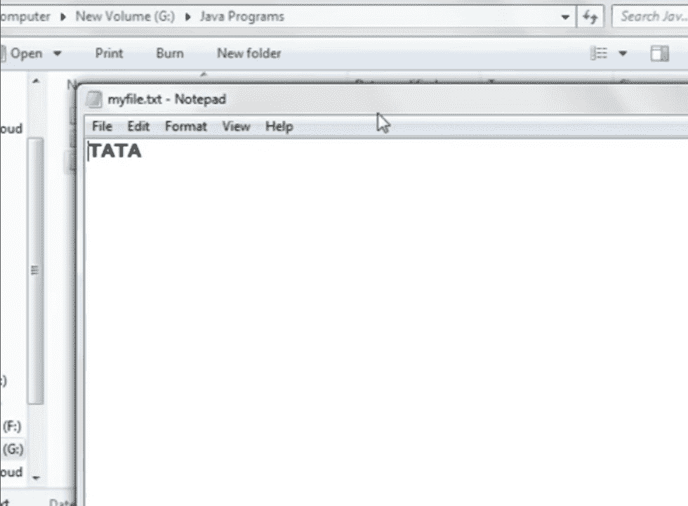

# Java 中的 FileOutputStream

> 哎哎哎:# t0]https://www . geeksforgeeks . org/file output stream-in-Java/

**文件输出流**是用于将数据/原始字节流写入文件或将数据存储到文件的输出流。文件输出流是[输出流](https://www.geeksforgeeks.org/java-io-outputstream-class-java/)的子类。要将基元值写入文件，我们使用`FileOutputStream`类。对于写面向字节和面向字符的数据，我们可以使用`FileOutputStream`，但是对于写面向字符的数据，更倾向于使用`FileWriter`。

**将数据存储到文件是什么意思？**



通过上面的图片，我们可以理解，当我们运行 java 程序时，数据存储在 ram 中。现在，假设变量数据存储在内存中，我们希望访问该数据，并将其带到硬盘中的一个文件中。因此，我们将在内存中创建一个输出流对象，它将指向一个引用硬盘的文件。

现在，来自内存中的可变数据文件的数据将进入引用文件(输出流的对象)，并从那里传输/存储在硬盘的文件中。

**文件输出流的层次结构**



**文件输出流的构造函数**

1.  `FileOutputStream(File file)`: 创建一个文件输出流，写入由指定文件对象表示的文件。
    > `FileOutputStream fout = new FileOutputStream(File file);`

2.  `FileOutputStream(File file, boolean append)`: 创建由指定文件对象表示的文件输出流对象。
    > `FileOutputStream fout = new FileOutputStream(file, boolean append);`

3.  `FileOutputStream(FileDescriptor fdObj)`: 创建一个文件输出流，用于写入指定的文件描述符，该描述符表示与文件系统中实际文件的现有连接。
    > `FileOutputStream fout = new FileOutputStream(FileDescriptor fdobj);`

4.  `FileOutputStream(String name)`: 创建一个文件输出流的对象，用提到的特定名称写入文件。
    > `FileOutputStream fout = new FileOutputStream(String name);`

5.  `FileOutputStream(String name, boolean append)`: 创建一个文件输出流对象，用指定的名称写入文件。
    > `FileOutputStream fout = new FileOutputStream(String name, boolean append);`

**声明:**

```java
public class FileOutputStream extends OutputStream 
```

**使用文件输出流将数据写入文件的步骤:**

*   首先，将文件路径附加到文件输出流，如下所示:
    ```java
    FileOutputStream fout = new FileOutputStream("file1.txt");
    ```
*   这将使我们能够将数据写入文件。然后，要将数据写入文件，我们应该使用`FileOutputStream`作为，
    ```java
    fout.write();
    ```
*   然后我们应该调用`close()`方法来关闭`fout`文件。
    ```java
    fout.close();
    ```

**示例:**

我们需要导入[java.io 包](https://www.geeksforgeeks.org/java-io-packag/)来使用`FileOutputStream`类。

```java
// java program to use FileOutputStream object for writing
// data

import java.io.*;

class FileExample {
    public static void main(String[] args)
        throws IOException
    {
        int i;

          // create a FileOutputStream object
        FileOutputStream fout = new FileOutputStream("../files/name3.txt",
                                    true);

        // we need to transfer this string to files
        String st = "TATA";

        char ch[] = st.toCharArray();
        for (i = 0; i < st.length(); i++) {

            // we will write the string by writing each
            // character one by one to file
            fout.write(ch[i]);
        }

        // by doing fout.close() all the changes which have
        // been made till now in RAM had been now saved to
        // hard disk
        fout.close();
    }
}
```

数据(即字符串`TATA`)将被传输到文件中。

**运行程序前**



**运行程序后**

创建`myfile.txt`文件，并将文本“TATA”保存在文件中。

 

### 一些重要的方法

1.  [`write()`方法](https://www.geeksforgeeks.org/writer-writestring-method-in-java-with-examples/#:~:text=The%20write(String)%20method%20of,is%20taken%20as%20a%20parameter.&text=Parameters%3A%20This%20method%20accepts%20a,do%20not%20returns%20any%20value.):
    *   `write()`: 这将单个字节写入文件输出流。
    *   `write(byte[] array)`: 这将指定数组的字节写入输出流。
    *   `write(byte[] array, int start, int length)`: 这将等于`length`的字节数写入从位置`start`开始的数组的输出流。

**示例:**

```java
// java program to write data to file

import java.io.FileOutputStream;
import java.util.*;

public class Main {
    public static void main(String[] args)
    {

        String data = "Welcome to GfG";

        try {
            FileOutputStream output
                = new FileOutputStream("output.txt");

            // The getBytes() method used
            // converts a string into bytes array.
            byte[] array = data.getBytes();

            // writing the string to the file by writing
            // each character one by one
            // Writes byte to the file
            output.write(array);

            output.close();
        }

        catch (Exception e) {
            e.getStackTrace();
        }
    }
}
```
当运行程序时，"Welcome to GfG" 这一行被复制到 `output.txt` 文件中。

2.  [`flush()`](https://www.geeksforgeeks.org/printwriter-flush-method-in-java-with-examples/):
    为了清除输出流，我们使用`flush()`方法。此方法强制将所有数据存储到其目的地。

**示例:**

```java
// java program to show the usage of flush() method
import java.io.FileOutputStream;
import java.io.IOException;

public class Main {
    public static void main(String[] args)
        throws IOException
    {

        FileOutputStream out = null;
        String data = "Welcome to GfG";

        try {
            out = new FileOutputStream("flush.txt");

            // Using write() method
            out.write(data.getBytes());

            // Using the flush() method
            out.flush();
            out.close();
        }
        catch (Exception e) {
            e.getStackTrace();
        }
    }
}
```
如果运行程序，文件 `flush.txt` 将被填充字符串 "Welcome to GfG" 的文本。

3.  [`close()`方法](https://www.geeksforgeeks.org/reader-close-method-in-java-with-examples/):
    此方法关闭文件输出流。一旦它被调用，我们就不能使用其他方法。

### 文件输出流的方法

| 方法 | 描述 |
| --- | --- |
| `void close()` | 它关闭文件输出流。 |
| `protected void finalize()` | 它用于清理与文件输出流的所有连接，并最终确定数据。 |
| `FileChannel getChannel()` | 返回与此文件输出流关联的唯一文件通道对象。 |
| `FileDescriptor getFD()` | 它返回与流相关联的文件描述符。 |
| `void write(int b)` | 它用于将指定的字节写入文件输出流。 |
| `void write(byte[] arr)` | 它用于将`arr[]`字节的数据写入文件输出流。 |
| `void write(byte[] ary, int off, int len)` | 它用于从起始位置开始，将等于长度的字节数写入数组的输出流。 |

### OutputStream 类中声明的方法

| 方法 | 描述 |
| --- | --- |
| `flush()` | 此方法强制将输出流中的所有数据写入目标(硬盘)。 |
| `nullOutputStream()` | 这个方法返回一个新的输出流，丢弃所有字节。返回的流最初是打开的。 |

**参考:**[https://docs.oracle.com/en/java/javase/11/docs/api/java.base/java/io/FileOutputStream.html](https://docs.oracle.com/en/java/javase/11/docs/api/java.base/java/io/FileOutputStream.html)