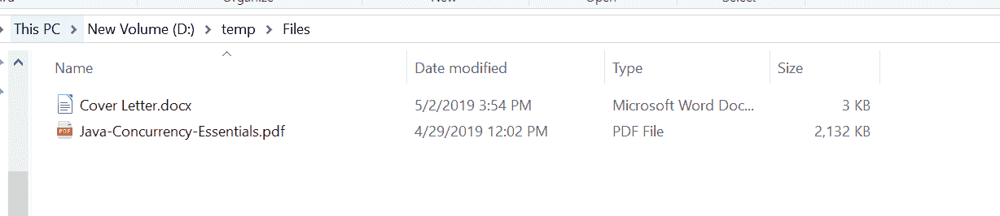
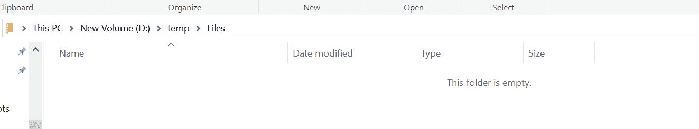

# Java 中的 `delete()` 方法示例

> 原文：[https://www.geeksforgeeks.org/files-delete-method-in-java-with-examples/](https://www.geeksforgeeks.org/files-delete-method-in-java-with-examples/)

`delete()` 方法（来自 `java.nio.file` 包）帮助我们删除位于作为参数传递的路径的文件。
相对于其他文件系统操作，该方法可能不是原子的。

如果文件是符号链接，则删除符号链接本身，而不是链接的最终目标。如果文件是一个目录，那么只有当目录为空时，此方法才会删除该文件。在一些实现中，目录具有在创建目录时创建的特殊文件或链接的条目。在这样的实现中，当只有特殊条目存在时，目录被认为是空的。在这种情况下，可以使用此方法删除目录。在某些操作系统上，当文件打开并被该 Java 虚拟机或其他程序使用时，可能无法删除该文件。

## 语法

```java
public static void delete(Path path)
                   throws IOException
```

## 参数

此方法接受一个参数 `path`，它是要删除的文件的路径。

## 返回值

此方法不返回任何内容。

## 异常

这个方法会抛出以下异常：

1.  `NoSuchFileException` – 如果文件不存在（可选特定例外）。
2.  `DirectoryNotEmptyException` – 如果文件是一个目录，并且由于目录不为空而无法删除。
3.  `IOException` – 如果出现输入/输出错误。
4.  `SecurityException` – 如果是默认提供程序，并且安装了安全管理器，则调用 `SecurityManager.checkDelete(String)` 方法来检查删除对文件的访问。

## 程序 1

下面的程序说明 `delete(Path)` 方法：

```java
// Java program to demonstrate
// java.nio.file.Files.delete() method

import java.io.IOException;
import java.nio.file.*;

public class GFG {
    public static void main(String[] args)
    {

        // create object of Path
        Path path
            = Paths.get("D:\\Work\\Test\\file1.txt");

        // delete File
        try {

            Files.delete(path);
        }
        catch (IOException e) {

            // TODO Auto-generated catch block
            e.printStackTrace();
        }
    }
}
```

**输出：**

**删除文件前：** 文件存在于路径 “D:\\Work\\Test\\file1.txt”


**删除文件后：** 文件从路径 “D:\\Work\\Test\\file1.txt” 被删除。


## 程序 2

```java
// Java program to demonstrate
// java.nio.file.Files.delete() method

import java.io.IOException;
import java.nio.file.*;

public class GFG {
    public static void main(String[] args)
    {

        // create object of Path
        Path pathOfFile1
            = Paths.get("D:\\temp\\Files"
                        + "\\Cover Letter.docx");
        Path pathOfFile2
            = Paths.get("D:\\temp\\Files"
                        + "\\Java-Concurrency-Essentials.pdf");

        // delete both Files
        try {

            Files.delete(pathOfFile1);
            Files.delete(pathOfFile2);
        }
        catch (IOException e) {

            // TODO Auto-generated catch block
            e.printStackTrace();
        }
    }
}
```

**输出：**

**删除文件前：**


**删除文件后：**


## 参考文献

[https://docs.oracle.com/javase/10/docs/api/java/nio/file/Files.html#delete(java.nio.file.Path)](https://docs.oracle.com/javase/10/docs/api/java/nio/file/Files.html#delete(java.nio.file.Path))