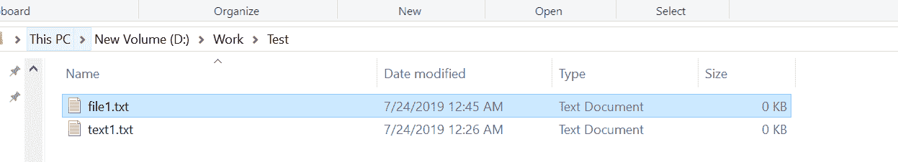
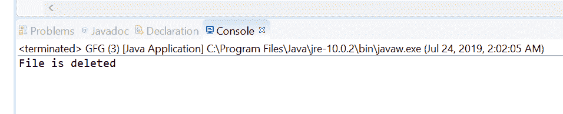

# Java 中 `deleteIfExists()` 方法示例

> 原文：[https://www.geeksforgeeks.org/files-deleteifexists-method-in-java-with-examples/](https://www.geeksforgeeks.org/files-deleteifexists-method-in-java-with-examples/)

[java.nio.file](https://www.geeksforgeeks.org/tag/java-nio-file-package/) 的 `deleteIfExists()` 方法帮助我们删除路径中存在的文件。我们将文件的路径作为参数传递给这个方法。如果文件被此方法删除，此方法将返回 `true`；如果由于文件不存在而无法删除，则返回 `false`。

如果文件是符号链接，则删除符号链接本身，而不是链接的最终目标。如果文件是一个目录，那么只有当目录为空时，此方法才会删除该文件。在一些实现中，目录具有在创建目录时创建的特殊文件或链接的条目。在这样的实现中，当只有特殊条目存在时，目录被认为是空的。在这种情况下，可以使用此方法删除目录。在某些操作系统上，当文件打开并被该 Java 虚拟机或其他程序使用时，可能无法删除该文件。

## 语法

```java
public static boolean deleteIfExists(Path path)
                   throws IOException
```

## 参数

此方法接受一个参数 `path`，它是要删除的文件的路径。

## 返回值

如果文件被该方法删除，则该方法返回 `true`；如果由于文件不存在而无法删除，则为 `false`。

## 异常

这个方法会抛出以下异常：

1.  `DirectoryNotEmptyException` – 如果文件是一个目录，并且由于目录不为空而无法删除。
2.  `IOException` – 如果出现输入/输出错误。
3.  `SecurityException` – 在默认提供程序的情况下，安装了安全管理器，调用 `SecurityManager.checkDelete(String)` 方法来检查删除对文件的访问。

下面的程序说明了 `deleteIfExists(Path)` 的方法：

### 程序 1

```java
// Java program to demonstrate
// java.nio.file.Files.deleteIfExists() method

import java.io.IOException;
import java.nio.file.*;

public class GFG {
    public static void main(String[] args)
    {

        // create object of Path
        Path path
            = Paths.get("D:\\Work\\Test\\file1.txt");

        // deleteIfExists File
        try {

            Files.deleteIfExists(path);
        }
        catch (IOException e) {

            // TODO Auto-generated catch block
            e.printStackTrace();
        }
    }
}
```

**输出：**

**删除文件前：** 文件存在于路径 `D:\Work\Test\file1.txt`


**删除文件后：** 文件已从路径 `D:\Work\Test\file1.txt` 中删除。


### 程序 2

```java
// Java program to demonstrate
// java.nio.file.Files.deleteIfExists() method

import java.io.IOException;
import java.nio.file.*;

public class GFG {
    public static void main(String[] args)
    {

        // create an object of Path
        Path pathOfFile
            = Paths.get("D:\\Work\\Test\\"
                        + "text1.txt");

        // delete both File if file exists
        try {

            boolean result
                = Files.deleteIfExists(pathOfFile);

            if (result)
                System.out.println("File is deleted");
            else
                System.out.println("File does not exists");
        }
        catch (IOException e) {

            // TODO Auto-generated catch block
            e.printStackTrace();
        }
    }
}
```

**输出：**


## 参考文献

[https://docs.oracle.com/javase/10/docs/api/java/nio/file/Files.html#deleteIfExists(java.nio.file.Path)](https://docs.oracle.com/javase/10/docs/api/java/nio/file/Files.html#deleteIfExists(java.nio.file.Path))