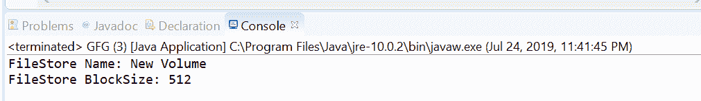
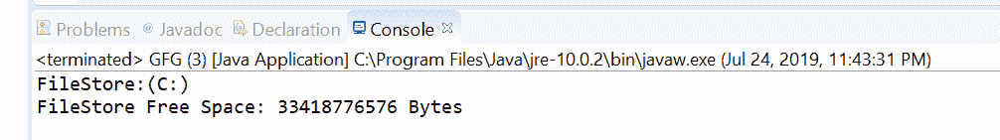

# Java 中的 `Files.getFileStore()` 方法示例

> 原文：[https://www.geeksforgeeks.org/files-getfilestore-method-in-java-with-examples/](https://www.geeksforgeeks.org/files-getfilestore-method-in-java-with-examples/)

`getFileStore()` 方法属于 `java.nio.file` 包。`Files` 类的该方法帮助我们返回一个代表文件所在文件存储的 `FileStore` 对象。一旦获得对文件存储的引用，就可以应用 `FileStore` 类型的操作来获取文件存储的信息。

## 语法

```java
public static FileStore
  getFileStore(Path path)
    throws IOException
```

## 参数

这个方法接受一个参数 `path`，它是要获取文件存储的文件路径。

## 返回值

该方法返回文件存储的 `FileStore` 对象。

## 异常

这个方法会抛出以下异常：

1.  `IOException`：如果出现输入输出错误。
2.  `SecurityException`：在默认提供者的情况下，安装了安全管理器，调用 `SecurityManager.checkRead(String)` 方法检查对文件的读取权限。

下面的程序说明了 `getFileStore(Path)` 方法：

## 程序 1

```java
// Java program to demonstrate
// Files.getFileStore() method

import java.io.IOException;
import java.nio.file.*;

public class GFG {
    public static void main(String[] args)
    {

// create object of Path
        Path path
            = Paths.get(
                "D:\\Work\\Test\\file1.txt");

// get FileStore object
        try {

FileStore fs
                = Files.getFileStore(path);

// print FileStore name and block size
            System.out.println("FileStore Name: "
                               + fs.name());
            System.out.println("FileStore BlockSize: "
                               + fs.getBlockSize());
        }
        catch (IOException e) {

// TODO Auto-generated catch block
            e.printStackTrace();
        }
    }
}
```

**输出：**


## 程序 2

```java
// Java program to demonstrate
// Files.getFileStore() method

import java.io.IOException;
import java.nio.file.*;

public class GFG {
    public static void main(String[] args)
    {

// create object of Path
        Path path = Paths.get("C:\\data\\db");

// get FileStore object
        try {

FileStore fs
                = Files.getFileStore(path);

// print FileStore details
            System.out.println("FileStore:"
                               + fs.toString());
            System.out.println("FileStore Free Space: "
                               + fs.getUnallocatedSpace()
                               + " Bytes");
        }
        catch (IOException e) {

// TODO Auto-generated catch block
            e.printStackTrace();
        }
    }
}
```

**输出：**


## 参考

[https://docs.oracle.com/javase/10/docs/api/java/nio/file/Files.html#getFileStore(java.nio.file.Path)](https://docs.oracle.com/javase/10/docs/api/java/nio/file/Files.html#getFileStore(java.nio.file.Path))