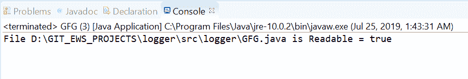
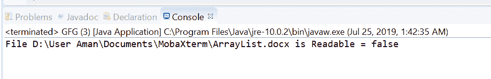

# Java 中的 Files.isReadable() 方法示例

> 原文：[https://www.geeksforgeeks.org/files-isreadable-method-in-java-with-examples/](https://www.geeksforgeeks.org/files-isreadable-method-in-java-with-examples/)

`isReadable()` 方法属于 [`java.nio.file`](https://www.geeksforgeeks.org/tag/java-nio-file-package/) 包。`Files` 类的该方法帮助我们检查 [Java 虚拟机](https://www.geeksforgeeks.org/jvm-works-jvm-architecture/)是否具有适当的权限，允许它打开该文件进行读取。该方法测试文件是否可读。此方法检查文件是否存在，如果文件存在，则它是否可读。如果文件存在且可读，此方法返回 `true`。如果出现以下情况，此方法将返回 `false`：

*   文件不存在。
*   由于 Java 虚拟机权限不足，执行访问将被拒绝。
*   无法确定访问权限。

## 语法

```java
public static boolean isReadable(Path path)
```

## 参数

这个方法接受一个参数 `path`，它是要检查的文件的路径。

## 返回值

如果文件存在且可读，则该方法返回 `true`；如果出现以下情况，则该方法返回 `false`：

*   文件不存在。
*   由于 Java 虚拟机权限不足，执行访问将被拒绝。
*   无法确定访问权限。

## 异常

这个方法会抛出 `SecurityException`。在默认提供者的情况下，安装了安全管理器，调用 `checkRead` 检查对文件的读访问。

下面的程序说明了 `isReadable(Path)` 方法：

## 程序 1

```java
// Java program to demonstrate
// Files.isReadable() method

import java.io.IOException;
import java.nio.file.*;

public class GFG {
    public static void main(String[] args)
    {

        // create object of Path
        // This file is available on windows and
        // It is a readable file.

        Path path
            = Paths.get(
                "D:\\GIT_EWS_PROJECTS\\logger"
                + "\\src\\logger"
                + "\\GFG.java");

        // check whether this file
        // is readable or not
        boolean result;
        result = Files.isReadable(path);

        System.out.println("File " + path
                           + " is Readable = "
                           + result);
    }
}
```

**输出：**


## 程序 2

```java
// Java program to demonstrate
// Files.isReadable() method

import java.io.IOException;
import java.nio.file.*;

public class GFG {
    public static void main(String[] args)
    {

        // create an object of Path
        // This file is available on windows and
        // It is not a readable file.

        Path path
            = Paths.get(
                "D:\\User Aman\\"
                + "Documents\\MobaXterm\\"
                + "\\ArrayList.docx");

        // check whether this file
        // is readable or not
        boolean result;
        result = Files.isReadable(path);

        System.out.println("File " + path
                           + " is Readable = "
                           + result);
    }
}
```

**输出：**


## 参考文献

[https://docs.oracle.com/javase/10/docs/api/java/nio/file/Files.html#isReadable(java.nio.file.Path)](https://docs.oracle.com/javase/10/docs/api/java/nio/file/Files.html#isReadable(java.nio.file.Path))