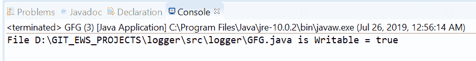
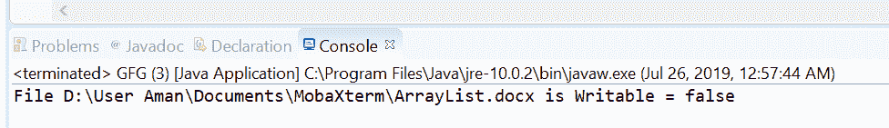

# Files.isWritable() 方法示例

> 原文：[https://www.geeksforgeeks.org/files-iswritable-method-in-java-with-examples/](https://www.geeksforgeeks.org/files-iswritable-method-in-java-with-examples/)

`isWritable()` 方法属于 `java.nio.file.Files` 类。它帮助我们检查 Java 虚拟机是否有适当的权限，允许它打开这个文件进行写入。这意味着这个方法测试文件是否可写。此方法检查文件是否存在，如果文件存在，则它是否可写。如果文件存在且可写，此方法返回 `true`。如果出现以下情况，此方法将返回 `false`：
*   文件不存在
*   因为 Java 虚拟机权限不足，执行访问会被拒绝
*   无法确定访问权限。

## 语法
```java
public static boolean isWritable(Path path)
```

## 参数
这个方法接受一个参数 `path`，它是要检查的文件的路径。

## 返回值
如果文件存在且可写，则该方法返回 `true`；如果出现以下情况，则该方法返回 `false`：
*   文件不存在
*   因为 Java 虚拟机权限不足，执行访问会被拒绝
*   无法确定访问权限。

## 异常
这个方法会抛出 `SecurityException`。在默认提供者的情况下，安装了安全管理器，调用 `checkWrite` 检查对文件的写访问。

下面的程序说明了 `isWritable(Path path)` 方法：

### 程序 1
```java
// Java program to demonstrate
// Files.isWritable() method

import java.nio.file.*;

public class GFG {
    public static void main(String[] args)
    {

        // create an object of Path
        // This file is available on windows and
        // It is a Writable file.

        Path path
            = Paths.get(
                "D:\\GIT_EWS_PROJECTS\\logger"
                + "\\src\\logger"
                + "\\GFG.java");

        // check whether this file
        // is Writable or not
        boolean result;
        result = Files.isWritable(path);

        System.out.println("File " + path
                           + " is Writable = "
                           + result);
    }
}
```
**输出：**


### 程序 2
```java
// Java program to demonstrate
// java.nio.file.Files.isWritable() method

import java.nio.file.*;

public class GFG {
    public static void main(String[] args)
    {

        // create an object of Path
        // This file is available on windows and
        // It is not a Writable file.

        Path path
            = Paths.get(
                "D:\\User Aman\\"
                + "Documents\\MobaXterm\\"
                + "\\ArrayList.docx");

        // check whether this file
        // is Writable or not
        boolean result;
        result = Files.isWritable(path);

        System.out.println("File " + path
                           + " is Writable = "
                           + result);
    }
}
```
**输出：**


## 参考文献
[https://docs.oracle.com/javase/10/docs/api/java/nio/file/Files.html#isWritable(java.nio.file.Path)](https://docs.oracle.com/javase/10/docs/api/java/nio/file/Files.html#isWritable(java.nio.file.Path))